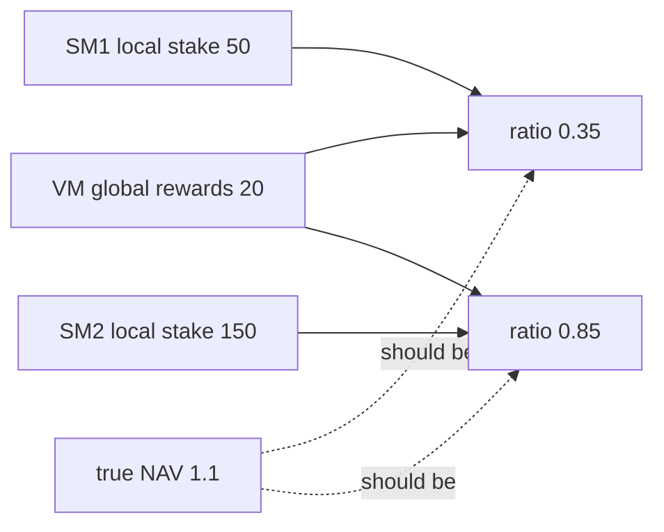

# Kinetiq — Exchange rate calculation is incorrect

> **Vulnerability classes:** vuln/reward-accounting · reward-calculation · fix-arithmetic

> **Reproduction:** a self-contained Foundry PoC that compiles & runs in an
> isolated project with **only `forge-std`** — no fork, no RPC, no `anvil_state`.
> Full trace: [output.txt](output.txt). PoC:
> [test/58616-h-08-exchange-rate-calculation-is-incorrect-pashov-audit-gro_exp.sol](test/58616-h-08-exchange-rate-calculation-is-incorrect-pashov-audit-gro_exp.sol).

<!-- non-defihacklabs -->
<!-- source-auditvault: https://github.com/Auditware/AuditVault/blob/main/findings/58616-h-08-exchange-rate-calculation-is-incorrect-pashov-audit-gro.md -->
<!-- date: 2025-02 -->

**AuditVault taxonomy:** `severity/high` · `sector/staking` · `reward-accounting` · `reward-calculation` · `variant` · `math-is-safe` · `fix-arithmetic`

---

## Key info

| | |
|---|---|
| **Impact** | **HIGH** — multi-manager setup mixes local stake with global PnL → wrong, divergent rates and mispriced redemptions |
| **Protocol** | Kinetiq — StakingManager + ValidatorManager |
| **Vulnerable code** | `getExchangeRatio` local `totalStaked` + global rewards / global supply |
| **Bug class** | Cross-instance accounting inconsistency |
| **Finding** | Pashov Audit Group · Kinetiq 2025-02-26 · #58616 · H-08 |
| **Report** | [Kinetiq-security-review_2025-02-26](https://github.com/pashov/audits/blob/master/team/md/Kinetiq-security-review_2025-02-26.md) |
| **Source** | [AuditVault](https://github.com/Auditware/AuditVault/blob/main/findings/58616-h-08-exchange-rate-calculation-is-incorrect-pashov-audit-gro.md) |
| **Status** | Audit finding. Reproduced as a standalone local PoC. |
| **Compiler** | `^0.8.24` (PoC) |

---

## TL;DR

1. Multiple `StakingManager`s share one `ValidatorManager` (global rewards/slashing) and one kHYPE.
2. Each manager stores **local** `totalStaked` / `totalClaimed`.
3. `getExchangeRatio = (localStaked + globalRewards - localClaimed - globalSlash) / globalSupply`.
4. With SM1=50, SM2=150, rewards=20, supply=200: SM1→0.35, SM2→0.85, **true→1.1**.
5. Redeeming via SM1 shortchanges users (50 kHYPE → 17.5 vs fair 55). Fix: global stake/claim totals.

---

## The vulnerable code

```solidity
uint256 totalHYPE = totalStaked + totalRewards - totalClaimed - totalSlashing; // @> VULN
// totalStaked/totalClaimed LOCAL; rewards/slashing GLOBAL; supply GLOBAL
return (totalHYPE * 1e18) / kHYPESupply;
```

---

## Root cause

PnL is protocol-global but stake/claim counters are per-manager. Dividing a hybrid numerator by global supply yields a rate that is neither the manager's local NAV nor the protocol NAV — and **differs across managers** whenever local stakes differ.

## Preconditions

- ≥2 StakingManagers sharing ValidatorManager + kHYPE.
- Global rewards or slashing non-zero.
- Local stakes unequal (divergence) or even equal (both wrong vs true global).

## Attack walkthrough

1. UserA stakes 50 on SM1; UserB stakes 150 on SM2.
2. ValidatorManager reports 20 rewards.
3. SM1 ratio 0.35e18, SM2 0.85e18, correct 1.1e18.
4. `kHYPEToHYPE(50)` on SM1 = 17.5 vs fair 55 → 37.5 shortfall.

## Diagrams



## Impact

Incorrect kHYPE valuation per manager, arbitrage between managers, and systematic under/over-payment on redemptions relative to true protocol NAV. Shared rewards are double-counted or under-attributed depending on local stake share.

## Sources

- [AuditVault finding #58616](https://github.com/Auditware/AuditVault/blob/main/findings/58616-h-08-exchange-rate-calculation-is-incorrect-pashov-audit-gro.md)
- [Pashov Kinetiq review 2025-02-26](https://github.com/pashov/audits/blob/master/team/md/Kinetiq-security-review_2025-02-26.md)
- Reduced source: [kinetiq-research/lst @ c83aa17](https://github.com/kinetiq-research/lst/tree/c83aa178eb429a7e084bdda402aadafe1a58dcc6) — `StakingManager.getExchangeRatio`
