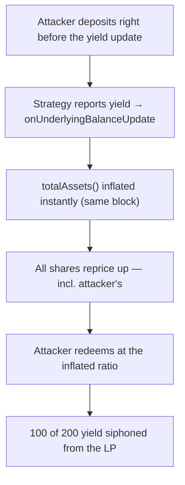

# Multipli: Reported yield instantly reprices shares, so a same-block sandwich siphons the LP's yield

> **Vulnerability classes:** vuln/erc4626 · vuln/same-block-sandwich · vuln/yield-theft
>
> **Reproduction:** a faithful minimal reproduction of the vulnerable finding — the vulnerable function is reproduced **verbatim** (marked `@>`) with faithful minimal doubles; local deploy, no fork.

<!-- source-auditvault: https://github.com/Auditware/AuditVault/blob/main/findings/58701-h-01-attackers-can-exploit-yield-distribution-through-onunde.md -->

## Root cause

onUnderlyingBalanceUpdate sets aggregatedUnderlyingBalances = newAggregatedBalance immediately (line 114), so totalAssets() jumps in one block; line 117 then reprices every share on that inflated total. An attacker who deposits right before the update and redeems right after captures part of the yield that belonged to existing long-term depositors — halving the honest LP's return.

```solidity
        require(block.number > lastBlockUpdated, "UpdateAlreadyCompletedInThisBlock");

        emit UnderlyingBalanceUpdated(aggregatedUnderlyingBalances, newAggregatedBalance);
        aggregatedUnderlyingBalances = newAggregatedBalance; // @> reported yield instantly inflates totalAssets() -> current shareholders (incl. a just-deposited attacker) reprice up in the same block

```

## Why it's exploitable here

- The reported yield is credited to `aggregatedUnderlyingBalances` instantly, repricing every existing share the same block.
- An attacker who front-runs the update with a deposit is treated as a shareholder at update time.
- Redeeming immediately after pays the attacker on the inflated ratio, diluting the honest LP's return by half.

## Attack path



## Marked-line walkthrough (Playground)

The EVM Playground pins each step to the exact executed source line in `MultipliVault`:

1. **Line 93** — deposit() computes shares = convertToShares(assets) on the assets:supply ratio BEFORE the yield is reported.
2. **Line 117** — **VULN.** onUnderlyingBalanceUpdate credits the reported yield instantly (line 114); this line immediately reprices every share via the inflated totalAssets() — including the just-deposited attacker's.
3. **Line 101** — redeem()'s convertToAssets pays the attacker more than deposited, siphoning part of the existing depositors' yield.

## PoC

Registry (Foundry, local deploy — exploit path + a fixed-variant control):

```bash
cd 58701-h-01-attackers-can-exploit-yield-distribution-through-onun_exp
forge test -vv
```

Expected: both tests PASS — the exploit test sandwiches the yield update and asserts 100 of 200 yield is siphoned from the LP; the fixed (vesting) vault yields the attacker nothing. The browser EVM Playground is served at `/hacks/58701-h-01-attackers-can-exploit-yield-distribution-through-onun/`.

## Remediation

Stream/vest the reported yield over time (or snapshot pre-update shares) so a same-block deposit cannot capture yield it did not earn.

## References

- AuditVault finding: https://github.com/Auditware/AuditVault/blob/main/findings/58701-h-01-attackers-can-exploit-yield-distribution-through-onunde.md
