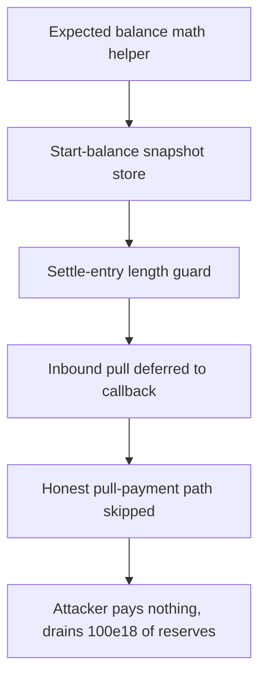

# Itos: `reentrantSettle` self-transfer bypasses payment

> **Vulnerability classes:** vuln/reentrancy · vuln/theft
>
> **Reproduction:** a faithful minimal reproduction of the vulnerable finding — the vulnerable `reentrantSettle` function of RFTLib is reproduced **verbatim** (marked `@>`) with faithful minimal doubles; local deploy, no fork.

<!-- source-auditvault: https://github.com/pashov/audits/blob/master/team/md/Itos-security-review_2025-05-24.md -->

## Root cause

`RFTLib.reentrantSettle` tracks a cumulative `transact.delta[token]` across nested (reentrant) calls and validates it against the contract's own balance change at the end of the outer call. It never rejects `payer == address(this)`, so a malicious `IRFTPayer` can re-enter during its `tokenRequestCB` and trigger a second settle with a negative amount whose `safeTransfer` becomes a self-transfer — leaving the real balance unchanged while zeroing the tracked delta. The vulnerable lines, reproduced verbatim from the finding:

```solidity
    function reentrantSettle(
@>      address payer, // @audit payer is set to requester
        address[] memory tokens,
        int256[] memory balanceChanges,
        bytes memory data
    ) internal returns (bytes memory cbData) {
         ...      
            // Handle and track all balance changes.
            int256 change = balanceChanges[i];
            if (change < 0) {
@>              TransferHelper.safeTransfer(token, payer, uint256(-change)); // @audit if payer == address(this), this is a self-transfer
            }
            // If we want tokens we transfer from when it is not an RFTPayer. Otherwise we wait to request at the end.
            if (change > 0 && !isRFTPayer) {
                TransferHelper.safeTransferFrom(token, payer, address(this), uint256(change));
            }

            // Handle bookkeeping.
@>          transact.delta[token] += change; // @audit delta is reduced because change is negative
        }
         ...
        }
    }
```

The final validation only asserts `finalBalance >= startBalance + delta`. Because the callback nets `delta` back to zero via a balance-neutral self-transfer, the expected balance collapses to the untouched starting balance and the check passes even though the payer transferred nothing in.

## Why it's exploitable here

Following the finding's scenario, with the hub holding `1000e18` of honest depositors' reserves and the attacker holding `0` tokens:

1. The attacker calls `deposit(attacker, +100e18)`. `reentrantSettle` snapshots `startBalance = 1000e18`, sets `delta = +100e18`, and because the attacker is an `IRFTPayer` it defers the inbound pull to `tokenRequestCB`.
2. In the callback the attacker re-enters with `payout(hub, 100e18)` → `reentrantSettle(hub, -100e18)`. The negative branch runs `safeTransfer(token, hub, 100e18)` — a hub-to-hub self-transfer, so the real balance is unchanged, but `delta += -100e18` nets it to `0`.
3. The outer call validates: `expectedBalance = 1000e18 + 0 = 1000e18`, and `finalBalance = 1000e18`, so the check passes. The hub credits the attacker `100e18` of redeemable shares.
4. The attacker redeems `100e18` from the hub reserves. It paid `0` and walked away with `100e18`, draining honest depositors' reserves from `1000e18` down to `900e18`.

## Attack path



## Marked-line walkthrough (Playground)

The EVM Playground pins each step to the exact executed source line in `0x671d353a…`:

1. **L67** — Expected balance math helper: The signed-add helper computes the hub's expected end balance as start balance plus the tracked delta, the value the final payment check compares against.
2. **L131** — Start-balance snapshot store: This mapping snapshots each token's starting balance so the routine can later diff the hub's real balance against the expected net change.
3. **L172** — Settle-entry length guard: On entry the routine only verifies the token and balance-change arrays match, with no guard against the payer being the hub itself.
4. **L209** — Inbound pull deferred to callback: Root cause: for an IRFTPayer the pull is skipped here, deferring payment to the attacker's callback, which self-transfers to net the tracked delta to zero.
5. **L210** — Honest pull-payment path skipped: An ordinary payer's deposit would be pulled straight in here, but the IRFTPayer branch skips this transfer so the hub collects no tokens.
6. **L241** — Bookkeeping cleared after fooled check: Once the fooled balance check passes, the start-balance and delta bookkeeping are deleted as if the deposit had been fully paid.
7. **L280** — ERC20 approve boilerplate: Setup: the ERC20 token double's standard approve function, plain boilerplate that plays no role in the payment-bypass itself.

## PoC

Registry (Foundry, local deploy — verbatim vulnerable source + harm-asserting test):

```bash
cd 58706-h-01-payers-exploit-reentrantsettle-to-bypass-payments-with_exp && forge test -vvv
```

The browser Playground replays the same synthetic opcode-for-opcode and measures the harm: **the attacker deposits `+100e18` it never pays, its callback self-transfers to zero the tracked delta, and it redeems `100e18` of honest reserves for free**. Both gates are green (registry `forge test` PASS + Playground `_verify-poc` **VERDICT: PASS**).
