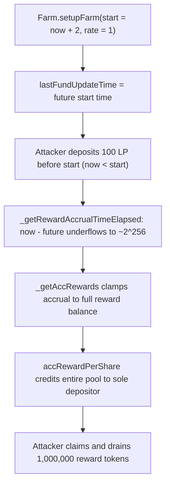

# Sperax Farms: future farm-start underflows elapsed time, letting the first depositor drain the whole reward pool

> **Vulnerability classes:** arithmetic-underflow, reward-accounting, timestamp-dependence
> **Reproduction:** Faithful minimal reproduction. The vulnerable `_getRewardAccrualTimeElapsed()` is reproduced VERBATIM (marked `@>`); everything else is a minimal double. Local deploy, no fork.

<!-- source-auditvault: https://github.com/Auditware/AuditVault/blob/main/findings/59249-underflow-in-farm-getrewardaccrualtimeelapsed-quantstamp-spe.md -->

The harm is immediate and total: a Farm is configured with a start time in the future, but deposits are already open. The **first depositor** deposits **before** that start time, an unchecked subtraction underflows the elapsed-time value to ~2²⁵⁶, and the reward accrual is clamped to the Farm's entire reward-token balance. That whole balance — **1,000,000 reward tokens** in this reproduction — is credited to the sole depositor, who claims it and drains the pool in a single transaction.

## Root cause

At setup, `_setupFarm()` writes the (possibly future) `farmStartTime` into `lastFundUpdateTime`. Deposits are already permitted at that point, and every deposit calls `_updateFarmRewardData()`, which asks `_getRewardAccrualTimeElapsed()` how much time has passed since the last update. That helper subtracts inside an `unchecked` block with no guard for a future start time:

```solidity
function _getRewardAccrualTimeElapsed() internal view returns (uint256) {
    unchecked {
        return block.timestamp - lastFundUpdateTime; // @> underflows when lastFundUpdateTime is a FUTURE start time
    }
}
```

When `block.timestamp < lastFundUpdateTime` (now is before the configured start), `block.timestamp - lastFundUpdateTime` wraps to roughly `type(uint256).max` instead of the intended `0`. That colossal "elapsed time" then flows straight into the reward math.

## Why it's exploitable here

- **Attacker-controlled trigger, no privilege required:** anyone can call `deposit()` in the open window between farm setup and the configured start time — exactly the state where the underflow fires.
- **No guard on the subtraction:** `_getRewardAccrualTimeElapsed()` never checks whether `lastFundUpdateTime` is in the future, and the `unchecked` block suppresses the revert that would otherwise catch the underflow.
- **The pool funds the loss:** `_getAccRewards()` clamps the (absurd) accrual to the Farm's own reward-token balance, so the pre-funded reward pool is what gets handed to the depositor.
- **Sole-depositor concentration:** because the attacker is the only liquidity provider at that moment, the inflated `accRewardPerShare` is entirely theirs — 100% of the reward balance, claimable immediately.

## Attack path



## Marked-line walkthrough (Playground)

1. **Line 87** — VULN: `block.timestamp - lastFundUpdateTime` executes in an `unchecked` block. With `block.timestamp = 1` and a future `lastFundUpdateTime = 2`, the subtraction wraps to ~2²⁵⁶ instead of reverting or returning 0. This underflowed value is the "elapsed time" the reward math trusts.
2. **Line 97** — `accRewards = rwdSupply`: `_getAccRewards()` computes `time * rewardRate`, which vastly exceeds the real reward supply, so it is clamped to the Farm's entire reward-token balance (`rwdSupply`). The whole pool is now the accrual for this single update.
3. **Line 106** — `accRewardPerShare += (accRewards * PRECISION) / totalLiquidity`: the full-balance accrual is folded into the per-share accumulator against the sole depositor's liquidity, allocating 100% of the reward pool to the attacker, who then `claim()`s and drains it.

## PoC

```bash
cd 59249-underflow-in-farm-getrewardaccrualtimeelapsed-quantstamp-s_exp
forge test -vv
```

The exploit test asserts the attacker walks away with **1,000,000 reward tokens** and the Farm's reward balance is left at **0**; the fixed-variant control runs the identical setup/deposit/claim against `FarmFixed` and asserts **0 tokens stolen** (the future-start check returns `0` elapsed time, so no rewards accrue). Served at `/hacks/59249-underflow-in-farm-getrewardaccrualtimeelapsed-quantstamp-s/`.

## Remediation

In `_getRewardAccrualTimeElapsed()`, return `0` when the start time is in the future (or unset) instead of letting the unchecked subtraction underflow. Tracking `farmStartTime` separately from `lastFundUpdateTime` makes the intent explicit.

```diff
 function _getRewardAccrualTimeElapsed() internal view returns (uint256) {
-    unchecked {
-        return block.timestamp - lastFundUpdateTime; // underflows for a future start
-    }
+    if (lastFundUpdateTime == 0 || block.timestamp < lastFundUpdateTime) {
+        return 0;
+    }
+    return block.timestamp - lastFundUpdateTime;
 }
```

The Sperax team fixed this by replacing `lastFundUpdateTime` with a dedicated `farmStartTime` in the accrual helper, so `_getRewardAccrualTimeElapsed()` returns `0` when `block.timestamp` precedes the start (or `lastFundUpdateTime == 0`). Fixed in commit `edb854e128420bb1723ef517f79c06b08bfbb6d7`.

## References

- AuditVault finding: https://github.com/Auditware/AuditVault/blob/main/findings/59249-underflow-in-farm-getrewardaccrualtimeelapsed-quantstamp-spe.md
- Quantstamp report (Sperax Farms): https://certificate.quantstamp.com/full/sperax-farms/e6f8e3b1-d55d-4c05-91da-30d4a4bb7633/index.html
- Fix commit: `edb854e128420bb1723ef517f79c06b08bfbb6d7`
