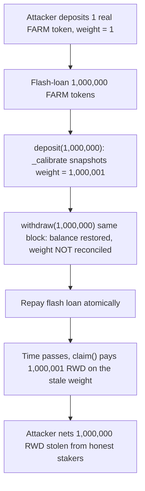

# Sperax Farms: same-block deposit + withdraw leaves the reward-weight snapshot inflated

> **Vulnerability classes:** reward-calculation, flash-loan, stale-snapshot
> **Reproduction:** faithful minimal reproduction — the vulnerable `Farm`/`Rewarder` logic is reproduced VERBATIM (the same-block `withdraw` that never reconciles the reward-weight snapshot is marked `@>`), deployed locally, no fork.

<!-- source-auditvault: https://github.com/Auditware/AuditVault/blob/main/findings/59251-reward-inflation-through-a-flash-loan-quantstamp-sperax-farm.md -->

A flash-loan attacker claims **1,000,001 reward tokens** against a same-block-inflated reward snapshot while holding only **1 token of real stake** — the other 1,000,000 reward tokens are drained from the pool that honest stakers should have earned.

## Root cause

Sperax's `Rewarder`/`Farm` let a user `deposit` and `withdraw` in the **same block**. `deposit` snapshots the user's current staked balance as their reward-earning `weight` (calibration). `withdraw` decrements the staked balance but **does not reconcile the snapshot** — so the inflated `weight` recorded during a flash-loaned deposit survives the withdrawal and is used to compute rewards long after the tokens are gone.

```solidity
function deposit(uint256 amount) external {
    farmToken.transferFrom(msg.sender, address(this), amount);
    balanceOf[msg.sender] += amount;
    depositTs[msg.sender] = block.timestamp;
    _calibrate(msg.sender);           // snapshots the (flash-inflated) balance
}

function _calibrate(address user) internal {
    weight[user] = balanceOf[user];   // reward-earning weight = current balance
}

function withdraw(uint256 amount) external {
    if (sameBlockGuard) {
        require(block.timestamp > depositTs[msg.sender], "same-block deposit+withdraw");
    }
    balanceOf[msg.sender] -= amount;  // @> vulnerable: same-block withdraw, snapshot not reconciled
    farmToken.transfer(msg.sender, amount);
}

function pendingReward(address user) public view returns (uint256) {
    return weight[user] * REWARD_RATE / SCALE; // pays on the stale, inflated weight
}
```

## Why it's exploitable here

- **Attacker-controlled input:** the deposit `amount` is arbitrary and can be sourced from an atomic flash loan, so the transient balance (and therefore the snapshotted `weight`) is unbounded.
- **No guard:** nothing forbids `deposit` and `withdraw` in the same block, and `withdraw` never touches `weight`, so the inflated calibration is permanent.
- **Who funds the loss:** honest stakers — the attacker's inflated `weight` claims reward tokens out of the shared reward reserve that would otherwise accrue to real depositors.
- **Systemic reach:** any farm with a shared, snapshot-based reward reserve is drainable; the report notes it is most feasible against smaller farms where a single inflated snapshot dominates the pool.

## Attack path



## Marked-line walkthrough (Playground)

1. **Line 126** — `_calibrate` sets `weight[user] = balanceOf[user]`; during the flash-loan deposit this records the huge transient balance as the reward-earning snapshot.
2. **Line 136** — VULN: the same-block `withdraw` decrements `balanceOf` but leaves the reward `weight` snapshot untouched, so it keeps the inflated value after the tokens leave.
3. **Line 141** — `pendingReward` multiplies the stale inflated `weight` by the rate, paying the attacker for stake they no longer hold.

## PoC

```bash
cd 59251-reward-inflation-through-a-flash-loan-quantstamp-sperax-fa_exp
forge test -vv
```

The exploit test drives one atomic transaction — real stake `1`, flash loan `1,000,000` — and asserts the attacker EOA receives `1,000,001` RWD (a fair share is `1`, so `1,000,000` is stolen), while the fixed-variant control builds the same `Farm` with the deposit-timestamp guard enabled and the flash-loan `withdraw` reverts with `"same-block deposit+withdraw"`, unwinding the whole attack. Served at `/hacks/59251-reward-inflation-through-a-flash-loan-quantstamp-sperax-fa/`.

## Remediation

Record a deposit timestamp and forbid `withdraw`/`decreaseDeposit` in the same block as the `deposit`/`increaseDeposit` that set it. Because a flash loan is atomic (single block), the guarded withdraw reverts, the loan cannot be repaid, and the attack unwinds.

```solidity
function withdraw(uint256 amount) external {
+   require(block.timestamp > depositTs[msg.sender], "same-block deposit+withdraw");
    balanceOf[msg.sender] -= amount;
    farmToken.transfer(msg.sender, amount);
}
```

This is exactly the client's fix (commit `e1359d8`): a `depositTs` was added to the `Deposit` struct, updated in `deposit()` and `increaseDeposit()`, and validated in `withdraw()` and `decreaseDeposit()`.

## References

- AuditVault finding: https://github.com/Auditware/AuditVault/blob/main/findings/59251-reward-inflation-through-a-flash-loan-quantstamp-sperax-farm.md
- Quantstamp report (Sperax Farms): https://certificate.quantstamp.com/full/sperax-farms/e6f8e3b1-d55d-4c05-91da-30d4a4bb7633/index.html
- Fix commit: `e1359d81959883d4485f09e48e28afa970627d89`
