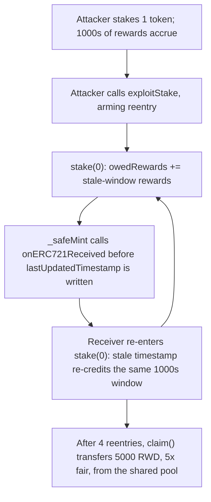

# Zero Staking: reentrancy in `stake()` re-credits a stale reward timestamp to drain the reward pool

> **Vulnerability classes:** `reentrancy-single-function`, `stale-timestamp-accounting`, `reward-theft`
>
> **Reproduction:** A faithful minimal reproduction. The vulnerable `stake()` / `_checkRewards()` ordering is reproduced VERBATIM (marked `@>`), with the reward token, the ERC721 receipt-mint callback, and a settable clock as minimal doubles. Local deploy, no fork, no cheatcodes.

<!-- source-auditvault: https://github.com/Auditware/AuditVault/blob/main/findings/59357-malicious-user-can-drain-rewards-through-reentrancy-in-staki.md -->

## Root cause

`StakingERC721.stake()` accrues pending rewards from the elapsed window `(now - staker.lastUpdatedTimestamp)`, but only writes `staker.lastUpdatedTimestamp` at the **very end** of the call. In between, it calls `_safeMint()`, which invokes `onERC721Received()` on the recipient. A malicious contract staker re-enters `stake()` during that callback: because `lastUpdatedTimestamp` is still the **stale** pre-call value, `_checkRewards()` credits the *same* elapsed window again on every reentry.

```solidity
function _checkRewards(Staker storage staker) internal view returns (uint256) {
    return ((currentTime - staker.lastUpdatedTimestamp) * REWARDS_PER_SEC * staker.amountStaked) / 1e18; // @> uses STALE lastUpdatedTimestamp — re-credited on every reentry
}

function stake(uint256 amount) external {
    Staker storage staker = stakers[msg.sender];

    staker.owedRewards += _checkRewards(staker); // @> accrue against the not-yet-updated timestamp
    staker.amountStaked += amount;

    _safeMint(msg.sender, nextTokenId++); // @> external onERC721Received callback fires BEFORE the timestamp is updated

    staker.lastUpdatedTimestamp = currentTime; // @> lastUpdatedTimestamp written only at the END of stake()
}
```

The state update that would close the accrual window happens *after* the untrusted external call instead of before it — a checks-effects-interactions violation on the reward accounting. The same risk exists in `StakingERC20.stake()` when ERC777 tokens (with `tokensReceived` hooks) are accepted.

## Why it's exploitable here

- **Attacker-controlled callback:** the staker is a contract implementing `onERC721Received`, so it fully controls the reentrant call that fires mid-`stake()`.
- **No guard:** neither `stake()` nor `unstake()` carries a `nonReentrant` modifier, and the timestamp is not finalized before the mint, so nothing blocks re-entry into the same accrual window.
- **Who funds the loss:** the inflated `owedRewards` is paid out in real reward tokens from the staking contract's **shared reward pool** — the excess comes directly out of other honest stakers' rewards.
- **Systemic reach:** the depth of reentry is attacker-chosen, so pending rewards inflate to an arbitrary multiple of the honest amount; the same pattern applies to the ERC20/ERC777 staking path.

## Attack path



## Marked-line walkthrough (Playground)

1. **Line 97** — `staker.owedRewards += _checkRewards(staker)` credits pending rewards using the still-stale `lastUpdatedTimestamp`, before `_safeMint` hands control to the attacker's receiver.
2. **Line 102** — `staker.lastUpdatedTimestamp = currentTime` runs only at the end of `stake()`, *after* `_safeMint` (line 100), so during the `onERC721Received` callback the timestamp is still stale and the reentry window stays open.
3. **Line 91 (VULN)** — `_checkRewards` multiplies `(currentTime - stale lastUpdatedTimestamp)` by the stake; re-entered during the mint callback it re-credits the same window every time, inflating pending rewards to 5x the honest amount.

## PoC

```bash
cd 59357-malicious-user-can-drain-rewards-through-reentrancy-in-sta_exp
forge test -vv
```

The exploit stakes 1 token, advances 1000 seconds (honest accrual = 1,000 RWD), then re-enters `stake(0)` four times during the mint callback and claims **5,000 RWD** (5x fair, 4,000 RWD stolen from the shared pool); the fixed-variant control that finalizes the timestamp before `_safeMint` sees a zero elapsed window on each reentry and claims exactly the fair 1,000 RWD. Served at `/hacks/59357-malicious-user-can-drain-rewards-through-reentrancy-in-sta/`.

## Remediation

Finalize `lastUpdatedTimestamp` **before** any external call, so a reentrant `stake()` sees a zero elapsed window and accrues nothing:

```diff
 function stake(uint256 amount) external {
     Staker storage staker = stakers[msg.sender];

     staker.owedRewards += _checkRewards(staker);
     staker.amountStaked += amount;
+    staker.lastUpdatedTimestamp = currentTime; // finalize timestamp BEFORE the external callback

-    _safeMint(msg.sender, nextTokenId++);
-
-    staker.lastUpdatedTimestamp = currentTime;
+    _safeMint(msg.sender, nextTokenId++);
 }
```

Equivalently, add OpenZeppelin's `nonReentrant` modifier to `stake()` and `unstake()` (and mirror the fix in the ERC20/ERC777 staking path). Reordering the state write is preferred as defense-in-depth even with a guard in place.

## References

- AuditVault finding: https://github.com/Auditware/AuditVault/blob/main/findings/59357-malicious-user-can-drain-rewards-through-reentrancy-in-staki.md
- Quantstamp report (Zero Staking): https://certificate.quantstamp.com/full/zero-staking/40ffa176-7b8d-43ec-a7e2-29732c12f21e/index.html
- Client fix commit: `0a9a94bb49ec54fce5e6bd8859be3f981fbbac4a`
