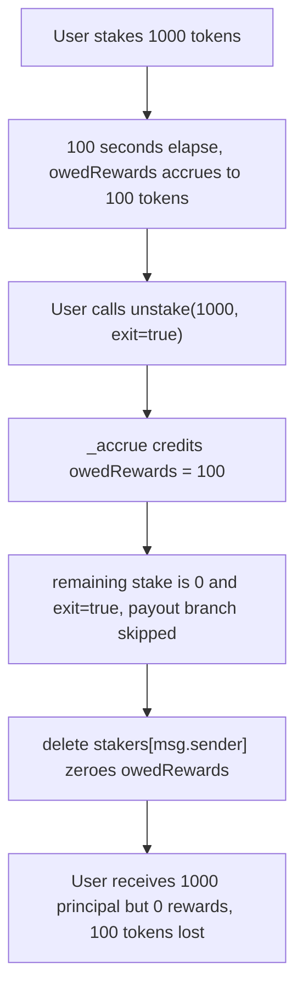

# Zero Staking: full-exit unstake `delete`s the Staker struct and wipes non-zero `owedRewards`

> **Vulnerability classes:** reward-accounting, reward-theft, staking-exit
>
> **Reproduction:** A faithful minimal reproduction of the vulnerable `StakingERC20.unstake` path, with the vulnerable function reproduced VERBATIM (marked `@>`). Local deploy, no fork.

<!-- source-auditvault: https://github.com/Auditware/AuditVault/blob/main/findings/59358-loss-of-pending-reward-when-unstaking-quantstamp-zero-stakin.md -->

The harm is immediate and self-funded: a user who unstakes their **full** balance with `exit = true` gets their staked principal back, but the very same call `delete`s their `Staker` struct — zeroing an `owedRewards` balance that was never paid. In the reproduction the user forfeits **100 reward tokens** of already-accrued rewards.

## Root cause

On a full-balance unstake, the contract cleans up by deleting the caller's `Staker` record. When `exit = true`, it takes the branch that skips the owed-reward payout and falls straight through to the `delete`, which zeroes `owedRewards` even when it is non-zero:

```solidity
if (staker.amountStaked - amount == 0) {
    if (!exit) {
        // Non-exit full unstake pays out owed rewards first.
        uint256 owed = staker.owedRewards;
        if (owed > 0) rewardsToken.transfer(msg.sender, owed);
    }
    delete stakers[msg.sender]; // @> wipes owedRewards even when exit=true and owedRewards>0
} else {
    staker.amountStaked -= amount;
}
```

The original finding shows the same root cause in `StakingERC20.sol` (and identically in `StakingERC721.sol`):

```solidity
// In StakingERC20.sol
if (staker.amountStaked - amount == 0) {
    delete stakers[msg.sender];
}
```

`delete stakers[msg.sender]` resets every field of the struct — including `owedRewards` — with no transfer of those rewards. The accounting of what the protocol owed the user is destroyed rather than settled.

## Why it's exploitable here

- **Attacker-controlled input:** `exit` is a plain caller-supplied `bool`. The user picks the exact flag value that routes them past the payout and into the `delete`.
- **No guard:** the full-exit branch has no check that `owedRewards == 0` before deleting, and no unconditional settlement of pending rewards.
- **Who funds the loss:** the user funds their own loss — accrued rewards they had already earned are silently discarded on exit; the protocol keeps the un-disbursed reward tokens.
- **Systemic reach:** the identical pattern exists in both `StakingERC20.sol` and `StakingERC721.sol`, so every staker of either contract who fully exits with `exit = true` while owed rewards is affected.

## Attack path



## Marked-line walkthrough (Playground)

1. **Line 115** — `_accrue(msg.sender)` runs inside `unstake`, crediting the staker's `owedRewards` for the elapsed period (100 seconds × `1e18` = 100 tokens). At this point the struct correctly records the debt the protocol owes.
2. **Line 118** — `stakingToken.transfer(msg.sender, amount)` returns the full staked principal (1000 tokens) to the user. Principal is settled; only rewards remain outstanding.
3. **Line 120 (VULN)** — the full-exit branch `if (staker.amountStaked - amount == 0)` is entered with `exit = true`. The code skips the owed-reward payout (line 124) and falls through to `delete stakers[msg.sender]` (line 126), wiping the non-zero `owedRewards` — the 100 tokens of rewards are lost.

## PoC

```bash
cd 59358-loss-of-pending-reward-when-unstaking-quantstamp-zero-stak_exp
forge test -vv
```

The exploit test asserts that after the vulnerable full-exit unstake the user gets 1000 principal tokens back but receives **0** reward tokens, leaving `100e18` of accrued `owedRewards` permanently lost; the fixed-variant control (`StakingERC20Fixed`, which pays owed rewards before `delete`) runs the same sequence and asserts the user is credited the full **100** reward tokens. Served at `/hacks/59358-loss-of-pending-reward-when-unstaking-quantstamp-zero-stak/`.

## Remediation

Settle `owedRewards` unconditionally before deleting the struct (or keep a separate owed-rewards record that the `delete` cannot touch):

```diff
 if (staker.amountStaked - amount == 0) {
-    if (!exit) {
-        // Non-exit full unstake pays out owed rewards first.
-        uint256 owed = staker.owedRewards;
-        if (owed > 0) rewardsToken.transfer(msg.sender, owed);
-    }
-    delete stakers[msg.sender];
+    // Always pay out owed rewards before deleting the struct.
+    uint256 owed = staker.owedRewards;
+    if (owed > 0) rewardsToken.transfer(msg.sender, owed);
+    delete stakers[msg.sender];
 } else {
     staker.amountStaked -= amount;
 }
```

Apply the same fix to `StakingERC721.sol`. If immediate transfer is undesirable (e.g. `unlockTime` has not passed), persist `owedRewards` in a mapping that survives the `Staker` deletion so it can be claimed later.

## References

- AuditVault finding: https://github.com/Auditware/AuditVault/blob/main/findings/59358-loss-of-pending-reward-when-unstaking-quantstamp-zero-stakin.md
- Quantstamp report (Zero Staking): https://certificate.quantstamp.com/full/zero-staking/40ffa176-7b8d-43ec-a7e2-29732c12f21e/index.html
- Fix commits: `2557a3905791ef0390513453c72077e2d7b0ed25`, `f4b922d5ddddb0b13753ad32bbcc5edb58aa27e7`
