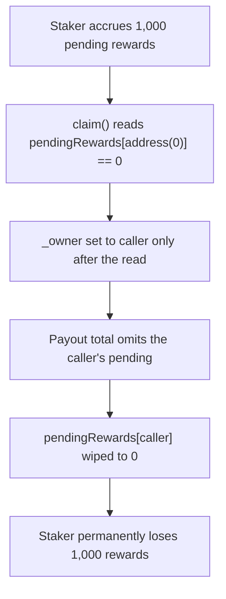

# IntentX: claim() reads pending rewards for the zero address, then wipes the caller's real balance unpaid

> **Vulnerability classes:** vuln/reward-accounting · vuln/uninitialized-read · vuln/reward-loss
>
> **Reproduction:** a faithful minimal reproduction of the vulnerable finding — the vulnerable function is reproduced **verbatim** (marked `@>`) with faithful minimal doubles; local deploy, no fork.

<!-- source-auditvault: https://github.com/Auditware/AuditVault/blob/main/findings/59427-user-pending-rewards-can-never-be-paid-out-quantstamp-intent.md -->

## Root cause

claim() reads `_amountOut = pendingRewards[_owner]` (line 89) while `_owner` is still the zero address (== 0), accumulates only the per-token rewards, then sets `_owner` to the caller (line 92) and wipes `pendingRewards[_owner] = 0` (line 93). The caller's real accrued pending balance is never included in the payout total and is zeroed — the staker permanently loses their rewards.

```solidity
    function claim(uint256 _tokenId) external returns (uint256) {
        address _owner;
        uint256 _amountOut = pendingRewards[_owner]; // @> reads pendingRewards[address(0)] == 0, not the caller's balance
        // add up the rewards of the xINTX token to the (wrongly-zero) pending total
```

## Why it's exploitable here

- `_amountOut = pendingRewards[_owner]` executes before `_owner` is resolved to the caller (it reads `pendingRewards[address(0)] == 0`).
- The payout total therefore never includes the caller's accrued rewards.
- `pendingRewards[_owner] = 0` then wipes the caller's real balance, so the rewards can never be claimed again.

## Attack path



## Marked-line walkthrough (Playground)

The EVM Playground pins each step to the exact executed source line in `StakedINTX`:

1. **Line 84** — _ownerOf(_tokenId) returns msg.sender — but only used AFTER the pending balance was already read for address(0).
2. **Line 91** — **VULN.** _amountOut accumulates only tokenRewards; the caller's pendingRewards (read as 0 on line 89 for address(0)) is never included.
3. **Line 94** — rewardToken.transfer pays _amountOut, and the caller's real pending balance was wiped to 0 (line 93) — permanently lost.

## PoC

Registry (Foundry, local deploy — exploit path + a fixed-variant control):

```bash
cd 59427-user-pending-rewards-can-never-be-paid-out-quantstamp-inte_exp
forge test -vv
```

Expected: both tests PASS — the exploit test asserts the caller receives 0 while 1,000 was accrued and wiped; the fixed order pays the caller their full pending balance. The browser EVM Playground is served at `/hacks/59427-user-pending-rewards-can-never-be-paid-out-quantstamp-inte/`.

## Remediation

Resolve `_owner` to the caller BEFORE reading `pendingRewards`, include that balance in the payout, then zero it.

## References

- AuditVault finding: https://github.com/Auditware/AuditVault/blob/main/findings/59427-user-pending-rewards-can-never-be-paid-out-quantstamp-intent.md
