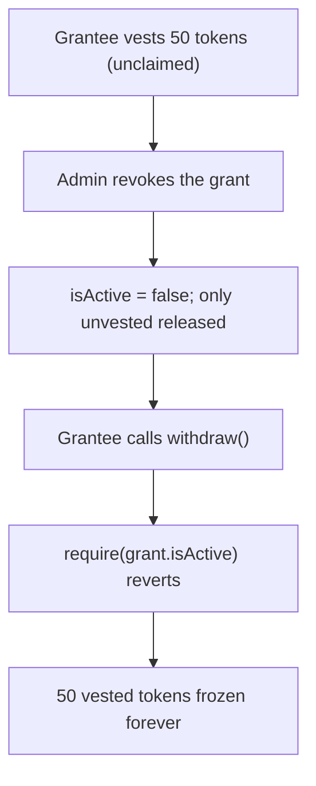

# TokenOps: withdraw() is gated by `isActive`, so revoking a grant freezes already-vested-but-unclaimed tokens

> **Vulnerability classes:** vuln/access-control · vuln/frozen-funds · vuln/vesting
>
> **Reproduction:** a faithful minimal reproduction of the vulnerable finding — the vulnerable function is reproduced **verbatim** (marked `@>`) with faithful minimal doubles; local deploy, no fork.

<!-- source-auditvault: https://github.com/Auditware/AuditVault/blob/main/findings/59721-vested-unclaimed-tokens-become-frozen-once-admin-revokes-the.md -->

## Root cause

revokeGrant sets isActive=false and only deducts the UNVESTED remainder from the reservation, but withdraw() is guarded by `require(grant.isActive)` (line 66). A grantee's already-vested-but-unwithdrawn tokens stay reserved in the contract yet can be withdrawn by no one — they are permanently frozen once the admin revokes.

```solidity
    modifier hasActiveGrant(address _recipient) {
        require(grants[_recipient].startTimestamp > 0 || grants[_recipient].cliffAmount > 0, "NO_GRANT");
        require(grants[_recipient].isActive, "NO_ACTIVE_GRANT"); // @> vested-but-unclaimed tokens are frozen once the grant is revoked
        _;
```

## Why it's exploitable here

- Revocation is meant to reclaim only the UNVESTED portion, but it also flips the flag that gates withdrawals.
- The already-vested tokens remain reserved in the contract (not returned to the admin either).
- The grantee's `withdraw()` reverts on `require(grant.isActive)`, permanently freezing what they had already earned.

## Attack path



## Marked-line walkthrough (Playground)

The EVM Playground pins each step to the exact executed source line in `TokenVesting`:

1. **Line 88** — createGrant reserves the linear + cliff amount for the grantee.
2. **Line 116** — revokeGrant sets isActive=false and records the deactivation; only the unvested remainder is released.
3. **Line 65** — **VULN.** the grantee's withdraw enters the require chain; the next check `require(grant.isActive)` (line 66) now reverts, freezing their already-vested-but-unclaimed tokens.

## PoC

Registry (Foundry, local deploy — exploit path + a fixed-variant control):

```bash
cd 59721-vested-unclaimed-tokens-become-frozen-once-admin-revokes-t_exp
forge test -vv
```

Expected: both tests PASS — the exploit test vests, revokes, then asserts the grantee cannot withdraw the 50 vested tokens; the fixed version pays out the vested balance. The browser EVM Playground is served at `/hacks/59721-vested-unclaimed-tokens-become-frozen-once-admin-revokes-t/`.

## Remediation

Let a revoked grantee still withdraw their already-vested amount (block only further vesting), or settle the vested balance to them on revoke.

## References

- AuditVault finding: https://github.com/Auditware/AuditVault/blob/main/findings/59721-vested-unclaimed-tokens-become-frozen-once-admin-revokes-the.md
