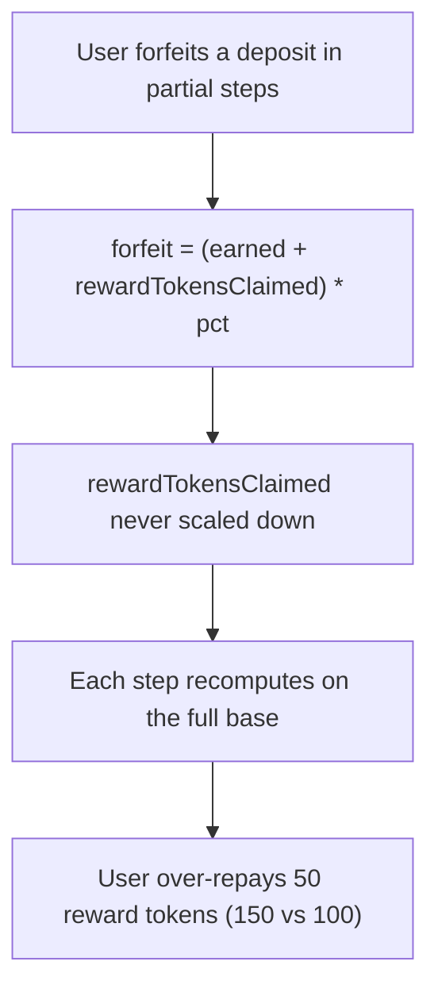

# Epoch Island: withdrawForfeit recomputes the forfeit on an un-scaled reward base, so partial forfeits over-repay

> **Vulnerability classes:** vuln/reward-accounting · vuln/missing-state-scaling
>
> **Reproduction:** a faithful minimal reproduction of the vulnerable finding — the vulnerable function is reproduced **verbatim** (marked `@>`) with faithful minimal doubles; local deploy, no fork.

<!-- source-auditvault: https://github.com/Auditware/AuditVault/blob/main/findings/59895-calling-withdrawforfeit-multiple-times-for-a-single-deposit.md -->

## Root cause

forfeitReward is computed as `(earned + rewardTokensClaimed) * percentage / 1e18`, but rewardTokensClaimed is never reduced as the deposit is partially forfeited. Forfeiting in multiple partial steps recomputes the forfeit against the un-scaled base each time, so the user repays more rewardToken (150 vs the fair 100) than they ever received.

```solidity
    // VERBATIM vulnerable path from Vepoch.sol::withdrawForfeit().
    function withdrawForfeit(uint256 _depositId, uint256 percentage) external {
        uint256 forfeitReward = ((earned[_depositId] + rewardTokensClaimed[_depositId]) * percentage) / 1e18; // @>
        rewardToken.transferFrom(msg.sender, address(this), forfeitReward);
```

## Why it's exploitable here

- Each partial forfeit recomputes against the full, un-reduced reward base.
- `rewardTokensClaimed` is never decreased as the deposit is partially forfeited.
- Summed over multiple partial steps, the user repays strictly more than a single full forfeit would cost.

## Attack path



## Marked-line walkthrough (Playground)

The EVM Playground pins each step to the exact executed source line in `Vepoch`:

1. **Line 90** — **VULN.** the forfeit uses (earned + rewardTokensClaimed) * percentage, but rewardTokensClaimed is not scaled down per partial forfeit.
2. **Line 91** — the computed forfeitReward is pulled from the user via transferFrom.
3. **Line 92** — totalForfeitPaid accumulates; across multiple partial steps the user over-repays by the un-scaled excess.

## PoC

Registry (Foundry, local deploy — exploit path + a fixed-variant control):

```bash
cd 59895-calling-withdrawforfeit-multiple-times-for-a-single-deposi_exp
forge test -vv
```

Expected: both tests PASS — the exploit test forfeits in partial steps and asserts 50 tokens of over-repayment; the fixed version scales the base so total repayment equals the fair 100. The browser EVM Playground is served at `/hacks/59895-calling-withdrawforfeit-multiple-times-for-a-single-deposi/`.

## Remediation

Scale `rewardTokensClaimed` (and the reward base) down by the forfeited percentage so partial forfeits sum to a single full forfeit.

## References

- AuditVault finding: https://github.com/Auditware/AuditVault/blob/main/findings/59895-calling-withdrawforfeit-multiple-times-for-a-single-deposit.md
