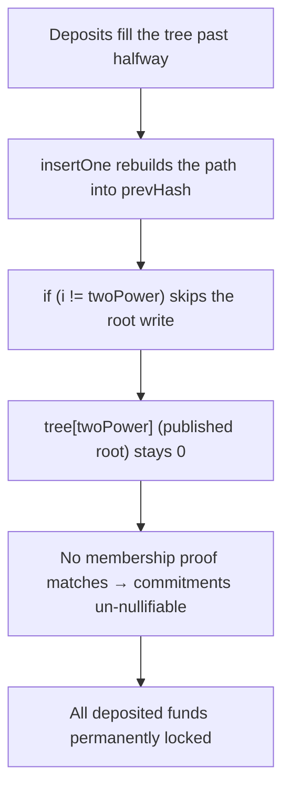

# Hinkal: Merkle insert never stores the top root once the tree is half-full, locking every deposit

> **Vulnerability classes:** vuln/state-update-omission · vuln/permanent-fund-lock · vuln/merkle-tree
>
> **Reproduction:** a faithful minimal reproduction of the vulnerable finding — the vulnerable function is reproduced **verbatim** (marked `@>`) with faithful minimal doubles; local deploy, no fork.

<!-- source-auditvault: https://github.com/Auditware/AuditVault/blob/main/findings/60149-all-funds-become-irredeemable-when-the-tree-is-halfway-popul.md -->

## Root cause

The insert loop rebuilds the path into the local `prevHash` but only writes lower nodes to storage; at the top level the `if (i != twoPower)` guard skips the final write, so the computed root is never stored to tree[twoPower]. Once the tree is more than half populated the published root stays 0, no membership proof matches, every commitment becomes un-nullifiable, and all deposits are permanently locked.

```solidity
                tree[i] = prevHash; // Left side - value stored
                if (i != twoPower) prevHash = hash(prevHash, 0);
            } else {
                prevHash = hash(tree[i], prevHash); // Right side - value cached // @> top root only cached, NEVER written to tree[twoPower]
            }
```

## Why it's exploitable here

- The root is computed only into a local (`prevHash`) and, at the top level, the `if (i != twoPower)` guard skips the final storage write.
- A zero published root means no valid membership/nullifier proof can ever be produced.
- Every depositor is affected at once — this is a protocol-wide, permanent lock, not a per-user edge case.

## Attack path



## Marked-line walkthrough (Playground)

The EVM Playground pins each step to the exact executed source line in `MiniMerkleBuggy`:

1. **Line 52** — the loop rebuilds the path from the new leaf up toward the root.
2. **Line 53** — the node index is even, so the left-side path is rebuilt.
3. **Line 55** — **VULN.** `if (i != twoPower)` skips the final write for the top level, so the computed root in prevHash is never written to tree[twoPower]; past halfway the stored root stays 0 → commitments un-nullifiable → funds locked.

## PoC

Registry (Foundry, local deploy — exploit path + a fixed-variant control):

```bash
cd 60149-all-funds-become-irredeemable-when-the-tree-is-halfway-pop_exp
forge test -vv
```

Expected: both tests PASS — the exploit test asserts the published root is 0 past halfway and 10 ETH is recorded locked; the fixed control stores the root so proofs still match. The browser EVM Playground is served at `/hacks/60149-all-funds-become-irredeemable-when-the-tree-is-halfway-pop/`.

## Remediation

Persist the computed top root to storage on every insert (write it to `tree[twoPower]`), not only the lower nodes.

## References

- AuditVault finding: https://github.com/Auditware/AuditVault/blob/main/findings/60149-all-funds-become-irredeemable-when-the-tree-is-halfway-popul.md
