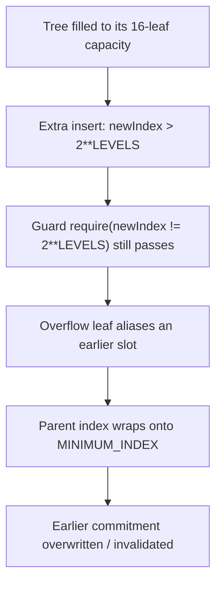

# Hinkal: Tree capacity guard uses `!=` instead of `<=`, letting an overflow overwrite an earlier commitment

> **Vulnerability classes:** vuln/off-by-one · vuln/state-corruption · vuln/merkle-tree
>
> **Reproduction:** a faithful minimal reproduction of the vulnerable finding — the vulnerable function is reproduced **verbatim** (marked `@>`) with faithful minimal doubles; local deploy, no fork.

<!-- source-auditvault: https://github.com/Auditware/AuditVault/blob/main/findings/60150-commitments-can-be-overwritten-by-overflowing-the-tree-quant.md -->

## Root cause

The full-tree guard checks `require(newIndex != 2**LEVELS)` (line 59) instead of `<=`, so once the tree is full an insert with newIndex > 2**LEVELS passes. The overflowing leaf is then written at an index that aliases an earlier position, and its parent (index/2) wraps back into the leaf region (onto MINIMUM_INDEX) — overwriting a previously-stored commitment and invalidating that depositor's funds.

```solidity
    // VERBATIM buggy capacity guard from the finding: uses `!=` instead of `<`.
    function insert(bytes32 leaf) public {
        uint256 newIndex = m_index;
        require(newIndex != uint256(2) ** LEVELS, "Tree is full."); // @>
        _insert(leaf);
```

## Why it's exploitable here

- `require(newIndex != 2**LEVELS)` passes for any `newIndex > 2**LEVELS`, so the tree is not actually capacity-bounded.
- The overflowing leaf's parent (`index/2`) aliases `MINIMUM_INDEX`, so a previously-stored commitment slot is overwritten.
- The overwritten commitment is silently invalidated — that depositor's funds become unspendable.

## Attack path



## Marked-line walkthrough (Playground)

The EVM Playground pins each step to the exact executed source line in `MerkleBase`:

1. **Line 60** — the `!=` guard (line 59) lets `_insert` run even though the tree is already full.
2. **Line 43** — **VULN.** nodes[newIndex] is set for the overflowing index, which aliases (overwrites) an earlier commitment's slot.
3. **Line 47** — the parent index (index/2) lands on MINIMUM_INDEX, corrupting a previously-stored commitment.

## PoC

Registry (Foundry, local deploy — exploit path + a fixed-variant control):

```bash
cd 60150-commitments-can-be-overwritten-by-overflowing-the-tree-qua_exp
forge test -vv
```

Expected: both tests PASS — the exploit test overflows the tree and asserts the first depositor's commitment slot was overwritten; the fixed `<=` guard reverts the overflowing insert. The browser EVM Playground is served at `/hacks/60150-commitments-can-be-overwritten-by-overflowing-the-tree-qua/`.

## Remediation

Use `require(newIndex <= 2**LEVELS, "Tree is full")` so the tree can never be overflowed.

## References

- AuditVault finding: https://github.com/Auditware/AuditVault/blob/main/findings/60150-commitments-can-be-overwritten-by-overflowing-the-tree-quant.md
