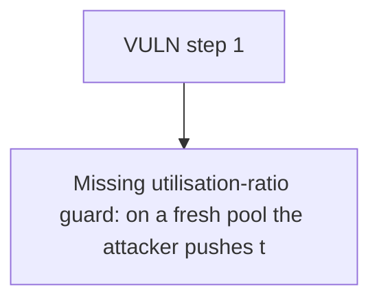

# Folks Finance: Missing utilisation-ratio guard: on a fresh pool the attacker pushes totalDebt (1e18) far 

> **Vulnerability classes:** vuln/theft · vuln/locked-funds · vuln/unfair-mint
>
> **Reproduction:** a faithful minimal reproduction of the vulnerable finding — the vulnerable function is reproduced **verbatim** (marked `@>`) with faithful minimal doubles; local deploy, no fork.

<!-- source-auditvault: https://github.com/Auditware/AuditVault/blob/main/findings/61019-infinite-interest-rate-bug-immunefi-folks-finance-git.md -->

## Root cause

Missing utilisation-ratio guard: on a fresh pool the attacker pushes totalDebt (1e18) far above totalDeposits (1e5), so calcUtilisationRatio returns 1e31 (>>100%) and the variable borrow rate explodes to ~4e31; after one block the attacker's 1e5-wei deposit over-mints to a ~5.7e23 underlying claim (~5.7e18x the pool's real asset base), letting them drain the entire pool and steal every co-deposito

```solidity
    /// utilisation ratio runs far above 1e18 (100%), exploding every downstream
    /// interest rate.
    function calcUtilisationRatio(uint256 totalDebt, uint256 totalDeposits) internal pure returns (uint256) {
        return totalDeposits > 0 ? totalDebt.mulDiv(ONE_18_DP, totalDeposits) : 0; // @> no `if (totalDebt > totalDeposits) revert RatioExceedsOne();` guard: utilisation exceeds 1e18 when debt > deposits, exploding the borrow/deposit rates
    }

```

## Why it's exploitable here

Missing utilisation-ratio guard: on a fresh pool the attacker pushes totalDebt (1e18) far above totalDeposits (1e5), so calcUtilisationRatio returns 1e31 (>>100%) and the variable borrow rate explodes to ~4e31; after one block the attacker's 1e5-wei deposit over-mints to a ~5.7e23 underlying claim (~5.7e18x the pool's real asset base), letting them drain the entire pool and steal every co-depositor's funds (protocol insolvency + direct theft).

## Attack path



## Marked-line walkthrough (Playground)

The EVM Playground pins each step to the exact executed source line in `0x671d353a77…`:

1. **L135** — VULN step 1: no `if (totalDebt > totalDeposits) revert RatioExceedsOne();` guard: utilisation exceeds 1e18 when debt > deposits, exploding the borrow/deposit rates

## PoC

Registry (Foundry, local deploy — verbatim vulnerable source + harm-asserting test + negative control):

```bash
cd 61019-infinite-interest-rate-bug-immunefi-folks-finance-git_exp
forge test -vvv
```

The browser Playground replays the same synthetic opcode-for-opcode and measures the harm: **Missing utilisation-ratio guard: on a fresh pool the attacker pushes totalDebt (1e18) far above totalDeposits (1e5), so calcUtilisationRatio**. Both gates are green (registry `forge test` PASS + Playground `_verify-poc` **VERDICT: PASS**).
