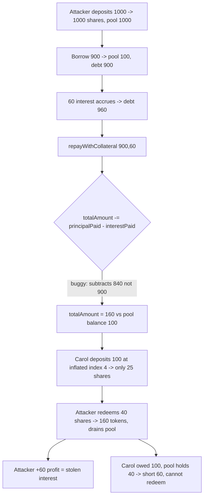

# Folks Finance — incorrect updates to `pool.depositData.totalAmount` during repay-with-collateral

> **Vulnerability classes:** vuln/accounting/double-count · vuln/logic/repay-with-collateral · vuln/loss-of-funds/pool-insolvency

> **Reproduction:** a self-contained Foundry PoC that compiles & runs in an
> isolated project with **only `forge-std`** — no fork, no RPC, no `anvil_state`.
> Full trace: [output.txt](output.txt). PoC:
> [test/61090-incorrect-updates-to-pooldepositdatatotalamount-and-loancoll_exp.sol](test/61090-incorrect-updates-to-pooldepositdatatotalamount-and-loancoll_exp.sol).

<!-- non-defihacklabs -->
<!-- source-auditvault: https://github.com/Auditware/AuditVault/blob/main/findings/61090-incorrect-updates-to-pooldepositdatatotalamount-and-loancoll.md -->
<!-- date: 2024-02 -->

**AuditVault taxonomy** — `lang/solidity` · `platform/immunefi` · `has/poc` ·
`severity/high` · `sector/lending` · `sector/stable` · `sector/token` ·
genome: `cross-contract-state-consistency` · `fee-theft` · `liquidation-underwater` · `decimal-mismatch`

---

## Key info

| | |
|---|---|
| **Impact** | **HIGH** — a repay-with-collateral double-counts the interest into `depositData.totalAmount`, inflating the pool's deposit accounting above the tokens it actually backs. The pool becomes insolvent; honest depositors cannot all be redeemed (theft of unclaimed yield / funds locked / pool cannot operate) |
| **Protocol** | [Folks Finance](https://folks.finance) — cross-chain lending (Hub/Spoke, `HubPool` + `LoanManager`) |
| **Vulnerable code** | `LoanManagerLogic.updateWithRepayWithCollateral` — `pool.depositData.totalAmount -= principalPaid - interestPaid;` |
| **Bug class** | Accounting error: subtracting `(principal − interest)` re-adds already-counted interest, double-counting it into total deposits |
| **Finding** | Immunefi Boost — Folks Finance #34179 · AuditVault #61090 · reporter **alix_40** (A2Security) |
| **Report** | [Immunefi Past-Audit-Competitions — Folks Finance](https://github.com/immunefi-team/Past-Audit-Competitions/blob/main/Folks%20Finance/Boost%20_%20Folks%20Finance%2034179%20-%20%5BSmart%20Contract%20-%20High%5D%20Incorrect%20Updates%20to%20pooldepositDatatotalAmount%20and%20loancollateralUsed%20During%20Repayment%20with%20Collateral.md) |
| **Source** | [AuditVault](https://github.com/Auditware/AuditVault/blob/main/findings/61090-incorrect-updates-to-pooldepositdatatotalamount-and-loancoll.md) |
| **Status** | Audit finding — caught in the Immunefi Boost competition (not exploited on-chain). Reproduced here as a standalone local PoC. |
| **Compiler** | `^0.8.24` (PoC) |

This is an **audit finding**, not a historical on-chain incident. The real Folks
Finance is a cross-chain Hub/Spoke lending system; the PoC keeps the vulnerable
accounting line verbatim and a faithful reduction of the deposit-share (fToken)
index so the inflated `totalAmount` becomes a measurable token loss.

---

## TL;DR

1. When a borrower repays with collateral, `LoanManagerLogic.updateWithRepayWithCollateral`
   updates the pool's total deposits with
   `pool.depositData.totalAmount -= principalPaid - interestPaid;`.
2. The `- interestPaid` term **adds the interest back** into total deposits. But
   that interest was already inside `totalAmount` when the collateral was first
   deposited — so it is **double-counted**. `totalAmount` ends up inflated by
   exactly `interestPaid`.
3. This breaks the core solvency invariant: `depositData.totalAmount` must never
   exceed `pool token balance + total borrowed`. After the repay, the pool's
   books claim more redeemable deposits than tokens exist.
4. Because the deposit index (`totalAmount / shares`) drives every deposit/withdraw
   valuation, the inflation lets early redeemers pull out **more than their fair
   share**, and a later honest depositor is left **unable to redeem in full** — the
   double-counted interest is stolen as yield and socialized as a loss.

---

## The vulnerable code

`LoanManagerLogic.updateWithRepayWithCollateral` (verbatim vulnerable line):

```solidity
function updateWithRepayWithCollateral(HubPoolState.PoolData storage pool, uint256 principalPaid, uint256 interestPaid, uint256 loanStableRate)
    external
    returns (DataTypes.RepayWithCollateralPoolParams memory repayWithCollateralPoolParams)
{
    // ... other code ...
    pool.depositData.totalAmount -= principalPaid - interestPaid; // @> subtracts (principal - interest): re-adds interest, double-counting it
    // ... rest of the function
}
```

The interest was **already** accounted in `pool.depositData.totalAmount` when the
collateral was deposited. Subtracting `principalPaid - interestPaid` (i.e.
`principal` minus a positive interest) removes *less* than the principal, leaving
`interestPaid` of phantom deposits behind.

**Recommended fix** — subtract only the principal:

```diff
-    pool.depositData.totalAmount -= principalPaid - interestPaid;
+    pool.depositData.totalAmount -= principalPaid;
```

---

## Root cause

`depositData.totalAmount` is the underlying-denominated total of all deposits and
is the numerator of the pool's deposit index. On a repay-with-collateral no token
enters the pool: the borrower forfeits collateral to settle `principal + interest`
of debt. Correct accounting reduces the deposit total by the **principal** that was
handed back to the pool. Adding the interest back (`- interestPaid`) counts it a
second time, so `totalAmount` grows above the physical token backing.

## Preconditions

- A depositor borrows against their own collateral (permissionless).
- Time passes so interest accrues (`interestPaid > 0`).
- The borrower repays the loan **with collateral** (`repayWithCollateral`), routing
  through the buggy accounting update.
- A lender-funded pool with other depositors exists (the value at risk).

## Attack walkthrough

Numbers kept exact and simple (USDC-like units, decimals omitted). Follows the
finding's own scenario (deposit 1000, borrow 900, interest 60), then adds an
honest co-depositor to make the loss a concrete token deficit. See [output.txt](output.txt).

1. Attacker deposits **1000** → 1000 deposit-shares at index 1; pool holds 1000.
2. Attacker borrows **900** → pool holds **100**; debt 900.
3. Time passes: **60** interest accrues → debt 960.
4. Attacker repays with collateral (`principalPaid=900`, `interestPaid=60`):
   - correct `totalAmount` would be **100** (== pool balance, solvent);
   - buggy `totalAmount` = **160** (double-counted the 60 interest).
   - **HARM 1:** `(totalDeposited − totalBorrowed) − poolBalance = 160 − 100 = 60`
     — the pool's books claim 60 more redeemable deposits than tokens exist.
5. Honest depositor **Carol** deposits **100**. Because the deposit index is now
   inflated (`160/40 = 4`), she receives only **25** shares (vs 40 in a healthy pool).
6. Attacker redeems their 40 leftover shares **first**: at the inflated index they
   pay out **160** tokens (vs 100 healthy), draining the pool.
   - **HARM 2 (theft of unclaimed yield):** attacker's honest capital of 1000 becomes
     **1060** — a **+60** profit, exactly the double-counted interest.
7. Carol tries to redeem her 25 shares, booked as worth **100**, but only **40**
   tokens remain.
   - **HARM 3 (insolvency / funds locked):** `poolBalance (40) < CarolClaim (100)`;
     a full redeem reverts — Carol cannot be made whole, short by exactly **60**.

A control test (`test_repayWithoutInterest_isSolvent`) runs the identical flow with
`interestPaid = 0`: the buggy `- interestPaid` term becomes a no-op, the pool stays
exactly solvent, and every depositor is made whole — proving the interest term is
what breaks the accounting.

## Diagrams



```mermaid
sequenceDiagram
    participant A as Attacker
    participant P as HubPool
    participant C as Carol (honest)
    A->>P: deposit 1000, borrow 900
    Note over P: pool balance 100, debt 900
    A->>P: accrue 60 interest, repayWithCollateral(900,60)
    Note over P: BUG: totalAmount 1000 -> 160 (should be 100)
    C->>P: deposit 100 (index inflated -> 25 shares)
    A->>P: redeem 40 shares -> 160 tokens
    Note over A,P: attacker +60 (stolen yield); pool drained to 40
    C->>P: redeem 25 shares (owed 100)
    Note over C,P: only 40 left -> Carol short 60, revert
```

## Impact

- **Theft of unclaimed yield:** the attacker walks off with exactly the interest
  that was double-counted (here **+60**), which should have accrued to honest
  depositors.
- **Pool insolvency / funds locked:** `depositData.totalAmount` permanently exceeds
  `poolBalance + totalBorrowed`; the discrepancy compounds with every
  repay-with-collateral. Honest depositors (Carol) cannot redeem their full claim —
  their funds are stranded.
- **Systemic mispricing:** the inflated total deposits lower the utilization ratio,
  which mis-prices borrow/lend interest rates and the deposit index, and corrupts
  `isDepositCapReached` / `isBorrowCapReached` — all Folks-documented downstream effects.

## Remediation

Subtract only the principal in `updateWithRepayWithCollateral`:
`pool.depositData.totalAmount -= principalPaid;`. The interest is already inside
`totalAmount` from the original deposit and must not be re-added.

## How to reproduce

```bash
cd ~/RustroverProjects/audits/evm-hack-registry/61090-incorrect-updates-to-pooldepositdatatotalamount-and-loancoll_exp
forge test -vvv
# Fully local — no fork, no RPC, no anvil_state required.
# Expected: both tests PASS:
#   test_exploit()                        (attack: totalAmount inflated, attacker +60, Carol short 60)
#   test_repayWithoutInterest_isSolvent() (control: interest=0 -> solvent, everyone whole)
```

PoC source: [test/61090-incorrect-updates-to-pooldepositdatatotalamount-and-loancoll_exp.sol](test/61090-incorrect-updates-to-pooldepositdatatotalamount-and-loancoll_exp.sol)
— the verbatim vulnerable accounting line inside a reduced `HubPool` with a
deposit-share index, plus an honest co-depositor and a solvent control.

> Note: the deposit-share (fToken) index and the 1000/900/60 magnitudes are a
> reduced model (real Folks is a cross-chain Hub/Spoke system with full interest
> indexes, out of scope). The exact +60 / −60 magnitudes validate the model; the
> bug class (interest double-counted into `depositData.totalAmount` →
> `totalAmount > backing` → insolvency, yield theft, locked funds) and the
> verbatim vulnerable line are faithful to the finding.

---

*Reference: finding **#61090** by **alix_40** (A2Security) in the [Immunefi Folks Finance Boost competition (#34179)](https://github.com/immunefi-team/Past-Audit-Competitions/blob/main/Folks%20Finance/Boost%20_%20Folks%20Finance%2034179%20-%20%5BSmart%20Contract%20-%20High%5D%20Incorrect%20Updates%20to%20pooldepositDatatotalAmount%20and%20loancollateralUsed%20During%20Repayment%20with%20Collateral.md) · curated by [AuditVault](https://github.com/Auditware/AuditVault/blob/main/findings/61090-incorrect-updates-to-pooldepositdatatotalamount-and-loancoll.md)*
