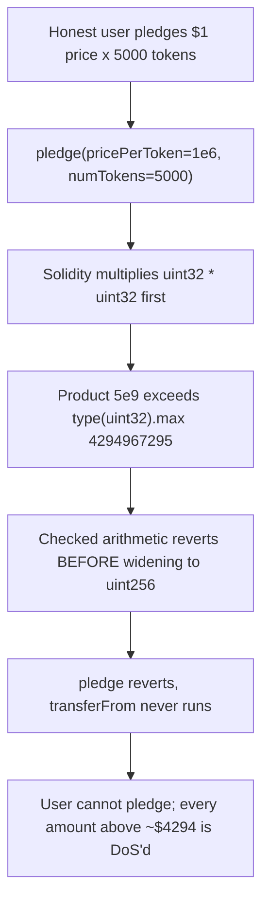

# Remora Pledge: `pricePerToken * numTokens` multiplies two `uint32`, so every pledge above ~$4,294 permanently reverts

> **Vulnerability classes:** integer-overflow · denial-of-service · unsafe-type-widening
>
> **Reproduction:** A faithful minimal reproduction. The vulnerable `PledgeManager.pledge` arithmetic is reproduced VERBATIM (marked `@>`), deployed locally with no fork — a routine $5,000 pledge reverts inside the checked `uint32 * uint32` multiply before the result is ever widened to `uint256`.

<!-- source-auditvault: https://github.com/Auditware/AuditVault/blob/main/findings/61172-pledgemanagerpledge-refundtokens-will-revert-due-to-overflow.md -->
<!-- date: 2025-07 -->

## Root cause

`pledge` declares the result as `uint256` and even comments "account for overflow" — but both operands are `uint32`, so Solidity evaluates the product in `uint32` FIRST and only widens the (already-computed) result to `uint256`. Under 0.8 checked arithmetic the multiply reverts the moment the product exceeds `type(uint32).max` (4,294,967,295):

```solidity
function pledge(address pledger, uint32 pricePerToken, uint32 numTokens) external returns (uint256) {
    uint256 stablecoinAmount = pricePerToken * numTokens; // @> uint32*uint32 reverts when product > type(uint32).max
    stablecoin.transferFrom(pledger, address(this), stablecoinAmount);
    pledgedOf[pledger] += stablecoinAmount;
    return stablecoinAmount;
}
```

`refundTokens` carries the identical latent bug (`uint256 refundAmount = numTokens * pricePerToken; //TOOD: overflow check`). With `pricePerToken` denominated in 6 decimals, `type(uint32).max` caps a single pledge at ~$4,294.96 — every larger pledge, and its matching refund, reverts.

## Why it's exploitable here

- **Attacker-controlled / user-supplied input:** `pricePerToken` and `numTokens` come straight from the pledge call. Any honest pledge whose product exceeds 4,294,967,295 base units hits the ceiling — no adversary is even required; ordinary usage triggers it.
- **No guard:** the widening to `uint256` happens *after* the `uint32` multiply, so it provides zero protection; there is no cast, no bound check, no larger intermediate type.
- **Who funds the loss:** ordinary pledgers. A routine $5,000 pledge (`$1 × 5000`) computes `5,000,000,000` base units — above the `uint32` cap — and reverts, so the user simply cannot participate.
- **Systemic reach:** the same faulty pattern sits on the refund path (`refundTokens`), and the contract is **not upgradeable**, so the ceiling cannot be lifted after deployment — the protocol is permanently capped at ~$4,294 per pledge.

## Attack path



## Marked-line walkthrough (Playground)

1. **Line 50 (VULN)** — `uint256 stablecoinAmount = pricePerToken * numTokens;` executes with `pricePerToken = 1e6` and `numTokens = 5000`, producing `5e9`. Because both operands are `uint32`, the multiply is evaluated in `uint32` and, being greater than `type(uint32).max`, reverts under checked arithmetic *before* the value is ever assigned to the `uint256`. The pledge can never succeed for this (entirely reasonable) input.

## PoC

```bash
cd 61172-pledgemanagerpledge-refundtokens-will-revert-due-to-overfl_exp
forge test -vv
```

The exploit test drives the honest `$1 × 5000` pledge, catches the revert inside the `uint32 * uint32` multiply, and mints the denied pledge value — `5,000,000,000` base units (`$5,000` at 6 decimals) — to the DoS probe as the harm marker; the fixed-variant control (`uint256(pricePerToken) * numTokens`) computes the same `5e9` without reverting, proving the revert is caused solely by the missing widen. Served at `/hacks/61172-pledgemanagerpledge-refundtokens-will-revert-due-to-overfl/`.

## Remediation

Cast one operand to `uint256` so the product is computed in the wide domain, and standardize protocol amounts to `uint128` so the value range is generous:

```diff
- uint256 stablecoinAmount = pricePerToken * numTokens; // account for overflow
+ uint256 stablecoinAmount = uint256(pricePerToken) * numTokens;
```

Apply the same fix on the refund path:

```diff
- uint256 refundAmount = numTokens * pricePerToken; //TOOD: overflow check
+ uint256 refundAmount = uint256(numTokens) * pricePerToken;
```

With the widened operand, `type(uint32).max × 10` yields `42,949,672,950` instead of reverting — the ~$4,294 ceiling disappears. Consider also reviewing `TokenBank::buyToken`, where `uint64 stablecoinValue = amount * curData.pricePerToken;` can overflow the same way.

## References

- AuditVault finding: https://github.com/Auditware/AuditVault/blob/main/findings/61172-pledgemanagerpledge-refundtokens-will-revert-due-to-overflow.md
- Cyfrin report (Remora Pledge, 2025-07-04): https://github.com/solodit/solodit_content/blob/main/reports/Cyfrin/2025-07-04-cyfrin-remora-pledge-v2.0.md
- Remora fix commits: [a0b277f](https://github.com/remora-projects/remora-smart-contracts/commit/a0b277fe4a59354f3b3783c4b8c06eb60f5157610), [ced21ba](https://github.com/remora-projects/remora-smart-contracts/commit/ced21ba9758b814eb48a09a5e792aa89cc87e8f5)
