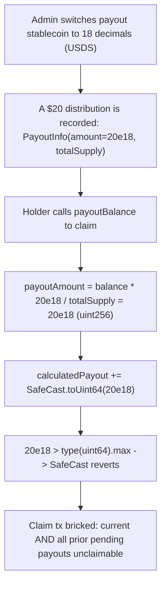

# Remora Pledge: uint64 `calculatedPayout` overflows on high-decimal stablecoin payouts, permanently bricking claims

> **Vulnerability classes:** integer-overflow, unsafe-downcast, denial-of-service
>
> **Reproduction:** A faithful minimal reproduction. `DividendManager.payoutBalance` is reproduced VERBATIM (vulnerable line marked `@>`), deployed locally with no fork. A single `$20` distribution funded in an 18-decimal stablecoin is enough to make the holder's `SafeCast.toUint64` cast revert, permanently DoSing every payout claim.

<!-- source-auditvault: https://github.com/Auditware/AuditVault/blob/main/findings/61173-distribution-of-payouts-will-revert-due-to-overflow-when-pay.md -->
<!-- date: 2025-07 -->

## Root cause

`DividendManager` accumulates each holder's owed dividend in a `uint256` (`payoutAmount`) but stores it into a **`uint64`** field, `calculatedPayout`, through a revert-on-overflow `SafeCast.toUint64`. Payouts were sized for a 6-decimal stablecoin (USDC), but the protocol can switch the payment stablecoin to one with 18 decimals (USDS). A `$20` payout then becomes `20e18`, which exceeds `type(uint64).max` (~`1.844e19`), so the cast reverts.

```solidity
struct HolderStatus {
    uint64 calculatedPayout; // @> BUG: uint64 cannot hold an 18-decimal payout
}

function payoutBalance(address holder) public returns (uint256) {
    PayoutInfo memory pInfo = payout;
    uint256 payoutAmount = (tokenBalance[holder] * pInfo.amount) / pInfo.totalSupply;

    HolderStatus storage holderStatus_ = holderStatus[holder];
    holderStatus_.calculatedPayout += SafeCast.toUint64(payoutAmount); // @> reverts: 20e18 > uint64.max
    return payoutAmount;
}
```

Because `payoutBalance` walks every uncalculated distribution and folds them into the same `calculatedPayout` slot, one oversized entry reverts the whole loop — the holder cannot claim the offending payout *or any earlier one still pending calculation*. The DoS is irreversible: the stored decimals never shrink.

## Why it's exploitable here

- **Trigger is ordinary protocol operation, not an attacker trick.** Any admin switch to an 18-decimal stablecoin (a documented capability) turns a routine `$20` distribution into a `20e18` value that overflows `uint64`.
- **No guard on the cast.** `SafeCast.toUint64` is the only bound, and it reverts rather than saturating — there is no fallback path once `payoutAmount > type(uint64).max`.
- **Holders fund their own loss of access.** The reverting call is the holder's own `payoutBalance`; they are locked out of dividends they are already owed, including previously-accrued ones.
- **Systemic reach.** Every holder with a pending high-decimal distribution hits the same revert — this is a protocol-wide claim freeze, not a single-account edge case.

## Attack path



## Marked-line walkthrough (Playground)

1. **Line 64** — `payout = PayoutInfo(amount, totalSupply)` records a distribution funded in an 18-decimal stablecoin (`amount = 20e18`), the precondition the finding requires.
2. **Line 69** — **VULN:** entry into `payoutBalance`; the holder's pro-rata payout `20e18` (computed on line 70) is about to be stored via `SafeCast.toUint64` (line 73), which reverts because `20e18 > type(uint64).max` — bricking this claim and every prior pending one.

## PoC

```bash
cd 61173-distribution-of-payouts-will-revert-due-to-overflow-when-p_exp
forge test -vv
```

The exploit test drives the verbatim `DividendManager`: the `$20` (`20e18`) claim reverts inside `SafeCast.toUint64`, the `catch` branch fires, and the full `20000000000000000000` (`20e18`) blocked payout is recorded to the DoS probe — proving the holder is permanently frozen out. The fixed-variant control (`FixedDividendManager`, `calculatedPayout` widened to `uint128`) casts the same `20e18` without reverting, so the claim succeeds and no amount is blocked. Served at `/hacks/61173-distribution-of-payouts-will-revert-due-to-overflow-when-p/`.

## Remediation

Widen `calculatedPayout` to `uint128` (which comfortably holds an 18-decimal payout) and, more robustly, normalize the internal accounting to a fixed number of decimals so it is independent of the configured stablecoin — the `PaymentSettler` converts to/from the stablecoin's actual decimals at the boundary.

```diff
 struct HolderStatus {
-    uint64 calculatedPayout;
+    uint128 calculatedPayout;
 }

-holderStatus_.calculatedPayout += SafeCast.toUint64(payoutAmount);
+holderStatus_.calculatedPayout += SafeCast.toUint128(payoutAmount);
```

Fixed upstream in commits [a0b277f](https://github.com/remora-projects/remora-smart-contracts/commit/a0b277fe4a59354f3b3783c4b8c06eb60f5157610) and [ced21ba](https://github.com/remora-projects/remora-smart-contracts/commit/ced21ba9758b814eb48a09a5e792aa89cc87e8f5).

## References

- AuditVault finding: https://github.com/Auditware/AuditVault/blob/main/findings/61173-distribution-of-payouts-will-revert-due-to-overflow-when-pay.md
- Cyfrin / Dacian report (Remora Pledge v2.0, 2025-07-04): https://github.com/solodit/solodit_content/blob/main/reports/Cyfrin/2025-07-04-cyfrin-remora-pledge-v2.0.md
- Vulnerable declaration (`calculatedPayout` as `uint64`): https://github.com/remora-projects/remora-smart-contracts/blob/audit/Dacian/contracts/RWAToken/DividendManager.sol#L42
- Overflowing `SafeCast.toUint64` cast: https://github.com/remora-projects/remora-smart-contracts/blob/audit/Dacian/contracts/RWAToken/DividendManager.sol#L435-L440
