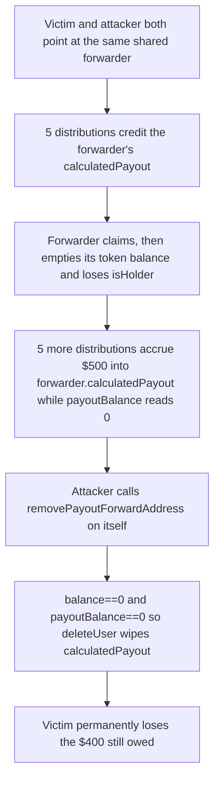

# Remora Pledge: removing a shared forwarder calls `deleteUser`, wiping `calculatedPayout` still owed to every other forwarding holder

> **Vulnerability classes:** griefing · denial-of-service · unsafe-state-deletion
>
> **Reproduction:** A faithful minimal reproduction. The vulnerable `DividendManager._removePayoutForwardAddress` is reproduced VERBATIM (marked `@>`), deployed locally with no fork — a single holder removing a shared forwarder triggers `deleteUser`, permanently wiping $400 of forwarded payouts that other holders are still owed.

<!-- source-auditvault: https://github.com/Auditware/AuditVault/blob/main/findings/61174-a-single-holder-can-grief-the-payouts-of-all-holders-forward.md -->
<!-- date: 2025-07 -->

## Root cause

Holders may nominate a shared `forwardAddress`; distributions accumulate each forwarded share onto the forwarder's `calculatedPayout`. Once the forwarder empties its own token balance it loses `isHolder`, so `payoutBalance(forwarder)` reads `0` even though `calculatedPayout` still holds funds owed to the *other* holders who are still forwarding to it.

`_removePayoutForwardAddress` gates the cleanup only on token balance and `payoutBalance`. Both are `0` for a drained non-holder forwarder, so it calls `deleteUser`, which `delete`s the entire `HolderStatus` — including the accumulated `calculatedPayout` that belongs to the still-forwarding holders:

```solidity
function _removePayoutForwardAddress(address holder, address forwardedAddress) internal virtual {
    holder; // silence unused-var warning; faithful to original signature
    if (forwardedAddress != address(0)) {
        if (
            balanceOf(forwardedAddress) == 0 &&
            payoutBalance(forwardedAddress) == 0
        ) deleteUser(forwardedAddress); // @> wipes forwarder.calculatedPayout still owed to other holders
    }
}
```

`payoutBalance` returns `0` for any non-holder, so the second condition is trivially satisfied precisely when the forwarder is holding the largest amount of *unsurfaced* forwarded payouts. The delete condition never inspects `calculatedPayout` itself.

## Why it's exploitable here

- **Attacker-controlled input:** any holder can call `removePayoutForwardAddress` on their own forwarding link at will; the trigger is a permissionless, single-actor call with no timing or funding barrier.
- **No guard:** the delete branch checks `balanceOf == 0 && payoutBalance == 0` but never `calculatedPayout == 0`, so a drained non-holder forwarder is deleted while it still custodies live forwarded payouts.
- **Who funds the loss:** the *other* honest holders still forwarding to that address. In the PoC the attacker sacrifices their own $100 of forwarded payout to destroy the victim's $400 — a 4× griefing ratio.
- **Systemic reach:** every holder pointed at the same forwarder is wiped in a single call, so one griefer can nuke the pooled payouts of an entire forwarding cohort at once.

## Attack path



## Marked-line walkthrough (Playground)

1. **Line 159** — `balanceOf(forwardedAddress) == 0` passes: the forwarder already transferred away its property tokens, so the first delete condition is met.
2. **Line 160 (VULN)** — `payoutBalance(forwardedAddress) == 0` passes because the drained forwarder is no longer a holder, so `payoutBalance` surfaces `0` even though `calculatedPayout` still holds $500. Both conditions now true, `deleteUser(forwarder)` (line 161) runs and zeroes the accumulator — permanently destroying the $400 owed to the still-forwarding victim.

## PoC

```bash
cd 61174-a-single-holder-can-grief-the-payouts-of-all-holders-forwa_exp
forge test -vv
```

The exploit test runs the finding's `test_holderForcesForwarderToLosePayouts` sequence — victim (8 tokens) and attacker (1 token) forward to a shared forwarder, 5 distributions credit and are claimed, the forwarder is drained to a non-holder, 5 more distributions accrue `500e6` into its `calculatedPayout`, and the attacker's `removePayoutForwardAddress` call deletes the forwarder — minting the victim's wiped `400e6` (`$400` at 6 decimals) to the loss probe as the harm marker; the fixed-variant control adds `calculatedPayout == 0` to the delete guard, so `deleteUser` is skipped and the victim's loss is `0`, proving the wipe is caused solely by the missing check. Served at `/hacks/61174-a-single-holder-can-grief-the-payouts-of-all-holders-forwa/`.

## Remediation

In `_removePayoutForwardAddress`, do not call `deleteUser` while the forwarded address still has a non-zero `calculatedPayout` — the payouts accumulated there are owed to the holders still forwarding to it:

```diff
 if (
     balanceOf(forwardedAddress) == 0 &&
     payoutBalance(forwardedAddress) == 0
+    && $._holderStatus[forwardedAddress].calculatedPayout == 0
 ) deleteUser(forwardedHolder);
```

Only delete a forwarder once every claim path is truly drained, so removing a forwarding link can never discard funds owed to third parties.

## References

- AuditVault finding: https://github.com/Auditware/AuditVault/blob/main/findings/61174-a-single-holder-can-grief-the-payouts-of-all-holders-forward.md
- Cyfrin report (Remora Pledge, 2025-07-04): https://github.com/solodit/solodit_content/blob/main/reports/Cyfrin/2025-07-04-cyfrin-remora-pledge-v2.0.md
- Vulnerable source (`DividendManager._removePayoutForwardAddress`): https://github.com/remora-projects/remora-smart-contracts/blob/main/contracts/RWAToken/DividendManager.sol#L215-L222
- Related issue #49 (forwarders can lose payouts): https://github.com/remora-projects/remora-smart-contracts/issues/49
- Remora fix commit: https://github.com/remora-projects/remora-smart-contracts/commit/7bd269128ebeac7f2cae0e30d55ee666e8fa21d7
