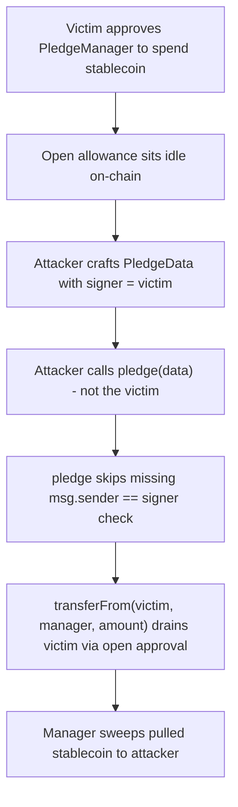

# Remora Pledge: `pledge` spends a victim's stablecoin because it never checks `msg.sender == data.signer`

> **Vulnerability classes:** access-control/missing-auth, loss-of-funds/indirect-loss, frontrun-exposure
>
> **Reproduction:** A faithful minimal reproduction of the finding — the vulnerable `PledgeManager.pledge` non-permit path is reproduced VERBATIM (marked `@>`), deployed locally, no fork. An attacker calls `pledge` with `data.signer = victim` and drains $1,000 of the victim's stablecoin through the victim's standing ERC20 approval, without the victim's consent.

<!-- source-auditvault: https://github.com/Auditware/AuditVault/blob/main/findings/61175-attacker-can-make-pledge-on-behalf-of-users-if-those-users-h.md -->
<!-- date: 2025-07 -->

## Root cause

`PledgeManager.pledge` pulls tokens from a caller-supplied `data.signer` via `transferFrom(signer, ...)`. Users approve the manager up front (often a max approval), so the pull succeeds against that standing allowance. In the non-permit path the function never checks that the caller is the account being spent — `msg.sender == data.signer` is missing — so anyone can pledge on anyone's behalf.

```solidity
function pledge(PledgeData calldata data) external {
    address signer = data.signer;
    uint256 finalStablecoinAmount = data.stablecoinAmount;

    if (data.usePermit) {
        // permit path binds the signature to `signer` (nonce/deadline/domain)
        // (omitted in this synthetic double; the bug is in the else path)
    }
    // @> MISSING: else if (msg.sender != signer) revert MsgSenderNotSigner();

    // Pull the signer's stablecoin using their standing approval. Because
    // the caller is never checked, an attacker triggers this spend.
    MiniToken(stablecoin).transferFrom(signer, address(this), finalStablecoinAmount); // @>

    pledgedOf[signer] += finalStablecoinAmount;
}
```

The permit path is safe: `IERC20Permit::permit` binds the signature to `signer` via nonce, deadline and domain separator. The manual-approval path has no equivalent binding, so the standing `approve` is the only gate — and it is not one, because `transferFrom` runs with `msg.sender = PledgeManager` regardless of who called `pledge`.

## Why it's exploitable here

- **Attacker-controlled input:** `data.signer` and `data.stablecoinAmount` come straight from calldata — the attacker names the victim and picks how much to spend.
- **No guard on the spend path:** the non-permit branch has zero authorization; nothing requires the caller to be `data.signer`.
- **The victim funds the loss:** the pull runs against the victim's own open approval, so the victim's stablecoin is spent without their knowledge or consent.
- **Systemic reach:** any account that ever left a non-zero (commonly max) approval to `PledgeManager` is exploitable by any external caller, at any time.

## Attack path



## Marked-line walkthrough (Playground)

1. **Line 100** — `finalStablecoinAmount = data.stablecoinAmount` reads the amount from caller-supplied `data` (with `data.signer` = the victim); the attacker chooses how much of the victim to spend.
2. **Line 110 (VULN)** — `transferFrom(signer, address(this), finalStablecoinAmount)` spends the victim's stablecoin through their standing approval, with no `msg.sender == signer` check gating it.
3. **Line 118** — `sweep` forwards the pulled stablecoin out to the attacker EOA, realizing the victim's loss as the attacker's profit.

## PoC

```bash
cd 61175-attacker-can-make-pledge-on-behalf-of-users-if-those-users_exp
forge test -vv
```

The exploit test asserts the attacker ends with 1,000e6 (`$1,000`) USDX pulled from the victim — victim balance goes 1,000e6 → 0 and attacker profit == 1,000e6 — while the fixed-variant control (`PledgeManagerFixed`, which enforces `msg.sender == data.signer` in the non-permit path) reverts with `MsgSenderNotSigner()` so no tokens move. Served at `/hacks/61175-attacker-can-make-pledge-on-behalf-of-users-if-those-users/`.

## Remediation

In the non-permit path, enforce that the caller is the account being spent (or, like `refundTokens`, always operate on `msg.sender`):

```diff
        if (data.usePermit) {
            IERC20Permit(stablecoin).permit(
                signer,
                address(this),
                finalStablecoinAmount,
                block.timestamp + 300,
                data.permitV,
                data.permitR,
                data.permitS
            );
        }
+       else if (msg.sender != signer) revert MsgSenderNotSigner();
```

Remora fixed this in commit [`e3bda7c`](https://github.com/remora-projects/remora-smart-contracts/commit/e3bda7c78321febb0e2f37b29912ba24c9e04343) by always using `msg.sender` and removing the permit method entirely.

## References

- AuditVault finding: https://github.com/Auditware/AuditVault/blob/main/findings/61175-attacker-can-make-pledge-on-behalf-of-users-if-those-users-h.md
- Cyfrin report (Remora Pledge, 2025-07-04, Dacian): https://github.com/solodit/solodit_content/blob/main/reports/Cyfrin/2025-07-04-cyfrin-remora-pledge-v2.0.md
- Fix commit: https://github.com/remora-projects/remora-smart-contracts/commit/e3bda7c78321febb0e2f37b29912ba24c9e04343
