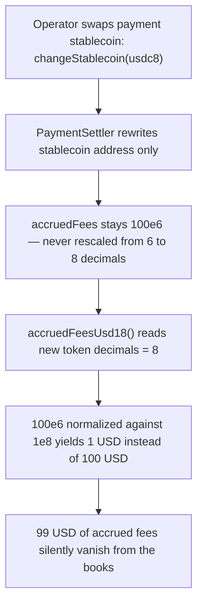

# Remora Pledge: `changeStablecoin` swaps the payment token's decimals without rescaling raw-unit accounting

> **Vulnerability classes:** decimal-mismatch, token-decimal-normalization, accounting-corruption
> **Reproduction:** faithful minimal reproduction — the vulnerable `PaymentSettler` accounting is reproduced VERBATIM (root-cause line marked `@>`), deployed locally, no fork.

<!-- source-auditvault: https://github.com/Auditware/AuditVault/blob/main/findings/61176-accounting-on-paymentsettler-will-be-corrupted-when-changing.md -->
<!-- date: 2025-07 -->

## Root cause

`PaymentSettler` keeps its fee/payout accounting in **raw units of the currently-active stablecoin**. The operator can swap that stablecoin for another one — and the replacement may use a **different number of decimals** — but `changeStablecoin` only rewrites the token address. Every accrued raw amount is left untouched, so its decimal *meaning* silently changes.

```solidity
/// @notice Swap the stablecoin used to process payments.
///         VULNERABLE: `accruedFees` (and every other raw-unit accounting
///         field) is left untouched, so its decimal interpretation silently
///         changes when `newStablecoin` has different decimals.
function changeStablecoin(address newStablecoin) external {
    stablecoin = newStablecoin; // @> accounting NOT rescaled to new stablecoin's decimals
}
```

The stored number never changes; only the divisor used to read it does. `100e6` (100 USD accrued while the stablecoin had 6 decimals) is later normalized against an 8-decimal token:

```solidity
function accruedFeesUsd18() external view returns (uint256) {
    uint8 d = MiniToken(stablecoin).decimals();      // now 8, not 6
    return accruedFees * 1e18 / (10 ** d);           // 100e6 * 1e18 / 1e8 == 1e18 == $1
}
```

$100 of accrued fees is now read as $1.

## Why it's exploitable here

- **Attacker/operator-controlled input:** the replacement stablecoin address is supplied to `changeStablecoin`; its `decimals()` is whatever that token reports (6 for USDC/USDT, 8 for others).
- **No guard, no migration:** the function performs zero decimal reconciliation — no check that old and new decimals match, no rescale of the existing balances.
- **The protocol funds the loss:** the corruption is silent and one-directional. Booked fees/payouts are reinterpreted, so the value the system believes it owes or holds diverges from the true value — a regression newly introduced when `PaymentSettler` was added (the prior version normalized decimals correctly).
- **Systemic reach:** every raw-unit accounting field tied to the active stablecoin (not just `accruedFees`) is corrupted by the same single swap.

## Attack path



## Marked-line walkthrough (Playground)

1. **Line 76** — `accruedFeesUsd18()` reads `MiniToken(stablecoin).decimals()`; after `changeStablecoin` swapped in the 8-decimal token, this returns `8` instead of the `6` under which the fees were booked.
2. **Line 77 (VULN)** — the raw accrual `accruedFees` (`100e6`, worth $100 at 6 decimals) is normalized against the wrong decimals — `100e6 * 1e18 / 1e8 == 1e18` — yielding ~$1. A silent $99 corruption, caused by `changeStablecoin` (line 70) never rescaling the stored accounting.

## PoC

```bash
cd 61176-accounting-on-paymentsettler-will-be-corrupted-when-changi_exp
forge test -vv
```

The exploit accrues 100 USD of fees at 6 decimals (`correctUsd18 == 100e18`), swaps to an 8-decimal stablecoin, and re-reads the balance as `corruptedUsd18 == 1e18` — minting the `99e18` divergence (`$99` of `CORRUPT-USD`) to the corruption probe; the `PaymentSettlerFixed` control rescales on swap and re-reads the full `100e18`, so its error is `0`. Served at `/hacks/61176-accounting-on-paymentsettler-will-be-corrupted-when-changi/`.

## Remediation

Do not persist accounting in the raw units of a token whose decimals can change. Normalize all internal balances to a fixed precision (e.g. 18 decimals) and convert to/from the active stablecoin's decimals only at the deposit/settlement boundary. If raw-unit storage is retained, `changeStablecoin` must rescale every accounting field from the old decimals to the new decimals atomically with the swap:

```solidity
function changeStablecoin(address newStablecoin) external {
    uint8 oldDec = MiniToken(stablecoin).decimals();
    uint8 newDec = MiniToken(newStablecoin).decimals();
    // Preserve the USD value the accounting represents across the swap.
    if (newDec > oldDec) {
        accruedFees = accruedFees * (10 ** (newDec - oldDec));
    } else if (oldDec > newDec) {
        accruedFees = accruedFees / (10 ** (oldDec - newDec));
    }
    stablecoin = newStablecoin;
}
```

With the boundary-normalization approach (store fees in 18-decimal USD, scale by the active token's decimals on transfer), no rescale is needed on swap at all — the stored value is decimal-agnostic.

## References

- AuditVault finding: https://github.com/Auditware/AuditVault/blob/main/findings/61176-accounting-on-paymentsettler-will-be-corrupted-when-changing.md
- Cyfrin report (Remora Pledge, 2025-07-04, Dacian): https://github.com/solodit/solodit_content/blob/main/reports/Cyfrin/2025-07-04-cyfrin-remora-pledge-v2.0.md
- Vulnerable code — `PaymentSettler.sol#L195-L198`: https://github.com/remora-projects/remora-smart-contracts/blob/audit/Dacian/contracts/PaymentSettler.sol#L195-L198
- Fix commit `a0b277f`: https://github.com/remora-projects/remora-smart-contracts/commit/a0b277fe4a59354f3b3783c4b8c06eb60f5157610
- Fix commit `ced21ba`: https://github.com/remora-projects/remora-smart-contracts/commit/ced21ba9758b814eb48a09a5e792aa89cc87e8f5
