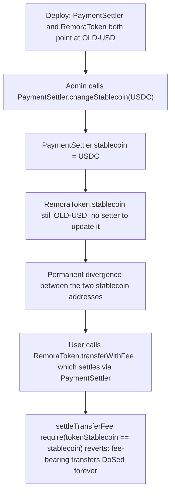

# Remora Pledge: PaymentSettler can change its stablecoin but RemoraToken can't, permanently DoSing fee-bearing transfers

> **Vulnerability classes:** `denial-of-service`, `state-desynchronization`, `missing-setter`
> **Reproduction:** A faithful minimal reproduction with the vulnerable function reproduced VERBATIM (marked `@>`), local deploy, no fork.

<!-- source-auditvault: https://github.com/Auditware/AuditVault/blob/main/findings/61177-paymentsettler-can-change-stablecoin-but-remoratoken-cant-re.md -->
<!-- date: 2025-07 -->

## Root cause

`RemoraToken` and `PaymentSettler` each store their own `stablecoin` address, and a core invariant requires the two to stay equal. `PaymentSettler` exposes a setter to change its `stablecoin`; `RemoraToken` does not — the inherited `DividendManager.changeStablecoin` was commented out when `PaymentSettler` was introduced. So once the settler's stablecoin is changed, `RemoraToken.stablecoin` can never catch up and the two diverge forever.

```solidity
contract PaymentSettler {
    address public stablecoin;

    function changeStablecoin(address newStablecoin) external {
        if (newStablecoin == address(0)) revert InvalidAddress();
        stablecoin = newStablecoin; // @> changes PaymentSettler.stablecoin; RemoraToken.stablecoin has no setter -> permanent mismatch
    }

    function settleTransferFee(address tokenStablecoin, address payer, uint256 fee) external {
        require(tokenStablecoin == stablecoin, "STABLECOIN_MISMATCH"); // reverts once RemoraToken diverges
        MiniToken(stablecoin).transferFrom(payer, address(this), fee);
    }
}

contract RemoraToken {
    address public stablecoin; // make sure same stablecoin is used here that is used in payment settler
    // ...no changeStablecoin: it was removed when PaymentSettler was introduced
}
```

The marked assignment mutates one side of a two-sided invariant that has no mechanism to update the other side.

## Why it's exploitable here

- **Attacker-controlled input, no counterpart guard:** the `restricted` `changeStablecoin` mutates `PaymentSettler.stablecoin`, but there is no corresponding setter on `RemoraToken` and no cross-contract sync, so the equality invariant is silently broken.
- **The invariant is load-bearing:** `settleTransferFee` hard-requires `tokenStablecoin == stablecoin`. The moment the addresses differ, that `require` reverts on every call.
- **Users fund the loss as permanent liveness:** every fee-bearing `RemoraToken` transfer routes through `settleTransferFee`, so all such transfers brick — a protocol-wide DoS on core token functionality, not a one-off.
- **Systemic and irreversible in-place:** because `RemoraToken` has no way to re-align, the only recovery is redeployment/upgrade; normal operation cannot restore the invariant.

## Attack path



## Marked-line walkthrough (Playground)

1. **Line 77** — `changeStablecoin` runs and updates `PaymentSettler`'s stablecoin (the assignment on line 78). `RemoraToken.stablecoin` has no setter and cannot follow, creating a permanent mismatch between the two contracts.
2. **Line 85 (VULN)** — every fee-bearing transfer settles through `require(tokenStablecoin == stablecoin)`; with the two stablecoins now diverged this check reverts, DoSing all fee-bearing `RemoraToken` transfers.

## PoC

```bash
cd 61177-paymentsettler-can-change-stablecoin-but-remoratoken-cant-_exp
forge test -vv
```

The exploit test performs the admin `changeStablecoin`, then asserts that `RemoraToken.transferWithFee(100e18)` reverts on the stablecoin mismatch and mints `100e18` DOS-MARKER to the DoS probe to record the blocked-transfer magnitude; the fixed-variant control runs the identical admin action and asserts the same transfer succeeds with `0` blocked, because `FixedRemoraToken` reads the settler's live stablecoin instead of storing its own. Served at `/hacks/61177-paymentsettler-can-change-stablecoin-but-remoratoken-cant-/`.

## Remediation

Keep `RemoraToken` and `PaymentSettler` on the same stablecoin. The cleanest fix is to remove `stablecoin` from `RemoraToken` entirely and make `PaymentSettler` the single source of truth, routing all transfers through it (this is what Remora shipped in commit `ced21ba`).

```diff
 contract RemoraToken {
-    address public stablecoin; // make sure same stablecoin is used here that is used in payment settler
     PaymentSettler public settler;

+    // Single source of truth: always read the settler's current stablecoin.
+    function stablecoin() public view returns (address) {
+        return settler.stablecoin();
+    }

     function transferWithFee(address to, uint256 amount) external {
         uint256 fee = amount / 10;
-        settler.settleTransferFee(stablecoin, msg.sender, fee);
+        settler.settleTransferFee(stablecoin(), msg.sender, fee);
         require(balanceOf[msg.sender] >= amount, "BALANCE");
         balanceOf[msg.sender] -= amount;
         balanceOf[to] += amount;
     }
 }
```

With the stablecoin read live from `PaymentSettler`, `changeStablecoin` updates both views atomically and the `settleTransferFee` invariant can never be broken. (If a stored copy must be kept, expose a matching setter that only the settler can drive, and account for the fact that swapping to a stablecoin with different decimals corrupts protocol accounting — see Remora's related decimal findings.)

## References

- AuditVault finding: https://github.com/Auditware/AuditVault/blob/main/findings/61177-paymentsettler-can-change-stablecoin-but-remoratoken-cant-re.md
- Cyfrin report (Remora Pledge, 2025-07-04): https://github.com/solodit/solodit_content/blob/main/reports/Cyfrin/2025-07-04-cyfrin-remora-pledge-v2.0.md
- Fix commit `ced21ba`: https://github.com/remora-projects/remora-smart-contracts/commit/ced21ba9758b814eb48a09a5e792aa89cc87e8f5
