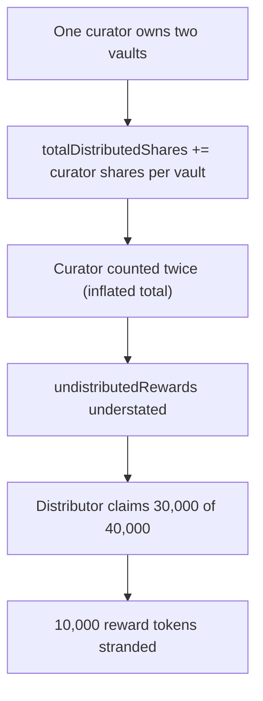

# Suzaku: Undistributed-rewards sum double-counts a multi-vault curator, stranding reward tokens

> **Vulnerability classes:** vuln/reward-accounting · vuln/double-counting · vuln/stranded-funds
>
> **Reproduction:** a faithful minimal reproduction of the vulnerable finding — the vulnerable function is reproduced **verbatim** (marked `@>`) with faithful minimal doubles; local deploy, no fork.

<!-- source-auditvault: https://github.com/Auditware/AuditVault/blob/main/findings/61233-incorrect-summation-of-curator-shares-in-claimundistributedr.md -->

## Root cause

`totalDistributedShares += curatorShares[epoch][curator]` is summed once PER OWNED VAULT, so a curator owning two vaults is counted twice. That inflates totalDistributedShares, shrinking `undistributedRewards = totalRewards - mulDiv(totalRewards, totalDistributedShares, 10000)`, so the distributor claims 30,000 instead of 40,000 — 10,000 tokens are permanently stranded.

```solidity
        // Sum curator shares
        for (uint256 i = 0; i < vaults.length; i++) {
            address curator = VaultTokenized(vaults[i]).owner();
            totalDistributedShares += curatorShares[epoch][curator]; // @> counts each curator once PER OWNED VAULT, inflating the total
        }
```

## Why it's exploitable here

- The share summation iterates vaults, not curators, so a curator owning N vaults contributes N times.
- An inflated `totalDistributedShares` makes `undistributedRewards = totalRewards - mulDiv(totalRewards, totalDistributedShares, 10000)` too small.
- The under-claimed remainder stays permanently stuck in the Rewards contract.

## Attack path



## Marked-line walkthrough (Playground)

The EVM Playground pins each step to the exact executed source line in `Rewards`:

1. **Line 171** — **VULN.** totalDistributedShares double-counts a curator who owns multiple vaults, inflating the distributed total.
2. **Line 174** — undistributedRewards = totalRewards - mulDiv(totalRewards, totalDistributedShares, 10000) is understated.
3. **Line 177** — the distributor receives only 30,000; the remaining 10,000 stays stuck in the Rewards contract.

## PoC

Registry (Foundry, local deploy — exploit path + a fixed-variant control):

```bash
cd 61233-incorrect-summation-of-curator-shares-in-claimundistribute_exp
forge test -vv
```

Expected: both tests PASS — the exploit test sets up a two-vault curator and asserts 10,000 stranded; the fixed summation lets the distributor claim the full 40,000. The browser EVM Playground is served at `/hacks/61233-incorrect-summation-of-curator-shares-in-claimundistribute/`.

## Remediation

Sum each curator's shares once per curator (dedupe by curator), not once per owned vault.

## References

- AuditVault finding: https://github.com/Auditware/AuditVault/blob/main/findings/61233-incorrect-summation-of-curator-shares-in-claimundistributedr.md
