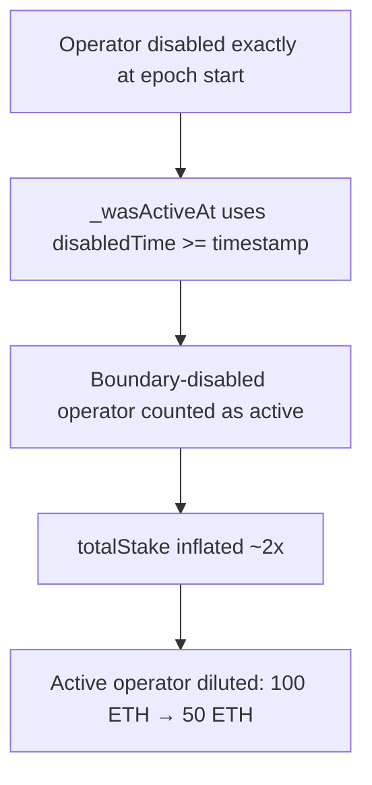

# Suzaku: `disabledTime >= timestamp` counts a boundary-disabled operator as active, diluting real operators

> **Vulnerability classes:** vuln/boundary-condition · vuln/reward-dilution · vuln/reward-accounting
>
> **Reproduction:** a faithful minimal reproduction of the vulnerable finding — the vulnerable function is reproduced **verbatim** (marked `@>`) with faithful minimal doubles; local deploy, no fork.

<!-- source-auditvault: https://github.com/Auditware/AuditVault/blob/main/findings/61235-timestamp-boundary-condition-causes-reward-dilution-for-acti.md -->

## Root cause

_wasActiveAt returns active when `disabledTime >= timestamp`, so an operator disabled at exactly the epoch start is still counted as active. Its stake inflates the epoch's total stake ~2x, diluting the genuinely-active operator's reward share to 50 ETH instead of the full 100 ETH — the lost 50 ETH stays stuck.

```solidity
    // VERBATIM vulnerable boundary check from the finding
    function _wasActiveAt(uint48 enabledTime, uint48 disabledTime, uint48 timestamp) private pure returns (bool) {
        return enabledTime != 0 && enabledTime <= timestamp && (disabledTime == 0 || disabledTime >= timestamp); // @> `>=` counts an operator disabled exactly at `timestamp` as still active
    }
```

## Why it's exploitable here

- `>=` treats the disable timestamp as still-active at the exact boundary, an off-by-one on the epoch edge.
- The boundary-disabled operator's stake is added to the epoch's total stake.
- The genuinely-active operator's pro-rata share is halved by the inflated denominator, and the lost rewards stay stuck.

## Attack path



## Marked-line walkthrough (Playground)

The EVM Playground pins each step to the exact executed source line in `AvalancheL1Middleware`:

1. **Line 63** — **VULN.** the active check uses disabledTime >= timestamp, so an operator disabled exactly at the epoch start passes as active.
2. **Line 80** — _wasActiveAt returns true, so the disabled-at-boundary operator is included rather than skipped.
3. **Line 85** — totalStake += the extra operator's stake, roughly doubling the total and halving the honest operator's reward share.

## PoC

Registry (Foundry, local deploy — exploit path + a fixed-variant control):

```bash
cd 61235-timestamp-boundary-condition-causes-reward-dilution-for-ac_exp
forge test -vv
```

Expected: both tests PASS — the exploit test disables an operator at the epoch boundary and asserts the active operator is diluted to 50 ETH; the fixed strict comparison restores the full 100 ETH. The browser EVM Playground is served at `/hacks/61235-timestamp-boundary-condition-causes-reward-dilution-for-ac/`.

## Remediation

Use a strict `disabledTime > timestamp` so an operator disabled at the boundary is excluded from that epoch.

## References

- AuditVault finding: https://github.com/Auditware/AuditVault/blob/main/findings/61235-timestamp-boundary-condition-causes-reward-dilution-for-acti.md
