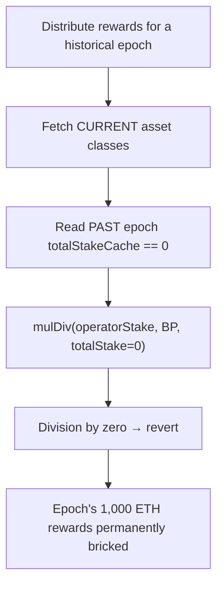

# Suzaku: Reward distribution divides by a zero historical-epoch stake, bricking the epoch forever

> **Vulnerability classes:** vuln/division-by-zero · vuln/permanent-dos · vuln/reward-accounting
>
> **Reproduction:** a faithful minimal reproduction of the vulnerable finding — the vulnerable function is reproduced **verbatim** (marked `@>`) with faithful minimal doubles; local deploy, no fork.

<!-- source-auditvault: https://github.com/Auditware/AuditVault/blob/main/findings/61239-division-by-zero-in-rewards-distribution-can-cause-permanent.md -->

## Root cause

distribution fetches the CURRENT asset classes but reads the PAST epoch's totalStakeCache, which is 0 for an asset class that had no stake in that epoch. `Math.mulDiv(operatorStake, BASIS_POINTS_DENOMINATOR, totalStake)` (line 147) then divides by zero and reverts — permanently bricking that epoch's reward distribution.

```solidity
            uint16 assetClassShare = rewardsSharePerAssetClass[assetClasses[i]];

            uint256 shareForClass = Math.mulDiv(
                Math.mulDiv(operatorStake, BASIS_POINTS_DENOMINATOR, totalStake), // @> DIVISION BY ZERO: totalStake == 0 for historical epoch
                assetClassShare,
```

## Why it's exploitable here

- The code fetches the CURRENT asset classes but the HISTORICAL epoch's stake, which can be 0 for a class that did not exist/stake then.
- `mulDiv(_, _, totalStake)` with `totalStake == 0` reverts on division by zero.
- The revert is deterministic and unavoidable, so the epoch's rewards can never be distributed.

## Attack path



## Marked-line walkthrough (Playground)

The EVM Playground pins each step to the exact executed source line in `Rewards`:

1. **Line 140** — getAssetClassIds() returns the classes that exist NOW, not those staked in the historical epoch.
2. **Line 143** — **VULN.** totalStakeCache(epoch, class) is 0 for a class with no stake that epoch; the next line's mulDiv(operatorStake, BP, totalStake) (147) divides by zero and reverts forever, blocking the epoch's 1,000 ETH rewards.

## PoC

Registry (Foundry, local deploy — exploit path + a fixed-variant control):

```bash
cd 61239-division-by-zero-in-rewards-distribution-can-cause-permane_exp
forge test -vv
```

Expected: both tests PASS — the exploit test distributes an epoch with a zero-stake class and asserts the 1,000-ETH pool is permanently blocked; the fixed guard skips the class and distributes normally. The browser EVM Playground is served at `/hacks/61239-division-by-zero-in-rewards-distribution-can-cause-permane/`.

## Remediation

Guard `totalStake == 0` (skip the class or contribute a zero share) before the `mulDiv` division.

## References

- AuditVault finding: https://github.com/Auditware/AuditVault/blob/main/findings/61239-division-by-zero-in-rewards-distribution-can-cause-permanent.md
