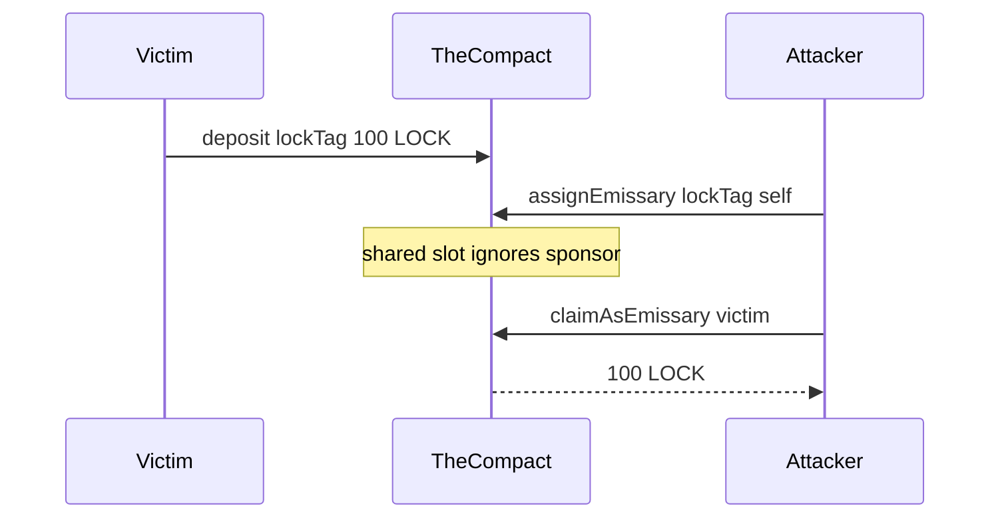

# Uniswap The Compact — incorrect emissary storage slot breaks authorization

> **Vulnerability classes:** vuln/access-control/auth-bypass · vuln/loss-of-funds/direct-drain · vuln/storage/slot-collision

> **Reproduction:** a self-contained Foundry PoC that compiles & runs in an
> isolated project with **only `forge-std`** — no fork, no RPC, no `anvil_state`.
> Full trace: [output.txt](output.txt). PoC:
> [test/61280-incorrect-storage-slot-derivation-breaks-authorization-spear_exp.sol](test/61280-incorrect-storage-slot-derivation-breaks-authorization-spear_exp.sol).

<!-- non-defihacklabs -->
<!-- source-auditvault: https://github.com/Auditware/AuditVault/blob/main/findings/61280-incorrect-storage-slot-derivation-breaks-authorization-spear.md -->
<!-- date: 2025-05 -->

**AuditVault taxonomy:** `severity/high` · `sector/bridge` · `sector/dex` · `platform/spearbit` · `frozen-funds` · `direct-drain` · `bridge-sender-auth`

---

## Key info

| | |
|---|---|
| **Impact** | **CRITICAL/HIGH** — emissary config slot ignores sponsor; attacker sets emissary for any user and claims their resource locks |
| **Protocol** | Uniswap The Compact — `EmissaryLib._getEmissaryConfig` |
| **Vulnerable code** | Assembly packs sponsor at `0x14` then `mstore(0x20, lockTag)` overwrites it before `keccak256(0x1c, 0x24)` |
| **Bug class** | Storage slot collision / broken authorization domain |
| **Finding** | Spearbit Uniswap The Compact May 2025 · #61280 · reporter **Philogy** |
| **Report** | [Uniswap-The-Compact-Spearbit-Security-Review-May-2025](https://github.com/spearbit/portfolio/blob/master/pdfs/Uniswap-The-Compact-Spearbit-Security-Review-May-2025.pdf) |
| **Source** | [AuditVault](https://github.com/Auditware/AuditVault/blob/main/findings/61280-incorrect-storage-slot-derivation-breaks-authorization-spear.md) |
| **Status** | Audit finding — fixed in commit `3caea0b7`. Reproduced as a standalone local PoC. |
| **Compiler** | `^0.8.24` (PoC) |

---

## TL;DR

1. Emissary config slots must be keyed by `(scope, sponsor, lockTag)`.
2. Buggy packing writes `lockTag` over the memory region holding `sponsor`.
3. All sponsors share one config per `lockTag`.
4. Attacker `assignEmissary` then `claimAsEmissary` steals any open lock for that tag. Fix: non-overlapping pack + hash `0x30` bytes including sponsor.

---

## The vulnerable code

```solidity
assembly ("memory-safe") {
    mstore(0x14, sponsor)
    mstore(0, scope)
    mstore(0x20, lockTag) // overwrites sponsor
    slot := keccak256(0x1c, 0x24) // @> VULN
}
// FIX: mstore(0x00, scope4); mstore(0x04, sponsor); mstore(0x24, lockTag);
//      slot := keccak256(0x00, 0x30)
```

---

## Root cause

`mstore(0x14, sponsor)` places the 20-byte address so its bytes begin at `0x20`. The subsequent `mstore(0x20, lockTag)` clobbers them. The hashed region therefore never contains the sponsor, so `msg.sender` is not part of the authorization domain.

## Preconditions

- Victim has locked balance under a `lockTag`.
- Attacker can call `assignEmissary` (permissionless for own sponsor — but slot is shared).

## Attack walkthrough

1. Victim deposits 100 LOCK under `lockTag`.
2. Attacker `assignEmissary(lockTag, attacker)` — writes the shared slot.
3. `getEmissary(victim, lockTag) == attacker`.
4. Attacker `claimAsEmissary(victim, lockTag, attackerRecv, 100)` drains the lock.

## Diagrams



## Impact

Any open resource lock for a given `lockTag` can be stolen once an attacker assigns the shared emissary. Affects all users; already-assigned emissaries only delay the attack until a reschedule window.

## Sources

- [AuditVault finding #61280](https://github.com/Auditware/AuditVault/blob/main/findings/61280-incorrect-storage-slot-derivation-breaks-authorization-spear.md)
- [Spearbit Uniswap The Compact May 2025](https://github.com/spearbit/portfolio/blob/master/pdfs/Uniswap-The-Compact-Spearbit-Security-Review-May-2025.pdf)
- Reduced source: `EmissaryLib.sol#L65-L84` — fixed in Uniswap Labs commit `3caea0b7`
