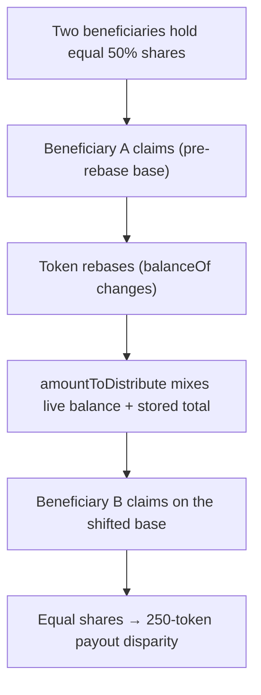

# CryptoLegacy: Vesting mixes a live rebasing balance with a stored total, so a rebase makes equal shares pay unequally

> **Vulnerability classes:** vuln/rebasing-token · vuln/accounting-drift · vuln/vesting
>
> **Reproduction:** a faithful minimal reproduction of the vulnerable finding — the vulnerable function is reproduced **verbatim** (marked `@>`) with faithful minimal doubles; local deploy, no fork.

<!-- source-auditvault: https://github.com/Auditware/AuditVault/blob/main/findings/61287-rebaseable-tokens-cause-unfair-vesting-and-claim-failures-mi.md -->

## Root cause

`amountToDistribute = token.balanceOf(this) + totalClaimedAmount` adds a LIVE rebasing balance to a STORED non-rebasing running total. When the token rebases between two beneficiaries' claims, the distribution base shifts, so beneficiaries holding EQUAL shares end with UNEQUAL totals (1,125 vs 875) — a 250-token unfair disparity.

```solidity
        // total distributable = current live balance + everything already claimed.
        // On a rebasing token balanceOf() shifts while totalClaimedAmount does not,
        // so equal shares yield unequal payouts across claims.
        uint256 amountToDistribute = IRebaseToken(_token).balanceOf(address(this)) + totalClaimedAmount; // @>

```

## Why it's exploitable here

- The distribution base moves with every rebase because it is derived from `balanceOf`.
- `totalClaimedAmount` is a fixed running total, so the two terms are denominated inconsistently after a rebase.
- Two beneficiaries with identical fixed shares end up with different payouts purely from claim timing around a rebase.

## Attack path



## Marked-line walkthrough (Playground)

The EVM Playground pins each step to the exact executed source line in `CryptoLegacyVesting`:

1. **Line 112** — **VULN.** amountToDistribute adds the rebasing balanceOf(this) to the non-rebasing totalClaimedAmount — the base moves with each rebase.
2. **Line 114** — vestedAmount = amountToDistribute * shares / BASE * vesting / BASE uses the distorted base.
3. **Line 115** — claimAmount = vestedAmount - claimed; a rebase between two equal-share claims produces a 250-token disparity.

## PoC

Registry (Foundry, local deploy — exploit path + a fixed-variant control):

```bash
cd 61287-rebaseable-tokens-cause-unfair-vesting-and-claim-failures-_exp
forge test -vv
```

Expected: both tests PASS — the exploit test claims around a rebase and asserts a 250-token disparity between equal-share beneficiaries; the fixed accounting keeps them equal. The browser EVM Playground is served at `/hacks/61287-rebaseable-tokens-cause-unfair-vesting-and-claim-failures-/`.

## Remediation

Track the total distributed amount independently of the live token balance; do not derive `amountToDistribute` from `balanceOf` of a rebasing token.

## References

- AuditVault finding: https://github.com/Auditware/AuditVault/blob/main/findings/61287-rebaseable-tokens-cause-unfair-vesting-and-claim-failures-mi.md
