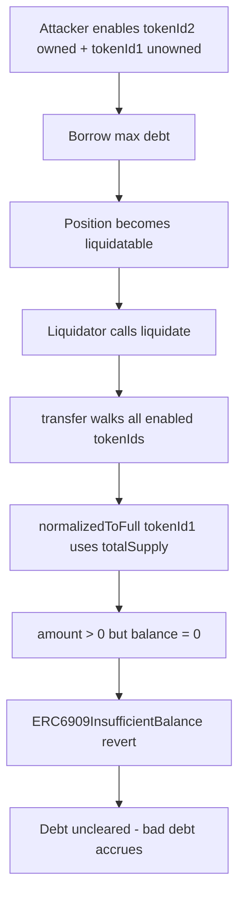

# VII Finance — liquidations can be made to revert by an attacker

> **Vulnerability classes:** liquidation-logic · fake-account-substitution · dos-resistance · access-roles

> **Reproduction:** a self-contained Foundry PoC that compiles & runs in an
> isolated project with **only `forge-std`** — no fork, no RPC.
> Full trace: [output.txt](output.txt). PoC:
> [test/61327-liquidations-can-be-made-to-revert-by-an-attacker-through-va_exp.sol](test/61327-liquidations-can-be-made-to-revert-by-an-attacker-through-va_exp.sol).

<!-- non-defihacklabs -->
<!-- source-auditvault: https://github.com/Auditware/AuditVault/blob/main/findings/61327-liquidations-can-be-made-to-revert-by-an-attacker-through-va.md -->
<!-- date: 2025-07 -->

**AuditVault taxonomy** — `lang/solidity` · `platform/cyfrin` · `has/poc` ·
`severity/high` · `sector/lending` · `sector/oracle` ·
genome: `fake-account-substitution` · `liquidation-logic` · `dos-resistance` · `access-roles` · `liquidation-underwater`

---

## Key info

| | |
|---|---|
| **Impact** | **HIGH** — an attacker can force liquidation of their underwater account to revert, so debt cannot be cleared and bad debt accrues in the vault |
| **Protocol** | [VII Finance](https://github.com/kankodu/vii-finance-smart-contracts) — Uniswap position wrappers as EVK collateral |
| **Vulnerable code** | `enableTokenIdAsCollateral` (no balance check) + `normalizedToFull` using `totalSupply` (see #61329); fee theft (#61328) is an alternate path |
| **Bug class** | Liquidation DoS via unowned collateral enable + transfer inflation |
| **Finding** | Cyfrin 2025-07-15 vii-v2.0 · AuditVault #61327 · reporter **Giovanni Di Siena** |
| **Report** | [Cyfrin vii-v2.0](https://github.com/solodit/solodit_content/blob/main/reports/Cyfrin/2025-07-15-cyfrin-vii-v2.0.md) |
| **Source** | [AuditVault](https://github.com/Auditware/AuditVault/blob/main/findings/61327-liquidations-can-be-made-to-revert-by-an-attacker-through-va.md) |
| **Status** | Fixed via #61328/#61329 mitigations; enable-without-balance alone becomes a zero transfer after the fix |
| **Compiler** | `^0.8.24` (PoC) |

---

## TL;DR

1. A borrower can `enableTokenIdAsCollateral` for a `tokenId` they do **not** hold.
2. Liquidation seizes value via `transfer`, which walks **all** enabled tokenIds.
3. `normalizedToFull` multiplies by `totalSupply(tokenId)` even when the sender's
   balance is 0 → tries to transfer a non-zero ERC-6909 amount → **reverts**.
4. Liquidation is permanently blocked; the underwater debt can become bad debt.

The report also documents fee-theft + transfer-inflation combinations; this PoC
reproduces the **minimal** enable-unowned-collateral path from
`test_blockLiquidationsPoC_enableCollateral`.

---

## The vulnerable code

```solidity
function normalizedToFull(uint256 tokenId, uint256 amount, uint256 currentBalance) public view returns (uint256) {
    return Math.mulDiv(amount, totalSupply(tokenId), currentBalance); // @> VULN
}

function enableTokenIdAsCollateral(uint256 tokenId) external {
    // missing: require(balanceOf(msg.sender, tokenId) > 0)
    _enabledTokenIds[msg.sender].push(tokenId);
}
```

**Recommended mitigations (from the report):**

- Decrement `tokensOwed` on partial unwrap (#61328).
- Use sender's tokenId balance in `normalizedToFull` (#61329).
- Consider blocking enable when the sender holds zero ERC-6909 of that tokenId.

---

## Root cause

Liquidation assumes every enabled tokenId is a real claim the violator can
transfer. Enabling unowned ids plus totalSupply-based normalization invents a
transfer amount the account cannot fund, turning a soft zero-value id into a hard
revert that aborts the entire liquidation.

## Preconditions

- Attacker can wrap at least one real position and enable an unowned `tokenId`.
- Attacker borrows against the wrapper collateral and becomes liquidatable.
- Liquidation path calls value-denominated `wrapper.transfer`.

## Attack walkthrough

1. Honest user wraps tokenId1; attacker wraps tokenId2.
2. Attacker enables **both** tokenId1 (balance 0) and tokenId2 as collateral.
3. Attacker borrows; position later becomes liquidatable.
4. Liquidator calls `liquidate` → `transfer` → for tokenId1,
   `normalizedToFull = yield * totalSupply(1) / bal` is non-zero while balance is 0.
5. Transfer reverts with `ERC6909InsufficientBalance`; debt remains.

## Diagrams



## Impact

Vault cannot liquidate the engineered position. As collateral value falls further,
bad debt socializes losses onto lenders. Fee-theft variants can also strand
liquidators after a "successful" partial seize (collateral unrecoverable).

## Sources

- [AuditVault finding #61327](https://github.com/Auditware/AuditVault/blob/main/findings/61327-liquidations-can-be-made-to-revert-by-an-attacker-through-va.md)
- [Cyfrin 2025-07-15 vii-v2.0 report](https://github.com/solodit/solodit_content/blob/main/reports/Cyfrin/2025-07-15-cyfrin-vii-v2.0.md)
- Related fixes: [8c6b6cc](https://github.com/kankodu/vii-finance-smart-contracts/commit/8c6b6cca4ed65b22053dc7ffaa0b77d06a160caf), [b7549f2](https://github.com/kankodu/vii-finance-smart-contracts/commit/b7549f2700af133ce98a4d6f19e43c857b5ea78a)
