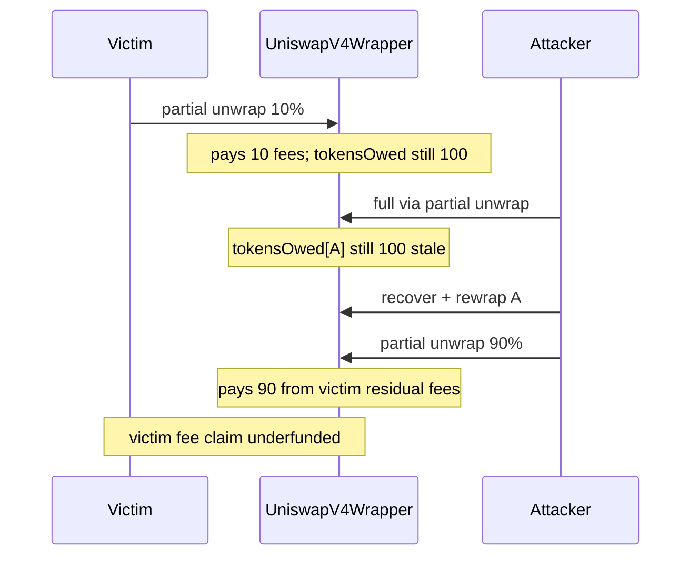

# VII Finance — fees stolen from partially unwrapped `UniswapV4Wrapper` positions

> **Vulnerability classes:** fee-theft · frozen-funds · fee-accounting · dos-resistance

> **Reproduction:** a self-contained Foundry PoC that compiles & runs in an
> isolated project with **only `forge-std`** — no fork, no RPC.
> Full trace: [output.txt](output.txt). PoC:
> [test/61328-fees-can-be-stolen-from-partially-unwrapped-uniswapv4wrapper_exp.sol](test/61328-fees-can-be-stolen-from-partially-unwrapped-uniswapv4wrapper_exp.sol).

<!-- non-defihacklabs -->
<!-- source-auditvault: https://github.com/Auditware/AuditVault/blob/main/findings/61328-fees-can-be-stolen-from-partially-unwrapped-uniswapv4wrapper.md -->
<!-- date: 2025-07 -->

**AuditVault taxonomy** — `lang/solidity` · `platform/cyfrin` · `has/poc` ·
`severity/high` · `sector/dex` · `sector/lending` · `sector/nft` ·
genome: `frozen-funds` · `fee-theft` · `fee-accounting` · `dos-resistance` · `liquidation-underwater`

---

## Key info

| | |
|---|---|
| **Impact** | **HIGH** — LP fees held for other ERC-6909 holders of a partially unwrapped Uniswap V4 position can be drained by re-wrapping a position whose stale `tokensOwed` was never decremented |
| **Protocol** | [VII Finance](https://github.com/kankodu/vii-finance-smart-contracts) — `UniswapV4Wrapper` |
| **Vulnerable code** | `UniswapV4Wrapper::_unwrap` — pays proportional fees from `tokensOwed` but never decrements it |
| **Bug class** | Stale fee accounting after partial unwrap / re-wrap |
| **Finding** | Cyfrin 2025-07-15 vii-v2.0 · AuditVault #61328 · reporter **Giovanni Di Siena** |
| **Report** | [Cyfrin vii-v2.0](https://github.com/solodit/solodit_content/blob/main/reports/Cyfrin/2025-07-15-cyfrin-vii-v2.0.md) |
| **Source** | [AuditVault](https://github.com/Auditware/AuditVault/blob/main/findings/61328-fees-can-be-stolen-from-partially-unwrapped-uniswapv4wrapper.md) |
| **Status** | Fixed in commit [8c6b6cc](https://github.com/kankodu/vii-finance-smart-contracts/commit/8c6b6cca4ed65b22053dc7ffaa0b77d06a160caf) |
| **Compiler** | `^0.8.24` (PoC) |

---

## TL;DR

1. Partial unwrap of a V4-wrapped position accumulates fees into `tokensOwed` and
   pays a proportional share to the unwrapper.
2. **`tokensOwed` is never decremented**, so the same fee claim can be reused.
3. After full-via-partial unwrap → recover NFT → re-wrap, the stale claim still
   points at fee balances that belong to other partially unwrapped holders.
4. Attacker drains those fees; victims' subsequent unwraps revert (DoS / bad debt path).

---

## The vulnerable code

```solidity
function _unwrap(address to, uint256 tokenId, uint256 amount, bytes calldata extraData) internal override {
    // ... accumulate fees into tokensOwed, decrease liquidity ...
    poolKey.currency0.transfer(to, amount0 + proportionalShare(tokenId, tokensOwed[tokenId].fees0Owed, amount)); // @> VULN
    poolKey.currency1.transfer(to, amount1 + proportionalShare(tokenId, tokensOwed[tokenId].fees1Owed, amount)); // @> VULN
}
```

**Recommended fix:**

```diff
+       uint256 proportionalFee0 = proportionalShare(tokenId, tokensOwed[tokenId].fees0Owed, amount);
+       uint256 proportionalFee1 = proportionalShare(tokenId, tokensOwed[tokenId].fees1Owed, amount);
+       tokensOwed[tokenId].fees0Owed -= proportionalFee0;
+       tokensOwed[tokenId].fees1Owed -= proportionalFee1;
-       poolKey.currency0.transfer(to, amount0 + proportionalShare(tokenId, tokensOwed[tokenId].fees0Owed, amount));
-       poolKey.currency1.transfer(to, amount1 + proportionalShare(tokenId, tokensOwed[tokenId].fees1Owed, amount));
+       poolKey.currency0.transfer(to, amount0 + proportionalFee0);
+       poolKey.currency1.transfer(to, amount1 + proportionalFee1);
```

---

## Root cause

Unlike Uniswap V3 (where `tokensOwed` lives in the NPM and is reduced by
`collect`), V4 settles fees into the wrapper. The wrapper must track residual
fees for multi-holder ERC-6909 positions. Paying from `tokensOwed` without
decrementing leaves a reusable claim that outlives the position's fee balance.

## Preconditions

- At least one position is partially unwrapped (fees sit in the wrapper).
- Attacker can fully unwrap (via partial overload), recover, and re-wrap a position.
- Stale `tokensOwed` for the attacker's `tokenId` is non-zero from a prior cycle.

## Attack walkthrough

1. Victim wraps position V; attacker wraps position A; both accrue 100 fees.
2. Victim partial-unwraps 10% → receives 10 fees; `tokensOwed[V]` still 100.
3. Attacker full-via-partial unwraps A (takes own 100 fees); `tokensOwed[A]` still 100.
4. Recover + re-wrap A (no new fees); stale `tokensOwed[A] = 100` survives.
5. Partial unwrap 90% of re-wrapped A pays 90 of stale claim from wrapper balance
   that still holds the victim's residual fees → **90 fee units stolen**.
6. Wrapper is short for the victim's remaining fee claim.

## Diagrams



## Impact

ERC-6909 holders of partially unwrapped positions lose accrued LP fees. Full
unwrap for remaining holders can revert, blocking liquidators from recovering
collateral and allowing bad debt to accrue (see also #61327).

## Sources

- [AuditVault finding #61328](https://github.com/Auditware/AuditVault/blob/main/findings/61328-fees-can-be-stolen-from-partially-unwrapped-uniswapv4wrapper.md)
- [Cyfrin 2025-07-15 vii-v2.0 report](https://github.com/solodit/solodit_content/blob/main/reports/Cyfrin/2025-07-15-cyfrin-vii-v2.0.md)
- Vulnerable source: [kankodu/vii-finance-smart-contracts](https://github.com/kankodu/vii-finance-smart-contracts) — `UniswapV4Wrapper::_unwrap` (fixed in 8c6b6cc)
