# VII Finance — more value extracted by liquidations than expected (`normalizedToFull`)

> **Vulnerability classes:** vuln/logic/liquidation-logic · liquidation-manipulation · integer-bounds

> **Reproduction:** a self-contained Foundry PoC that compiles & runs in an
> isolated project with **only `forge-std`** — no fork, no RPC, no `anvil_state`.
> Full trace: [output.txt](output.txt). PoC:
> [test/61329-more-value-can-be-extracted-by-liquidations-than-expected-du_exp.sol](test/61329-more-value-can-be-extracted-by-liquidations-than-expected-du_exp.sol).

<!-- non-defihacklabs -->
<!-- source-auditvault: https://github.com/Auditware/AuditVault/blob/main/findings/61329-more-value-can-be-extracted-by-liquidations-than-expected-du.md -->
<!-- date: 2025-07 -->

**AuditVault taxonomy** — `lang/solidity` · `platform/cyfrin` · `has/poc` ·
`severity/high` · `sector/dex` · `sector/lending` · `sector/nft` ·
genome: `liquidation-logic` · `liquidation-manipulation` · `variant` · `integer-bounds` · `liquidation-underwater`

---

## Key info

| | |
|---|---|
| **Impact** | **HIGH** — value-denominated collateral transfers (used in liquidations) seize more unit-of-account value than requested when the violator owns less than 100% of any enabled ERC-6909 `tokenId` |
| **Protocol** | [VII Finance](https://github.com/kankodu/vii-finance-smart-contracts) — Uniswap V3/V4 position wrappers as EVK collateral |
| **Vulnerable code** | `ERC721WrapperBase.normalizedToFull` — multiplies by `totalSupply(tokenId)` instead of the sender's balance |
| **Bug class** | Incorrect normalization in liquidation share transfer |
| **Finding** | Cyfrin 2025-07-15 vii-v2.0 · AuditVault #61329 · reporter **Giovanni Di Siena** |
| **Report** | [Cyfrin vii-v2.0](https://github.com/solodit/solodit_content/blob/main/reports/Cyfrin/2025-07-15-cyfrin-vii-v2.0.md) |
| **Source** | [AuditVault](https://github.com/Auditware/AuditVault/blob/main/findings/61329-more-value-can-be-extracted-by-liquidations-than-expected-du.md) |
| **Status** | Fixed in commit [b7549f2](https://github.com/kankodu/vii-finance-smart-contracts/commit/b7549f2700af133ce98a4d6f19e43c857b5ea78a) |
| **Compiler** | `^0.8.24` (PoC) |

---

## TL;DR

1. Liquidation / value transfer walks every enabled `tokenId` and converts a
   unit-of-account amount into an ERC-6909 amount via `normalizedToFull`.
2. `normalizedToFull` multiplies by **`totalSupply(tokenId)`** instead of the
   sender's **own** ERC-6909 balance of that `tokenId`.
3. When the violator owns less than 100% of any `tokenId`, each leg of the
   transfer is inflated; the liquidator receives **more value than requested**.
4. Fix: multiply by `balanceOf(sender, tokenId)`.

---

## The vulnerable code

```solidity
function normalizedToFull(uint256 tokenId, uint256 amount, uint256 currentBalance) public view returns (uint256) {
    // @audit => multiplying by the total ERC-6909 supply of the specified tokenId is incorrect
    return Math.mulDiv(amount, totalSupply(tokenId), currentBalance); // @> VULN
}
```

**Recommended fix:**

```diff
-       return Math.mulDiv(amount, totalSupply(tokenId), currentBalance);
+       return Math.mulDiv(amount, balanceOf(_msgSender(), tokenId), currentBalance);
```

---

## Root cause

`balanceOf(sender)` is the sum of unit-of-account values across enabled
tokenIds. For each tokenId the code must convert `amount / currentBalance` into
a fraction of the **sender's** claim on that tokenId. Using `totalSupply` treats
the sender as if they owned 100% of every tokenId, so partial ownership inflates
the ERC-6909 amount transferred on every other leg as well.

## Preconditions

- Sender has enabled multiple tokenIds (or one partially owned tokenId).
- Sender owns less than 100% of at least one enabled tokenId (prior partial
  transfer / partial liquidation / shared position).
- A value-denominated `transfer(to, amount)` is executed (liquidation path).

## Attack walkthrough

1. Borrower wraps two positions (tokenId1, tokenId2), full supply 100 each.
2. Borrower transfers half of tokenId1 to another account → owns 50 + 100 = 150 value.
3. Liquidator requests transfer of 75 (half of remaining value).
4. Bug: tokenId1 transfers `75 * 100 / 150 = 50` (all remaining); tokenId2
   transfers `75 * 100 / 150 = 50` → **100 value seized vs 75 requested** (+25 surplus).
5. Correct formula would transfer 25 + 50 = 75.

## Diagrams

```mermaid
flowchart TD
    A["Borrower owns tokenId1:50 and tokenId2:100"] --> B["balanceOf = 150"]
    B --> C["transfer liquidator amount=75"]
    C --> D{"normalizedToFull uses totalSupply?"}
    D -->|bug| E["tokenId1: 75*100/150=50<br/>tokenId2: 75*100/150=50"]
    E --> F["liquidator value = 100 > 75"]
    D -->|fix| G["tokenId1: 75*50/150=25<br/>tokenId2: 75*100/150=50"]
    G --> H["liquidator value = 75 exact"]
```



## Impact

Liquidated accounts incur larger losses than the liquidation parameters
specify. Repeated partial liquidations amplify the surplus extraction.

## Sources

- [AuditVault finding #61329](https://github.com/Auditware/AuditVault/blob/main/findings/61329-more-value-can-be-extracted-by-liquidations-than-expected-du.md)
- [Cyfrin 2025-07-15 vii-v2.0 report](https://github.com/solodit/solodit_content/blob/main/reports/Cyfrin/2025-07-15-cyfrin-vii-v2.0.md)
- Vulnerable source: [kankodu/vii-finance-smart-contracts](https://github.com/kankodu/vii-finance-smart-contracts) — `ERC721WrapperBase.normalizedToFull` (fixed in b7549f2)
