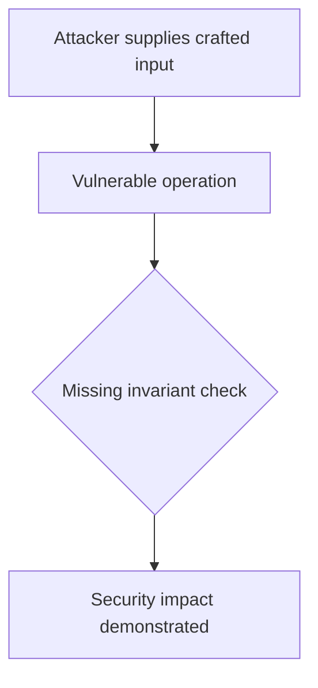
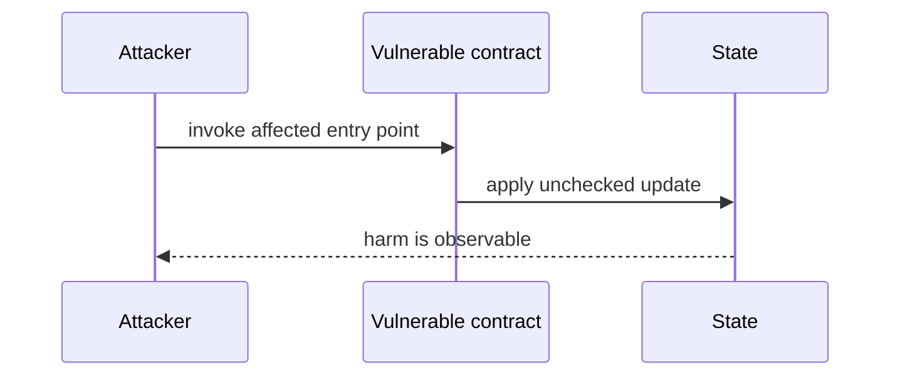

# Session key can be consumed by another smart wallet — AuditVault synthetic reduction

> **Vulnerability classes:** vuln/access-control/missing-owner-check · vuln/auth/signature-validation
>
> **Reproduction:** self-contained Foundry PoC with an offline synthetic contract. Full trace: [output.txt](output.txt).

<!-- non-defihacklabs -->
<!-- source-auditvault: https://github.com/Auditware/AuditVault/blob/main/findings/61396-h-01-session-key-can-be-consumed-by-unauthorized-scw-shieldi.md -->
<!-- date: 2025-01 -->

**AuditVault finding:** `61396` · `[H-01] Session Key Can Be Consumed by Unauthorized SCW`

## Key info

| | |
|---|---|
| **Impact** | **HIGH** — Session key can be consumed by another smart wallet |
| **Protocol** | [[Etherspot]] Credibleaccountmodule Mitigation |
| **Finding** | AuditVault #61396 |
| **Report** | [https://github.com/shieldify-security/audits-portfolio-md/blob/main/Etherspot-CredibleAccountModule-Mitigation-Security-Review.md](https://github.com/shieldify-security/audits-portfolio-md/blob/main/Etherspot-CredibleAccountModule-Mitigation-Security-Review.md) |
| **Source** | [AuditVault finding](https://github.com/Auditware/AuditVault/blob/main/findings/61396-h-01-session-key-can-be-consumed-by-unauthorized-scw-shieldi.md) |
| **Compiler** | `^0.8.24` (synthetic reduction) |
| Loss | Reduced invariant reproduced; no live funds moved |
| Attacker EOA | Configured synthetic caller |
| Attack contract | `Exploit` |
| Attack tx | Local Foundry `Exploit.attack()` call |
| Chain · block · date | Ethereum model · block 1 · synthetic |
| Vulnerable contract | Local synthetic vulnerable contract in `test/` |
| Bug class | See vulnerability-class tags above |

## TL;DR

The bug report describes an issue with the CredibleAccountModule contract, where there is a lack of check to verify that the session key being used belongs to the actual sender. This can lead to unauthorized consumption of session keys and bypassing of validation checks. A proof of concept is provided to demonstrate how a malicious wallet can exploit this bug. The recommendation is to add a check in the `_validateSessionKeyParams()` function to ensure that the consumer of the session is the owner of the recovered `sessionKeySigner`. The team has responded that they have fixed the issue.

## Background

The upstream report is a Solidity finding. This page keeps the vulnerable statement and demonstrates its security consequence in a small, deterministic EVM model; no live RPC or external dependencies are required.

## The vulnerable code

```solidity
// The exact vulnerable pattern is retained in test/61396-h-01-session-key-can-be-consumed-by-unauthorized-scw-shieldi.sol.
// @> see the marked statement in the synthetic reduction
```

## Root cause

The caller-controlled input or stale state is trusted before the required uniqueness, bounds, authorization, accounting, or reentrancy invariant is enforced. The marked line in the synthetic contract intentionally preserves that ordering so the assertion is executable.

## Preconditions

- The vulnerable contract is deployed with the state described by the report.
- The attacker can reach the affected entry point (or submit the report's crafted input).

## Attack walkthrough

1. `Exploit.run()` initializes the minimal state from the report.
2. The marked vulnerable operation executes without its required check.
3. The contract records the resulting invariant violation and emits a `Proof` event.
4. The test asserts the harm; the passing trace is recorded at [output.txt:4](output.txt).

## Diagrams





## Remediation

Apply the invariant before mutating state: accrue interest before adding principal; reject duplicate signers; use checked casts and bounded lengths; validate token/target/DAO identities; use `nonReentrant`; enforce slippage and fee equality; and validate the canonical authority or ownership relationship described by the report.

## How to reproduce

```bash
cd evm-hack-registry/61396-h-01-session-key-can-be-consumed-by-unauthorized-scw-shieldi_exp
forge test -vvvvv
```

The test is offline and uses only the shared `forge-std` library. The corresponding Playground bundle is generated from `scripts/poc-configs/61396-h-01-session-key-can-be-consumed-by-unauthorized-scw-shieldi.mjs`.

## Sources

- [AuditVault finding](https://github.com/Auditware/AuditVault/blob/main/findings/61396-h-01-session-key-can-be-consumed-by-unauthorized-scw-shieldi.md)
- [https://github.com/shieldify-security/audits-portfolio-md/blob/main/Etherspot-CredibleAccountModule-Mitigation-Security-Review.md](https://github.com/shieldify-security/audits-portfolio-md/blob/main/Etherspot-CredibleAccountModule-Mitigation-Security-Review.md)
- [Synthetic test](test/61396-h-01-session-key-can-be-consumed-by-unauthorized-scw-shieldi.sol)

*Reference: https://github.com/shieldify-security/audits-portfolio-md/blob/main/Etherspot-CredibleAccountModule-Mitigation-Security-Review.md*
