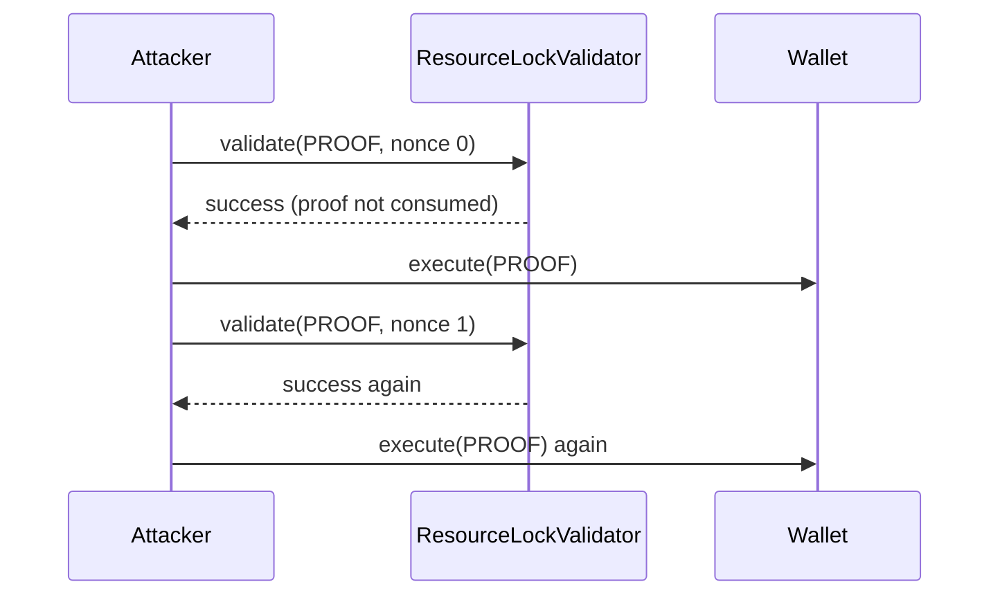

# Etherspot ResourceLockValidator — replayable signature proof

> **Vulnerability classes:** vuln/bridge/replay · vuln/auth/signature-replay
>
> **Reproduction:** local synthetic Foundry reduction; the complete passing trace is in [output.txt](output.txt).

<!-- non-defihacklabs -->
<!-- source-auditvault: https://github.com/Auditware/AuditVault/blob/main/findings/61409-c-07-in-resourcelockvalidator-the-validateuserop-function-is.md -->
<!-- date: 2025-01 -->

## Key info

| Field | Value |
|---|---|
| Loss | The same resource-lock call executes twice; no live funds are moved in this synthetic. |
| Vulnerable contract | `ResourceLockValidator.validate` (reduced in [test/61409-c-07-resource-lock-validator-signature-proof-replay.sol](test/61409-c-07-resource-lock-validator-signature-proof-replay.sol)) |
| Attacker EOA | `0x1111111111111111111111111111111111111111` (configured runner caller) |
| Attack contract | `Exploit` |
| Attack tx | Local Foundry `Exploit.run()` |
| Chain · block · date | Ethereum model · block 0 · synthetic |
| Compiler | Solidity `^0.8.24` |
| Bug class | Replayable proof / missing nonce or consumed-proof state |

## TL;DR

The validator checks a ResourceLock Merkle proof but never consumes it. EntryPoint can therefore submit the same call data with a different nonce, and the wallet executes the signed action repeatedly.

## Background

ResourceLock authorization is intentionally narrower than ordinary account nonce validation. It must bind a proof to a one-time call (or maintain a nonce/consumed set) before returning validation success.

## The vulnerable code

The synthetic preserves the audited operation with an `@> VULN` marker:

```solidity
function validate(bytes32 proof, uint256 /*nonce*/) external returns (bool) {
    validations++;
    // @> VULN: proof is accepted without recording it as consumed.
    return proof != bytes32(0);
}
```

Full source: [test/61409-c-07-resource-lock-validator-signature-proof-replay.sol](test/61409-c-07-resource-lock-validator-signature-proof-replay.sol).

## Root cause

The validator treats the EntryPoint nonce as sufficient even though the signed hash is reconstructed from ResourceLock call data only. No proof hash is stored as consumed, so a fresh nonce does not create a fresh authorization.

## Preconditions

- A wallet has installed the ResourceLock validator and a valid signed proof exists.
- The EntryPoint accepts a subsequent nonce for the same call data.
- The validator is reached without a one-time proof/nonce check.

## Attack walkthrough

1. `Exploit.run()` validates `PROOF` with nonce `0` and executes the wallet.
2. It submits the identical `PROOF` with nonce `1`; `validate` returns true again.
3. The wallet execution counter reaches `2`, proving replay. The passing assertion is recorded at [output.txt:355](output.txt#L355).

## Diagrams



## Remediation

Hash the nonce into the signed ResourceLock authorization and reject a proof hash already present in a consumed mapping. Mark it consumed atomically before executing the call.

## How to reproduce

```bash
cd evm-hack-registry/61409-c-07-resource-lock-validator-signature-proof-replay_exp
forge test -vvvvv
```

## Sources

- [AuditVault finding #61409](https://github.com/Auditware/AuditVault/blob/main/findings/61409-c-07-in-resourcelockvalidator-the-validateuserop-function-is.md)
- [Shieldify Etherspot review](https://github.com/shieldify-security/audits-portfolio-md/blob/main/Etherspot-CredibleAccountModule-Security-Review.md)
- [Synthetic test](test/61409-c-07-resource-lock-validator-signature-proof-replay.sol)

*Reference: https://github.com/shieldify-security/audits-portfolio-md/blob/main/Etherspot-CredibleAccountModule-Security-Review.md*
