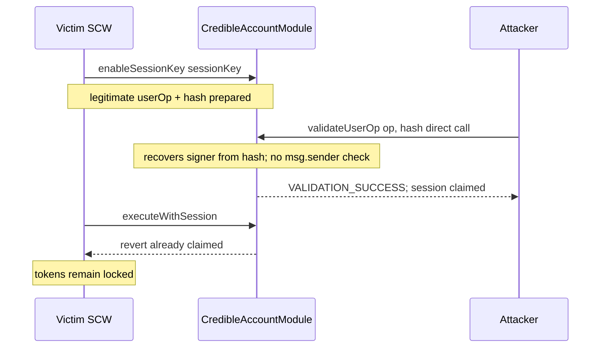

# Etherspot CredibleAccountModule — [H-01] no check for `userOp` / `userOpHash` mismatch nor sender validity

> **Vulnerability classes:** missing-modifier · direct-drain · account-signer · reward-accounting

> **Reproduction:** a self-contained Foundry PoC that compiles & runs in an
> isolated project with **only `forge-std`** — no fork, no RPC.
> Full trace: [output.txt](output.txt). PoC:
> [test/61411-h-01-no-check-for-userop-and-userophash-mismatch-nor-the-val_exp.sol](test/61411-h-01-no-check-for-userop-and-userophash-mismatch-nor-the-val_exp.sol).

<!-- non-defihacklabs -->
<!-- source-auditvault: https://github.com/Auditware/AuditVault/blob/main/findings/61411-h-01-no-check-for-userop-and-userophash-mismatch-nor-the-val.md -->
<!-- date: 2025-01 -->

**AuditVault taxonomy** — `lang/solidity` · `platform/shieldify` · `has/poc` ·
`severity/high` · `sector/account` · `sector/stable` · `sector/staking` ·
genome: `missing-modifier` · `direct-drain` · `account-signer` · `reward-accounting`

---

## Key info

| | |
|---|---|
| **Impact** | **HIGH** — an attacker can call `validateUserOp` directly with a victim's valid `(userOp, userOpHash)`, claim the session key, and brick the real modular account from consuming the session (tokens remain locked / session unusable) |
| **Protocol** | [Etherspot](https://github.com/etherspot/etherspot-modular-accounts) — `CredibleAccountModule` |
| **Vulnerable code** | `CredibleAccountModule.validateUserOp` — recovers signer from `userOpHash` and mutates state from `userOp` without binding them or checking `msg.sender` |
| **Bug class** | Missing authentication / hash binding on ERC-4337 validation entrypoint |
| **Finding** | Shieldify Security Review · AuditVault #61411 |
| **Report** | [Etherspot CredibleAccountModule Security Review](https://github.com/shieldify-security/audits-portfolio-md/blob/main/Etherspot-CredibleAccountModule-Security-Review.md) |
| **Source** | [AuditVault](https://github.com/Auditware/AuditVault/blob/main/findings/61411-h-01-no-check-for-userop-and-userophash-mismatch-nor-the-val.md) |
| **Status** | Fixed by the team |
| **Compiler** | `^0.8.24` (PoC) |

---

## TL;DR

1. `validateUserOp(userOp, userOpHash)` derives `sessionKeySigner` from **`userOpHash`**
   and validates params against **`userOp`**.
2. There is **no** check that `userOp.sender == msg.sender`, and **no** check that
   `userOpHash` is the EIP-4337 hash of that `userOp`.
3. Anyone can replay a victim's signed hash with the victim's op data by calling
   the module **directly** (not via EntryPoint/SCW), claiming the session.
4. The real modular account can no longer execute the session path; locked tokens
   cannot be released through that session.

---

## The vulnerable code

```solidity
function validateUserOp(PackedUserOperation calldata userOp, bytes32 userOpHash) ... {
    if (userOp.signature.length < 65) return VALIDATION_FAILED;
    bytes memory sig = _digestSignature(userOp.signature);
    address sessionKeySigner = ECDSA.recover(ECDSA.toEthSignedMessageHash(userOpHash), sig);
    if (!validateSessionKeyParams(sessionKeySigner, userOp)) {
        return VALIDATION_FAILED;
    }
    // @> VULN: no userOp.sender == msg.sender, no hash(userOp) binding
    sessionClaimed[sessionKeySigner] = true;
}
```

**Recommended fix:**

```diff
+   require(userOp.sender == msg.sender, "sender");
+   // optional but stronger: require(userOpHash == getUserOpHash(userOp), "hash mismatch");
```

---

## Root cause

ERC-4337's EntryPoint is expected to be the only caller of `validateUserOp` and
to supply a correctly bound hash. The module trusted that ambient guarantee
instead of enforcing it. Direct external calls therefore get full session-claim
side effects with attacker-chosen `msg.sender`.

## Preconditions

- Victim modular account has installed the module and enabled a session key.
- Attacker observes or constructs a valid `(userOp, userOpHash, signature)` for that session.
- Module is callable externally (not restricted to EntryPoint / account).

## Attack walkthrough

1. Victim SCW enables session key with locked tokens for a solver claim.
2. A legitimate `PackedUserOperation` is prepared for the SCW sender.
3. Attacker calls `module.validateUserOp(op, hash)` **directly**.
4. Session is marked claimed; validation returns success.
5. Victim SCW's subsequent `executeWithSession` reverts (`already claimed`).
6. Locked tokens remain locked — session burned without legitimate release.

## Diagrams



## Impact

Malicious parties can consume other modular accounts' session signatures,
preventing legitimate solvers/users from releasing locked tokens via that session.
High impact loss-of-liveness / funds-stuck for affected accounts.

## Sources

- [AuditVault finding #61411](https://github.com/Auditware/AuditVault/blob/main/findings/61411-h-01-no-check-for-userop-and-userophash-mismatch-nor-the-val.md)
- [Shieldify — Etherspot CredibleAccountModule Security Review](https://github.com/shieldify-security/audits-portfolio-md/blob/main/Etherspot-CredibleAccountModule-Security-Review.md)
- Vulnerable source: [etherspot/etherspot-modular-accounts@d4774db](https://github.com/etherspot/etherspot-modular-accounts/blob/d4774db9f544cc6f69000c55e97627f93fe7242b/src/modules/validators/CredibleAccountModule.sol#L272-L273)
