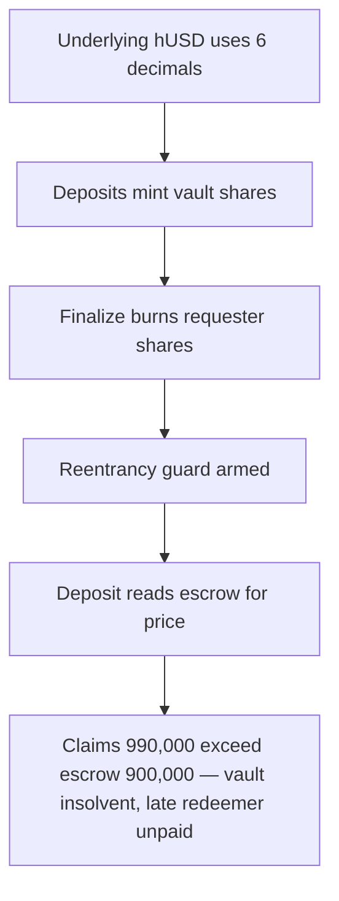

# Blueberry: `requestRedeem` never deducts redemption requests from vault totals

> **Vulnerability classes:** vuln/logic · vuln/accounting
>
> **Reproduction:** a faithful minimal reproduction of the vulnerable finding — `HyperEvmVault.requestRedeem` is reproduced **verbatim** (marked `@>`) with faithful minimal doubles for the ERC20 shares, escrow, and finalize paths; local deploy, no fork.

<!-- source-auditvault: https://github.com/pashov/audits/blob/master/team/md/Blueberry-security-review_2025-03-12.md -->

## Root cause

`HyperEvmVault.requestRedeem()` records a redemption request into `request` and `$.totalRedeemRequests`, but never subtracts the requested shares/assets from `totalSupply()` or the `tvl()` escrow. Until the request is finalized, every share-price calculation (`assets = shares.mulDivDown(tvl(), totalSupply())`) still counts the already-spoken-for shares and assets, so the reported price stays stale and inflated for every other user. The vulnerable lines, reproduced verbatim:

```solidity
function requestRedeem(uint256 shares_) external nonReentrant {
        V1Storage storage $ = _getV1Storage();
        uint256 balance = this.balanceOf(msg.sender);
        // Determine if the user withdrawal request is valid
        require(shares_ <= balance, Errors.INSUFFICIENT_BALANCE());

        RedeemRequest storage request = $.redeemRequests[msg.sender];
        request.shares += shares_;
        require(request.shares <= balance, Errors.INSUFFICIENT_BALANCE());

        // User will redeem assets at the current share price
        uint256 tvl_ = _totalEscrowValue($);
        _takeFee($, tvl_);
        uint256 assetsToRedeem = shares_.mulDivDown(tvl_, totalSupply());

        request.assets += uint64(assetsToRedeem);
@>      $.totalRedeemRequests += uint64(assetsToRedeem); // recorded, but totalSupply() and tvl() are NOT reduced
        --snip--
    }
```

`request.assets` and `$.totalRedeemRequests` are incremented, so the claim is locked at the current price — but `totalSupply()` and the escrow returned by `_totalEscrowValue()`/`tvl()` are left untouched. The redemption is fully spoken for, yet the vault still prices everyone else as if those shares and assets were unclaimed.

## Why it's exploitable here

Following the finding's worked example on a 6-decimal token:

1. **WHALE** deposits `900,000` and **LATE** deposits `100,000` at price 1 — escrow and `totalSupply()` both reach `1,000,000`.
2. WHALE calls `requestRedeem` for all `900,000` shares, locking a `900,000` claim at price 1. The vulnerable line records the request but leaves `totalSupply()` at `1,000,000` and the escrow at `1,000,000`.
3. The vault loses `100,000` to bad debt — escrow drops to `900,000`, supply still `1,000,000`.
4. LATE calls `requestRedeem` for its `100,000` shares. Priced against the stale totals (`900,000 / 1,000,000 = 0.9`), it is credited a `90,000` claim — backed by assets already reserved for WHALE.
5. Outstanding claims `900,000 + 90,000 = 990,000` now exceed the `900,000` escrow: the vault is insolvent by `90,000`. WHALE finalizes first and is paid `900,000` in full, draining escrow; LATE finalizes and receives nothing — `90,000` of user funds are frozen/lost.

## Attack path



## Marked-line walkthrough (Playground)

The EVM Playground pins each step to the exact executed source line in `0x671d353a…`:

1. **L54** — Underlying hUSD uses 6 decimals: Setup: the vault escrows a 6-decimal hUSD token, fixing the unit for every share-price and redemption-claim calculation that follows.
2. **L113** — Deposits mint vault shares: Setup: each deposit mints shares and grows totalSupply; both honest users deposit at price 1, so escrow and supply both reach 1,000,000.
3. **L118** — Finalize burns requester shares: On finalize the vault burns the requester's shares to settle their price-locked claim against whatever escrow is left.
4. **L143** — Reentrancy guard armed: Setup: requestRedeem's nonReentrant guard starts unlocked; the flaw is missing accounting, not reentrancy, so the guard never helps.
5. **L175** — Deposit reads escrow for price: Setup: deposit reads current escrow (tvl) to price minted shares; this escrow-over-supply ratio is exactly what requestRedeem later leaves stale.
6. **L205** — Requests never deducted from totals: Root cause: requestRedeem records the request but never subtracts it from totalSupply()/tvl(), so a later redeemer is mispriced and finalize can't pay all.
7. **L209** — Finalize pays the locked claim: finalizeRedeem pays each price-locked claim from remaining escrow; the whale drains it in full, leaving the late redeemer's 90,000 claim unpaid.

## PoC

Registry (Foundry, local deploy — verbatim vulnerable source + harm-asserting test):

```bash
cd 61454-h-01-unapproved-requests-are-not-deducted-from-total-assets_exp && forge test -vvv
```

The browser Playground replays the same synthetic opcode-for-opcode and measures the harm: **two users deposit at price 1, a whale requests redemption, the vault loses value, and a later redeemer is credited a claim against the stale totals — outstanding claims (990,000) exceed escrow (900,000), leaving the vault insolvent by 90,000 hUSD**. Both gates are green (registry `forge test` PASS + Playground `_verify-poc` **VERDICT: PASS**).
