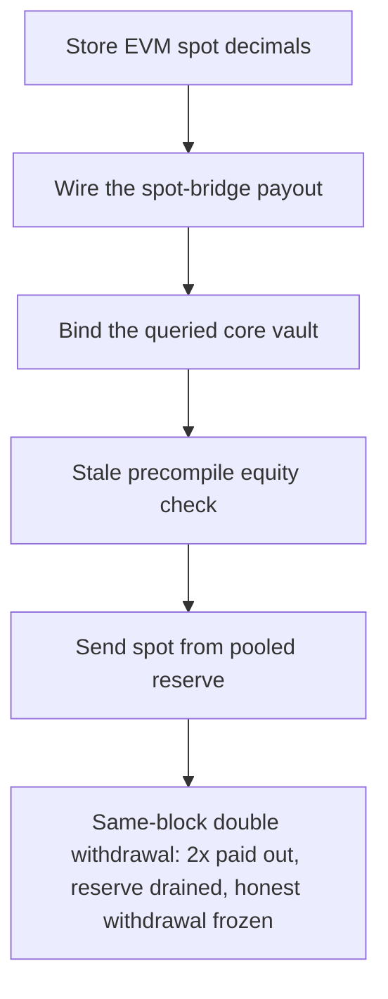

# Blueberry: `withdraw()` equity check bypassed by a stale once-per-block precompile

> **Vulnerability classes:** vuln/theft · vuln/frozen-funds · vuln/logic
>
> **Reproduction:** a faithful minimal reproduction of the vulnerable finding — the vulnerable `withdraw()` equity check and `_vaultEquity()` precompile read are reproduced **verbatim** (marked `@>`) with faithful minimal doubles; local deploy, no fork.

<!-- source-auditvault: https://github.com/pashov/audits/blob/master/team/md/Blueberry-security-review_2025-03-12.md -->

## Root cause

In `VaultEscrow`, `withdraw()` guards the requested amount with `require(assets_ <= _vaultEquity(), ...)`, and `_vaultEquity()` reads the vault's equity from the HyperCore vault-equity precompile at `VAULT_EQUITY_PRECOMPILE_ADDRESS` (`0x…0802`). Per the HyperLiquid docs that precompile is synced Core→EVM only **once, at block construction** — it is not updated per transaction, so multiple same-block withdrawals all read the same stale equity and each passes the check. The vulnerable lines, reproduced verbatim:

```solidity
    address public constant VAULT_EQUITY_PRECOMPILE_ADDRESS = 0x0000000000000000000000000000000000000802;

    function withdraw(uint64 assets_) external override onlyVaultWrapper {
@>        require(assets_ <= _vaultEquity(), Errors.INSUFFICIENT_VAULT_EQUITY());
        uint256 amountPerp = (_perpDecimals > _evmSpotDecimals)
            ? assets_ * (10 ** (_perpDecimals - _evmSpotDecimals))
            : assets_ / (10 ** (_evmSpotDecimals - _perpDecimals));

        L1_WRITE_PRECOMPILE.sendVaultTransfer(_vault, false, uint64(amountPerp));
        L1_WRITE_PRECOMPILE.sendUsdClassTransfer(uint64(amountPerp), false);
        L1_WRITE_PRECOMPILE.sendSpot(HYPERLIQUID_SPOT_BRIDGE, _assetIndex, assets_);
    }
```
```solidity
    function _vaultEquity() internal view returns (uint256) {
        (bool success, bytes memory result) =
            VAULT_EQUITY_PRECOMPILE_ADDRESS.staticcall(abi.encode(address(this), _vault));
        require(success, "VaultEquity precompile call failed");

        UserVaultEquity memory userVaultEquity = abi.decode(result, (UserVaultEquity));

        uint256 equityInSpot = (_perpDecimals > _evmSpotDecimals)
            ? userVaultEquity.equity / (10 ** (_perpDecimals - _evmSpotDecimals))
            : userVaultEquity.equity * (10 ** (_evmSpotDecimals - _perpDecimals));

        return equityInSpot;
    }
```

The equity the check trusts is a block-level snapshot, not live per-transaction state. Nothing decrements it when a withdrawal is paid out, so the guard is only correct for the *first* withdrawal in a block.

## Why it's exploitable here

Following the finding's worked example, with the attacker holding a real vault equity of `1000 USDC` and an honest depositor's `1000 USDC` pooled in the same reserve:

1. Block-start sync writes the escrow's equity (`1000`) into the precompile. It is **not** resynced between transactions in that block.
2. Withdrawal #1: `assets_ = 1000 <= _vaultEquity() = 1000` passes; `sendSpot` pays out `1000 USDC` from the pooled reserve.
3. Withdrawal #2, same block: the precompile still reports `1000` (stale — it was never reduced by #1), so the check passes **again** and another `1000 USDC` is paid out.
4. The attacker walks away with `2000 USDC` on a real equity of `1000` — a `1000 USDC` direct drain of the honest depositor's pooled funds.
5. The pooled reserve is now empty, so the honest depositor's later withdrawal reverts on the spot delivery — their funds are frozen (the finding's "Bob's transaction will be reverted").

## Attack path



## Marked-line walkthrough (Playground)

The EVM Playground pins each step to the exact executed source line in `0xbd4fd5a3…`:

1. **L154** — Store EVM spot decimals: Setup: The escrow records the EVM spot decimals used to scale the HyperCore vault equity into the withdrawable spot amount the check compares against.
2. **L168** — Wire the spot-bridge payout: Setup: The constructor wires the HyperLiquid spot-bridge address that routes withdrawn funds out of the pooled reserve to the caller.
3. **L173** — Bind the queried core vault: Setup: The constructor binds the core vault whose equity the withdraw check later queries from the HyperCore precompile.
4. **L181** — Stale precompile equity check: Root cause: withdraw() gates assets_ against _vaultEquity(), a stale once-per-block precompile read, so every same-block withdrawal passes the check.
5. **L190** — Send spot from pooled reserve: The bypassed check lets sendSpot deliver the full requested assets from the pooled reserve to the caller on each same-block withdrawal.
6. **L193** — Query vault-equity precompile: _vaultEquity() staticcalls the HyperCore vault-equity precompile at 0x...0802, the sole equity source the withdraw check trusts.
7. **L201** — Scale and return stale equity: It scales the precompile's equity into spot units and returns it; that value never drops mid-block, so back-to-back withdrawals see the same cap.

## PoC

Registry (Foundry, local deploy — verbatim vulnerable source + harm-asserting test):

```bash
cd 61455-h-02-withdraw-check-can-be-bypassed-pashov-audit-group-none_exp && forge test -vvv
```

The browser Playground replays the same synthetic opcode-for-opcode and measures the harm: **two same-block withdrawals both pass the stale-equity check, paying out 2x the attacker's real equity, draining the pooled reserve and freezing the honest depositor's withdrawal**. Both gates are green (registry `forge test` PASS + Playground `_verify-poc` **VERDICT: PASS**).
