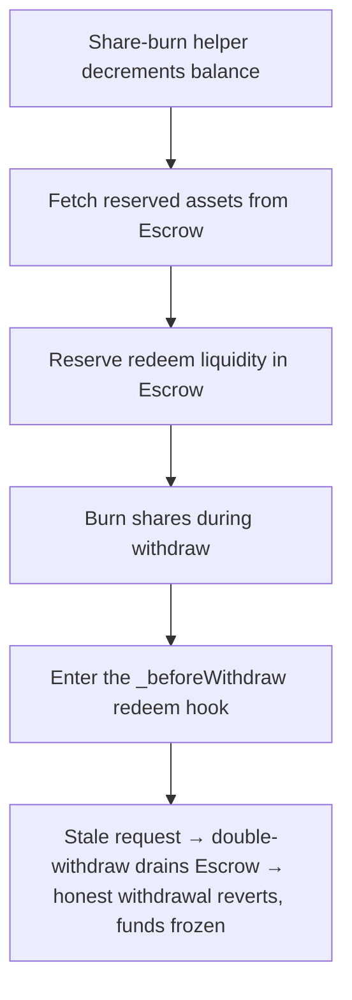

# Blueberry HyperEvmVault: a never-cleared redeem request blocks other withdrawals

> **Vulnerability classes:** vuln/frozen-funds · vuln/logic
>
> **Reproduction:** a faithful minimal reproduction of the vulnerable finding — the `_beforeWithdraw` and `_beforeTransfer` redeem hooks are reproduced **verbatim** (the vulnerable line marked `@>`) with faithful minimal doubles for the share token, the liquid Escrow, and the underlying USDC; local deploy, no fork.

<!-- source-auditvault: https://github.com/pashov/audits/blob/master/team/md/Blueberry-security-review_2025-03-12.md -->

## Root cause

In HyperEvmVault the redeem is a two-step flow: `requestRedeem` records a `RedeemRequest` and reserves the assets in a shared Escrow, then `withdraw` calls `_beforeWithdraw` to deduct that request and pay out. `_beforeWithdraw` loads the caller's request into a **memory** copy and decrements it, but never writes the updated struct back to `$.redeemRequests[msg.sender]` — so the stored request is never reduced. The vulnerable lines, reproduced verbatim:

```solidity
    function _beforeWithdraw(uint256 assets_, uint256 shares_) internal {
        V1Storage storage $ = _getV1Storage();
@>        RedeemRequest memory request = $.redeemRequests[msg.sender];
        require(request.assets >= assets_, Errors.WITHDRAW_TOO_LARGE());
        require(request.shares >= shares_, Errors.WITHDRAW_TOO_LARGE());
        request.assets -= uint64(assets_);
        request.shares -= shares_;
        $.totalRedeemRequests -= uint64(assets_);
        _fetchAssets(assets_);
    }
```

Because `request` is a memory copy, the `request.assets -= ...` / `request.shares -= ...` decrements are discarded when the function returns. The stored request keeps its full original value forever. The recommended fix is a single line: `$.redeemRequests[msg.sender] = request;`.

## Why it's exploitable here

Following the finding's worked example, with share price 1:1:

1. The honest depositor (Bob) deposits `1000` USDC and calls `requestRedeem(1000)`, reserving `1000` USDC in the shared Escrow for his future withdraw.
2. The attacker (Alice) deposits `2000` USDC and calls `requestRedeem(1000)`, reserving another `1000` in the Escrow (Escrow now holds `2000`).
3. The attacker calls `withdraw(1000, 1000)`. `_beforeWithdraw` passes its `require` checks against the full request, pulls `1000` from the Escrow, and pays it out — but the stored request stays at `1000` instead of dropping to zero.
4. The attacker calls `withdraw(1000, 1000)` **again**. The checks still see the stale full request, so the call succeeds and pulls a second `1000` out of the Escrow — twice the attacker's single reservation.
5. Bob calls `withdraw(1000, 1000)`. His reserved liquidity is gone, so `_fetchAssets` reverts on the drained Escrow. Bob's `1000` USDC is frozen. As a bonus, his `request.shares` also stays `> 0`, so `_beforeTransfer` permanently blocks him from transferring his shares.

## Attack path



## Marked-line walkthrough (Playground)

The EVM Playground pins each step to the exact executed source line in `0xce01759b…`:

1. **L147** — Share-burn helper decrements balance: Setup: the vault's _burn helper subtracts redeemed shares from the caller's balance, checked so an over-burn would revert.
2. **L164** — Fetch reserved assets from Escrow: Setup: _fetchAssets pulls the requested assets out of the shared Escrow, and reverts once the Escrow has been drained.
3. **L183** — Reserve redeem liquidity in Escrow: Setup: requestRedeem moves the requested assets into the shared Escrow, reserving that liquidity for the caller's later withdraw.
4. **L192** — Burn shares during withdraw: Setup: withdraw burns the caller's shares and pays out assets, right after the vulnerable _beforeWithdraw hook runs.
5. **L208** — Enter the _beforeWithdraw redeem hook: Setup: withdraw calls _beforeWithdraw, the second redeem step meant to deduct the caller's outstanding request before payout.
6. **L210** — Request loaded into memory copy: Root cause: the redeem request is read into a memory copy, so the decrements below never persist and the stored request is never cleared.
7. **L227** — Transfer guard reads stale request: The transfer guard blocks moving shares while request.shares > 0, which the never-cleared request keeps true forever, locking the shares.

## PoC

Registry (Foundry, local deploy — verbatim vulnerable source + harm-asserting test):

```bash
cd 61457-h-04-malicious-users-may-block-other-withdrawals-pashov-audi_exp && forge test -vvv
```

The browser Playground replays the same synthetic opcode-for-opcode and measures the harm: **one redeem request of 1000 USDC withdrawn twice against the never-cleared request, draining the shared Escrow so an honest depositor's reserved 1000 USDC withdrawal reverts (funds frozen)**. Both gates are green (registry `forge test` PASS + Playground `_verify-poc` **VERDICT: PASS**).
