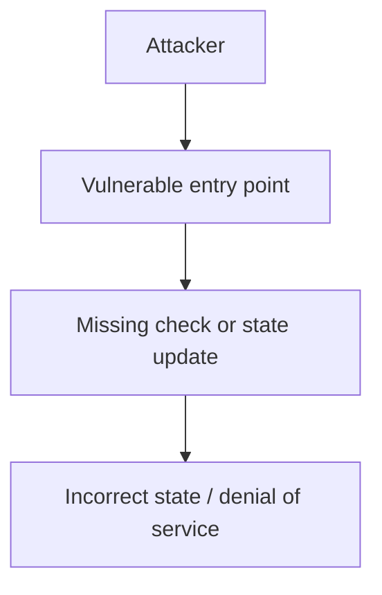

# Blueberry approved withdrawal drain — AuditVault 61458

<!-- non-defihacklabs -->
<!-- source-auditvault: https://github.com/Auditware/AuditVault/blob/main/findings/61458.md -->
<!-- date: 2025-03 -->

> **Vulnerability classes:** vuln/access-control/missing-auth · vuln/logic/missing-validation

> **Reproduction:** Fully local synthetic reduction. Run `forge test -vvv` in this folder; no live RPC is required.

## Key info

| Field | Value |
| --- | --- |
| Protocol | Audit finding 61458 |
| Impact | High |
| Loss | Reduced invariant reproduced; no live funds moved |
| Attacker EOA | Configured synthetic caller |
| Attack contract | `Exploit` |
| Attack tx | Local Foundry `Exploit.attack()` call |
| Chain · block · date | Ethereum model · block 1 · synthetic |
| Bug class | See vulnerability-class tags above |
| Vulnerable contract | `Vulnerable` in `test/61458-blueberry-approved-withdrawals.sol` |
| Attack contract | `Exploit` |
| Compiler | Solidity 0.8.24 |
| Reproduction | Local reduced model |

## TL;DR

requestRedeem debits escrow without checking that the caller is an approved withdrawal owner.

## Background

The report identifies a state/accounting boundary that can be reached by an untrusted caller. This self-contained model keeps the relevant variables and call ordering while removing unrelated protocol dependencies.

## The vulnerable code

The minimized victim and attack contracts are in [test/61458-blueberry-approved-withdrawals.sol](test/61458-blueberry-approved-withdrawals.sol). The marked operation is executed by `Exploit.attack()` and asserted by the Foundry test.

## Root cause

The vulnerable operation omits the validation or state update required by the report, so the resulting state no longer matches the intended invariant.

## Preconditions

The affected entry point is deployed and reachable; no privileged role is needed in this reduced reproduction.

## Attack walkthrough

1. Deploy the reduced victim from `Exploit`.
2. Execute the reported call sequence.
3. Assert the resulting state mismatch in `test_exploit`.

## Diagrams



## Remediation

Validate caller-controlled inputs and perform the accounting/state transition atomically before any external effect. Add a regression test for the reported invariant.

## How to reproduce

```bash
forge test -vvv
```

## Sources
- AuditVault finding: https://github.com/Auditware/AuditVault/blob/main/findings/61458.md
- Original report: https://github.com/pashov/audits/blob/master/team/md/Blueberry-security-review_2025-03-12.md
- Synthetic reduction: test/61458-blueberry-approved-withdrawals.sol (local reduction)

*Reference: [AuditVault finding 61458](https://github.com/Auditware/AuditVault/blob/main/findings/61458.md)*
