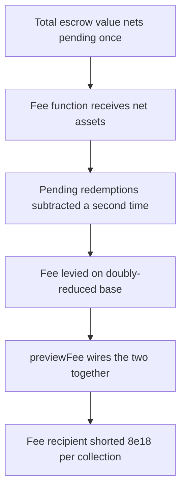

# Blueberry HyperEvmVault: `_calculateFee` double-subtracts `requestSum.assets`

> **Vulnerability classes:** vuln/logic/fee-calculation · vuln/arithmetic/underflow
>
> **Reproduction:** a faithful minimal reproduction of the vulnerable finding — the `_calculateFee` and `_totalEscrowValue` bodies are reproduced **verbatim** (the double-subtracting line marked `@>`) with faithful minimal doubles for the escrows, `requestSum`, and fee config; local deploy, no fork.

<!-- source-auditvault: https://github.com/pashov/audits/blob/master/team/md/Blueberry-security-review_2025-03-26.md -->

## Root cause

`_calculateFee(grossAssets)` subtracts `$.requestSum.assets` from `grossAssets` to size the fee base — but `grossAssets` is passed straight from `_totalEscrowValue`, which **already** returned `assets_ - $.requestSum.assets`. The pending-redemption amount is therefore subtracted twice, so the management fee is levied on a doubly-reduced value (or the second subtraction underflows and reverts). The vulnerable line, reproduced verbatim from the report:

```solidity
    function _calculateFee(V1Storage storage $, uint256 grossAssets) internal view returns (uint256 feeAmount_) {
        if (grossAssets == 0 || block.timestamp <= $.lastFeeCollectionTimestamp) {
            return 0;
        }

        // Calculate time elapsed since last fee collection
        uint256 timeElapsed = block.timestamp - $.lastFeeCollectionTimestamp;

        // We subtract the pending redemption requests from the total asset value to avoid taking more fees than needed from
        //    users who do not have any pending redemption requests
@>        uint256 eligibleForFeeTake = grossAssets - $.requestSum.assets;
        // Calculate the pro-rated management fee based on time elapsed
        feeAmount_ = eligibleForFeeTake * $.managementFeeBps * timeElapsed / BPS_DENOMINATOR / ONE_YEAR;

        return feeAmount_;
    }
```

The upstream `_totalEscrowValue` — also reproduced verbatim — is where the first, legitimate subtraction happens, which is what makes the `@>` line a *double* subtraction:

```solidity
    function _totalEscrowValue(V1Storage storage $) internal view returns (uint256 assets_) {
        uint256 escrowLength = $.escrows.length;
        for (uint256 i = 0; i < escrowLength; ++i) {
            VaultEscrow escrow = VaultEscrow($.escrows[i]);
            assets_ += escrow.tvl();
        }

        if ($.lastL1Block == l1Block()) {
            assets_ += $.currentBlockDeposits;
        }

@>        return assets_ - $.requestSum.assets;
    }
```

## Why it's exploitable here

The reproduction configures a vault with `TVL = 1000e18` held in one escrow, `requestSum.assets = 400e18` of pending redemptions, a `2%` annual management fee, and `timeElapsed = ONE_YEAR`:

1. `_totalEscrowValue()` returns `1000e18 - 400e18 = 600e18` — this is the `grossAssets` handed to `_calculateFee`.
2. The `@>` line computes `eligibleForFeeTake = 600e18 - 400e18 = 200e18`, subtracting the pending amount a second time.
3. Buggy fee: `200e18 * 2% = 4e18`. Correct fee (finding's fix — do not subtract again): `600e18 * 2% = 12e18`.
4. The fee recipient is shorted `12e18 - 4e18 = 8e18` every collection — a full fee on the entire `400e18` pending amount. When `requestSum.assets` exceeds the already-reduced `grossAssets`, the second subtraction underflows and reverts, bricking fee collection.

## Attack path



## Marked-line walkthrough (Playground)

The EVM Playground pins each step to the exact executed source line in `0x671d353a…`:

1. **L135** — Total escrow value nets pending once: `_totalEscrowValue` sums each escrow's TVL and returns it already reduced by `$.requestSum.assets` — the one legitimate subtraction of pending redemptions.
2. **L149** — Fee function receives net assets: `_calculateFee` is handed `grossAssets`, which is exactly the value `_totalEscrowValue` already netted down by the pending redemptions.
3. **L159** — Pending redemptions subtracted a second time: Root cause: `grossAssets - $.requestSum.assets` subtracts pending redemptions again, double-counting them and shrinking the fee base too far.
4. **L161** — Fee levied on doubly-reduced base: The fee is pro-rated over `eligibleForFeeTake`, charging it on `TVL - 2*requestSum` instead of `TVL - requestSum`, so the protocol is undercharged.
5. **L178** — previewFee wires the two together: `previewFee` calls `_calculateFee(_totalEscrowValue())`, feeding the already-netted value straight into the buggy line and realizing the double subtraction.
6. **L185** — Seed the vault with TVL: Setup: `addEscrow` registers one escrow holding the full 1000e18 TVL that `_totalEscrowValue` will sum.
7. **L190** — Record pending redemption amount: Setup: `setRequestSumAssets` stores 400e18 of pending redemptions — the value that ends up subtracted twice.

## PoC

Registry (Foundry, local deploy — verbatim vulnerable source + harm-asserting test):

```bash
cd 61468-c-01-incorrect-fee-due-to-double-subtracting-requestsumasset_exp && forge test -vvv
```

The browser Playground replays the same synthetic opcode-for-opcode and measures the harm: with `TVL = 1000e18`, `requestSum = 400e18`, and a `2%` annual fee, the verbatim `_calculateFee(_totalEscrowValue())` chain charges `4e18` instead of `12e18`, and the `8e18` under-collected fee is minted to the SINK marker as the harm magnitude. Both gates are green (registry `forge test` PASS + Playground `_verify-poc` **VERDICT: PASS**).
