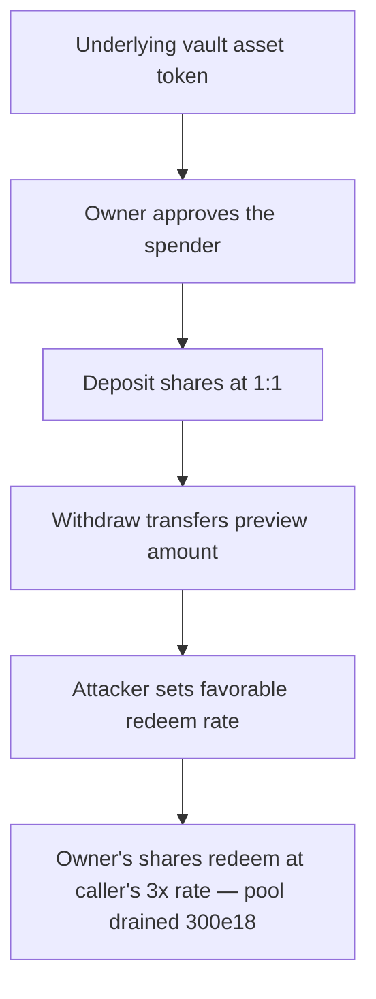

# Blueberry HyperEvmVault: redeem preview converts on the caller, not the share owner

> **Vulnerability classes:** vuln/theft · vuln/logic
>
> **Reproduction:** a faithful minimal reproduction of the vulnerable finding — the overridden `previewWithdraw` / `previewRedeem` bodies are reproduced **verbatim** (marked `@>`) with faithful minimal doubles; local deploy, no fork.

<!-- source-auditvault: https://github.com/pashov/audits/blob/master/team/md/Blueberry-security-review_2025-03-26.md -->

## Root cause

Withdrawals in HyperEvmVault are gated by a per-account `redeemRequests` snapshot (the shares and assets that settled back from L1). The overridden `previewWithdraw()` / `previewRedeem()` index that snapshot by `msg.sender` — the **caller** — even though ERC4626 supports a flow where the caller differs from the share `owner`. The vulnerable bodies, reproduced verbatim from the report:

```solidity
function previewWithdraw(uint256 assets_) public view override(ERC4626Upgradeable, IERC4626) returns (uint256) {
    V1Storage storage $ = _getV1Storage();
@>  RedeemRequest memory request = $.redeemRequests[msg.sender];
    return assets_.mulDivUp(request.shares, request.assets);
}

function previewRedeem(uint256 shares_) public view override(ERC4626Upgradeable, IERC4626) returns (uint256) {
    V1Storage storage $ = _getV1Storage();
@>  RedeemRequest memory request = $.redeemRequests[msg.sender];
    return shares_.mulDivDown(request.assets, request.shares);
}
```

`_withdraw()` correctly burns the **owner's** shares and spends the **owner's** allowance, but the payout amount it transfers is computed by these previews off the **caller's** request. So a caller with a more favourable snapshot redeems the owner's shares at the caller's conversion rate.

## Why it's exploitable here

With numbers taken from the reproduction:

1. Honest depositors seed the pool with `1000e18`.
2. The victim `owner` deposits `100e18` (mints `100e18` shares) and legitimately requests a redeem at the 1:1 L1 rate, so `redeemRequests[owner] = {shares: 100e18, assets: 100e18}` — worth exactly `100e18`.
3. The attacker deposits `100e18`, sets the L1 settlement rate to 3x, and records its own request, so `redeemRequests[attacker] = {shares: 100e18, assets: 300e18}`.
4. The owner approves the attacker as a shares spender (`100e18`) — the standard ERC4626 caller-differs-from-owner flow.
5. The attacker calls `redeem(100e18, attacker, owner)`. `previewRedeem` reads `redeemRequests[msg.sender]` = the attacker's request, computing `100e18.mulDivDown(300e18, 100e18) = 300e18`. `_withdraw` burns the owner's `100e18` shares but transfers `300e18` to the attacker — 3x the owner's fair value.

Net result: the attacker extracts `300e18` for a position worth `100e18`, a `200e18` theft that drains honest depositors' pooled liquidity.

## Attack path



## Marked-line walkthrough (Playground)

The EVM Playground pins each step to the exact executed source line in `0x671d353a…`:

1. **L50** — Underlying vault asset token: Setup: declares the vault's underlying ERC20, the pooled asset honest depositors fund and that the exploit ultimately drains.
2. **L117** — Owner approves the spender: Setup: the shares' `approve()` grants a spender an allowance, enabling the ERC4626 flow where the redeeming caller differs from the share owner.
3. **L137** — Deposit shares at 1:1: Setup: depositors mint vault shares 1:1 for assets; honest users and the victim owner both fund the pool here before requesting any redeem.
4. **L164** — Withdraw transfers preview amount: The `_withdraw` core burns the owner's shares but transfers the `assets` amount the preview computed — the value the flawed preview inflates.
5. **L207** — Attacker sets favorable redeem rate: Setup: writes the per-account L1 settlement rate; the attacker snapshots its own request at 3x while the owner's stayed at 1x.
6. **L222** — previewWithdraw indexes the caller: `previewWithdraw` reads `redeemRequests[msg.sender]` (the caller) — the withdraw-path twin of the same bug, converting on the caller, not the owner.
7. **L228** — previewRedeem uses caller not owner: Root cause: `previewRedeem` reads `redeemRequests[msg.sender]` (the caller), so the owner's shares redeem at the caller's 3x rate — paying triple and draining the pool.

## PoC

Registry (Foundry, local deploy — verbatim vulnerable source + harm-asserting test):

```bash
cd 61469-h-01-flawed-withdrawal-logic-when-caller-differs-from-share_exp && forge test -vvv
```

The browser Playground replays the same synthetic opcode-for-opcode and measures the harm: **the attacker redeems the owner's `100e18`-worth shares for `300e18`, a `200e18` theft that drains the pooled liquidity of honest depositors**. Both gates are green (registry `forge test` PASS + Playground `_verify-poc` **VERDICT: PASS**).
