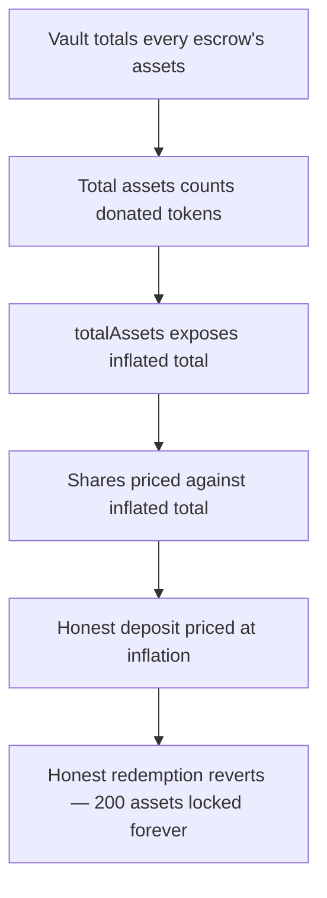

# Blueberry HyperEVM Vault: donated tokens inflate share price but can never be redeemed

> **Vulnerability classes:** vuln/logic · vuln/dos
>
> **Reproduction:** a faithful minimal reproduction of the vulnerable finding — the vulnerable total-assets accounting (`_totalEscrowValue`) and the escrow equity check (`VaultEscrow.tvl` / `withdraw`) are reproduced **verbatim** (marked `@>`) with faithful minimal doubles; local deploy, no fork.

<!-- source-auditvault: https://github.com/pashov/audits/blob/master/team/md/Blueberry-security-review_2025-03-26.md -->

## Root cause

`HyperEvmVault._totalEscrowValue` computes the vault's total assets (the share-price numerator) by summing each escrow's `tvl()`. `VaultEscrow.tvl()` returns `vaultEquity_ + assetBalance`, i.e. the L1-vault equity **plus** the escrow's raw ERC20 balance — so tokens donated directly to an escrow inflate total assets even though they are never pushed into the L1 vault and never become equity. The vulnerable lines, reproduced verbatim:

```solidity
    function _totalEscrowValue(V1Storage storage $) internal view returns (uint256 assets_) {
        uint256 escrowLength = $.escrows.length;
        for (uint256 i = 0; i < escrowLength; ++i) {
            VaultEscrow escrow = VaultEscrow($.escrows[i]);
@>          assets_ += escrow.tvl();
        }

        if ($.lastL1Block == l1Block()) {
            assets_ += $.currentBlockDeposits;
        }

        return assets_ - $.requestSum.assets;
    }
```

On redemption, `VaultEscrow.withdraw` enforces `require(vaultEquity_ >= lastWithdraws)`, and `vaultEquity_` only reflects assets actually held in the L1 vault — it never sees the donation. The donation-backed portion of every share is therefore phantom TVL: it raises the price shares are sold at but can never be paid out.

## Why it's exploitable here

Following the finding's worked example:

1. The attacker deposits `100`, minting `100` shares; L1 equity is `100`.
2. The attacker donates `100` directly to the escrow. `tvl()` now returns `equity(100) + balance(100) = 200`, so `totalAssets = 200` for `100` shares — the share price has doubled.
3. An honest user deposits `200` real assets. At the inflated price they mint only `200 * 100 / 200 = 100` shares (total supply `200`, total assets `400`).
4. The attacker redeems `100` shares (worth `200`), which succeeds and drains the L1 equity down to `100`.
5. The honest user redeems `100` shares (worth `200`), but the escrow's equity check sees only `100` of L1 equity against `200` owed and **always reverts**. The `100` donated tokens are stuck in the escrow forever, and the honest user's `200` assets are un-redeemable.

## Attack path



## Marked-line walkthrough (Playground)

The EVM Playground pins each step to the exact executed source line in `0xbd4fd5a3…`:

1. **L279** — Vault totals every escrow's assets: The vault enters `_totalEscrowValue`, the function that sums each escrow's assets to produce the numerator every share price is based on.
2. **L280** — Total assets counts donated tokens: Root cause: the loop sums each escrow's `tvl()`, which includes raw tokens donated straight to the escrow and never deposited into the L1 vault.
3. **L293** — totalAssets exposes inflated total: `totalAssets()` returns that donation-inflated sum, so the vault now reports more assets than it can ever actually pay out on redemption.
4. **L304** — Shares priced against inflated total: `convertToAssets` multiplies shares by the inflated `totalAssets`, promising every redeemer more assets than the L1 vault actually holds.
5. **L313** — Honest deposit priced at inflation: In `deposit`, the honest user's shares are computed against the doubled price, so their real 200 assets mint only 100 shares.
6. **L325** — Honest user redeems 100 shares: The honest user calls `redeem`, converting their 100 shares back to 200 assets against the still-inflated total supply.
7. **L334** — Equity check reverts redemption: `escrow.withdraw` requires L1 equity to cover the amount owed, but equity never counted the 100 donated tokens, so redemption reverts and funds stay locked.

## PoC

Registry (Foundry, local deploy — verbatim vulnerable source + harm-asserting test):

```bash
cd 61470-h-02-donated-tokens-are-never-deposited-into-vaults-pashov-a_exp && forge test -vvv
```

The browser Playground replays the same synthetic opcode-for-opcode and measures the harm: **a 100-token donation doubles the share price, and the honest user's 200-asset redemption reverts on the escrow equity check while the donated tokens stay locked**. Both gates are green (registry `forge test` PASS + Playground `_verify-poc` **VERDICT: PASS**).
