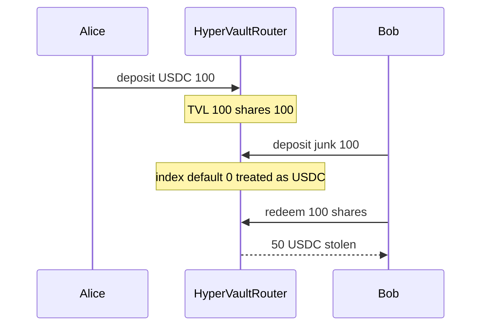

# Blueberry HyperVaultRouter — missing asset index check mints shares for any token

> **Vulnerability classes:** vuln/logic/wrong-condition · impact/loss-of-funds/direct-drain · check/missing-asset-validation

> **Reproduction:** a self-contained Foundry PoC that compiles & runs in an
> isolated project with **only `forge-std`** — no fork, no RPC, no `anvil_state`.
> Full trace: [output.txt](output.txt). PoC:
> [test/61477-c-02-missing-asset-index-check-allows-any-token-to-mint-shar_exp.sol](test/61477-c-02-missing-asset-index-check-allows-any-token-to-mint-shar_exp.sol).

<!-- non-defihacklabs -->
<!-- source-auditvault: https://github.com/Auditware/AuditVault/blob/main/findings/61477-c-02-missing-asset-index-check-allows-any-token-to-mint-shar.md -->
<!-- date: 2025-04 -->

**AuditVault taxonomy:** `severity/high` · `sector/lending` · `sector/stable` · `platform/pashov` · `wrong-condition` · `wrong-state`

---

## Key info

| | |
|---|---|
| **Impact** | **HIGH** — any unregistered ERC20 mints USDC-priced shares; attacker redeems real USDC |
| **Protocol** | Blueberry HyperVaultRouter |
| **Vulnerable code** | `deposit`: `assetIndexes[asset]` defaults to 0 == `USDC_SPOT_INDEX` |
| **Bug class** | Missing zero-index / unregistered-asset check |
| **Finding** | Pashov Audit Group Blueberry 2025-04-30 · #61477 · **C-02** |
| **Report** | [Blueberry-security-review_2025-04-30](https://github.com/pashov/audits/blob/master/team/md/Blueberry-security-review_2025-04-30.md) |
| **Source** | [AuditVault](https://github.com/Auditware/AuditVault/blob/main/findings/61477-c-02-missing-asset-index-check-allows-any-token-to-mint-shar.md) |
| **Status** | Audit finding. Reproduced as a standalone local PoC. |
| **Compiler** | `^0.8.24` (PoC) |

---

## TL;DR

1. `deposit(asset, amount)` looks up `assetIndexes[asset]` and requires `_isAssetSupported`.
2. Unregistered tokens return mapping default `0`, and USDC is hardcoded as index `0`.
3. Attacker deposits a worthless ERC20, receives USDC-priced shares, redeems real USDC.

---

## The vulnerable code

```solidity
uint64 assetIndex_ = assetIndexes[asset];
require(_isAssetSupported(assetIndex_), "COLLATERAL_NOT_SUPPORTED"); // @> VULN
// FIX: require(assetIndex_ != 0 || asset == address(usdc), "not usdc");
```

---

## Root cause

The support check treats index `0` as always valid because USDC lives at `USDC_SPOT_INDEX = 0`. Solidity mappings return `0` for missing keys, so every unknown token is accepted as USDC.

## Preconditions

- Router has real USDC deposits (honest TVL).
- Attacker can mint/hold any ERC20 and call `deposit`.

## Attack walkthrough

1. Alice deposits 100 USDC → 100e18 shares; TVL = 100e18.
2. Bob deposits 100 worthless RND → check passes (index 0) → 100e18 shares; TVL still 100e18.
3. Bob redeems 100e18 shares → 50 USDC of Alice's deposit.

## Diagrams



## Impact

Share supply inflates without TVL growth. Attackers convert worthless tokens into claims on real USDC, diluting honest depositors by 50% in the PoC.

## Sources

- [AuditVault finding #61477](https://github.com/Auditware/AuditVault/blob/main/findings/61477-c-02-missing-asset-index-check-allows-any-token-to-mint-shar.md)
- [Pashov Blueberry security review 2025-04-30](https://github.com/pashov/audits/blob/master/team/md/Blueberry-security-review_2025-04-30.md)
- Reduced source: HyperVaultRouter.deposit / `_isAssetSupported` (Pashov Blueberry 2025-04-30)
