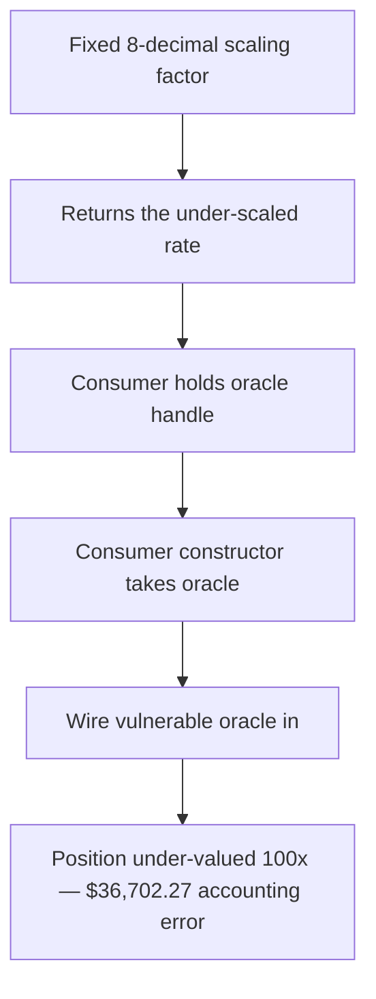

# Blueberry: `getRate()` ignores `szDecimals`, under-pricing spot assets 100x

> **Vulnerability classes:** vuln/oracle/spot-price · vuln/accounting
>
> **Reproduction:** a faithful minimal reproduction of the vulnerable finding — the `getRate()` spot-price scaling is reproduced **verbatim** (marked `@>`) with faithful minimal doubles (the Hyperliquid SPOT-PX precompile and a `value = quantity × rate` consumer); local deploy, no fork.

<!-- source-auditvault: https://github.com/pashov/audits/blob/master/team/md/Blueberry-security-review_2025-04-30.md -->

## Root cause

`getRate()` reads a raw spot price from the Hyperliquid SPOT-PX precompile and scales it by a **fixed** `USDC_SPOT_SCALING = 10 ** (18 - 8)` — it assumes every asset's price carries exactly 8 meaningful decimals. In Hyperliquid the number of meaningful price decimals is `8 - szDecimals`, so any asset with `szDecimals > 0` is under-reported by exactly `10 ** szDecimals`. The vulnerable scaling line, reproduced verbatim:

```solidity
uint8 public constant USDC_SPOT_DECIMALS = 8;
uint256 public constant USDC_SPOT_SCALING = 10 ** (18 - USDC_SPOT_DECIMALS);

function getRate(uint32 spotMarket) public view override returns (uint256) {
    (bool success, bytes memory result) = SPOT_PX_PRECOMPILE_ADDRESS.staticcall(abi.encode(spotMarket));
    require(success, Errors.PRECOMPILE_CALL_FAILED());
@>  uint256 scaledRate = uint256(abi.decode(result, (uint64))) * USDC_SPOT_SCALING;
    return scaledRate;
}
```

The precompile result is multiplied only by the constant `USDC_SPOT_SCALING`. There is no per-asset `szDecimals` term, so the meaningful-decimals difference is silently dropped and the returned rate is wrong for every asset whose `szDecimals` is non-zero.

## Why it's exploitable here

Following the finding's worked example — token **HFUN** with `szDecimals = 2`, whose precompile price `cast call 0x…0808 …0001` returns `37073000` (i.e. **$37.073**, with `8 - szDecimals = 6` meaningful decimals):

1. `getRate(HFUN)` computes `37073000 * 1e10 = 0.37073e18`, so the protocol reads the price as **$0.37073** instead of the true **$37.073** — a `10 ** szDecimals = 100x` under-report.
2. A protocol valuing a real **1000-HFUN** position through this rate books it at `1000 * 0.37073 = $370.73` instead of the true `1000 * 37.073 = $37,073`.
3. The gap is a **$36,702.27** accounting error per 1000 HFUN. Any market that prices collateral, debt, or redemptions through this oracle now runs on figures 100x off — an attacker can transact against the mispriced asset (over-borrow, under-collateralize, or extract mispriced value) and drain honest depositors' liquidity.

The PoC reads the buggy rate, derives the correct rate using the finding's own recommended fix (`… * USDC_SPOT_SCALING * 10 ** szDecimals`), and asserts the position is under-valued by exactly the `100x` factor, recording the `$36,702.27` value-at-risk as the concrete accounting harm.

## Attack path



## Marked-line walkthrough (Playground)

The EVM Playground pins each step to the exact executed source line in `0xce01759b…`:

1. **L78** — Fixed 8-decimal scaling factor: Root cause: getRate() scales the raw precompile price by a fixed 10**(18-8), ignoring szDecimals, so HFUN (szDecimals=2) is under-reported 100x.
2. **L79** — Returns the under-scaled rate: The mis-scaled rate is returned to every caller, so all downstream USD valuations inherit the same 100x under-report.
3. **L87** — Consumer holds oracle handle: Setup: the OracleConsumer keeps an immutable reference to the spot-price oracle it will query for position values.
4. **L89** — Consumer constructor takes oracle: Setup: the consumer is deployed with the address of the vulnerable Blueberry spot oracle under test.
5. **L90** — Wire vulnerable oracle in: Setup: the buggy getRate() oracle is stored in the consumer, so every valueOf() call routes through the mis-scaling.
6. **L93** — Value a position with bad rate: valueOf() multiplies a 1000-HFUN position by the buggy rate, pricing it at $370.73 instead of $37,073 — a 100x under-valuation.

## PoC

Registry (Foundry, local deploy — verbatim vulnerable source + harm-asserting test):

```bash
cd 61478-h-01-getrate-ignores-szdecimals-pashov-audit-group-none-blue_exp && forge test -vvv
```

The browser Playground replays the same synthetic opcode-for-opcode and measures the harm: **the HFUN rate and a 1000-HFUN position are under-reported by exactly 100x, a $36,702.27 misvaluation**. Both gates are green (registry `forge test` PASS + Playground `_verify-poc` **VERDICT: PASS**).
