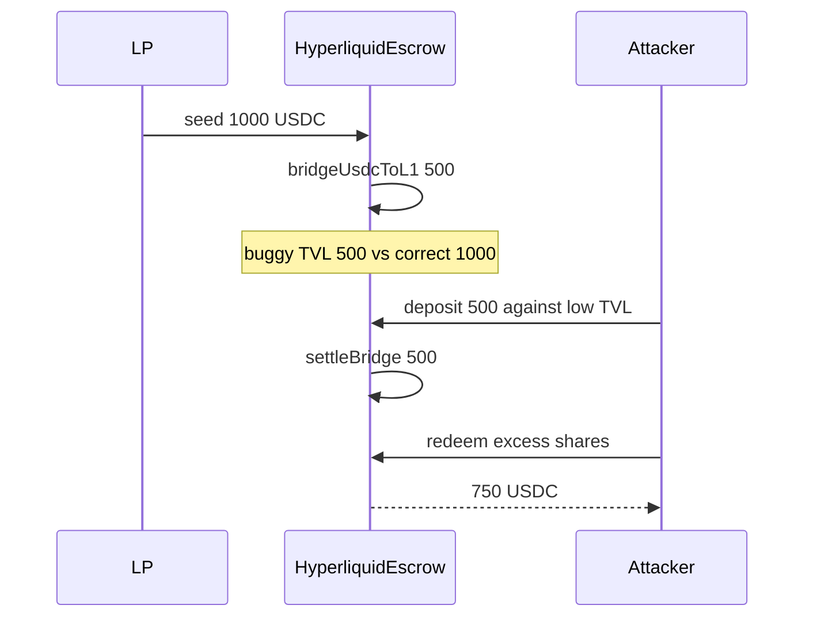

# Blueberry HyperliquidEscrow — tvl() omits in-flight USDC

> **Vulnerability classes:** vuln/logic/wrong-state · impact/loss-of-funds/direct-drain · frozen-funds

> **Reproduction:** a self-contained Foundry PoC that compiles & runs in an
> isolated project with **only `forge-std`** — no fork, no RPC.
> Full trace: [output.txt](output.txt). PoC:
> [test/61494-h-01-escrowtvl-does-not-add-in-flight-usdc-amount-pashov-aud_exp.sol](test/61494-h-01-escrowtvl-does-not-add-in-flight-usdc-amount-pashov-aud_exp.sol).

<!-- non-defihacklabs -->
<!-- source-auditvault: https://github.com/Auditware/AuditVault/blob/main/findings/61494-h-01-escrowtvl-does-not-add-in-flight-usdc-amount-pashov-aud.md -->
<!-- date: 2025-05 -->

**AuditVault taxonomy:** `severity/high` · `sector/bridge` · `sector/lending` · `platform/pashov` · `locked-funds` · `oracle-freshness`

---

## Key info

| | |
|---|---|
| **Impact** | **HIGH** — understated TVL during USDC bridge → excess shares → drain honest LPs |
| **Protocol** | Blueberry HyperliquidEscrow |
| **Vulnerable code** | `tvl()` USDC branch skips in-flight bridge amount |
| **Bug class** | Incomplete TVL / share-price accounting |
| **Finding** | Pashov Audit Group Blueberry 2025-05-16 · #61494 · **H-01** |
| **Report** | [Blueberry-security-review_2025-05-16](https://github.com/pashov/audits/blob/master/team/md/Blueberry-security-review_2025-05-16.md) |
| **Source** | [AuditVault](https://github.com/Auditware/AuditVault/blob/main/findings/61494-h-01-escrowtvl-does-not-add-in-flight-usdc-amount-pashov-aud.md) |
| **Status** | Audit finding. Reproduced as a standalone local PoC. |
| **Compiler** | `^0.8.24` (PoC) |

---

## TL;DR

1. Non-USDC assets add same-block in-flight bridge amounts into TVL.
2. The USDC branch only counts `balanceOf` and skips in-flight.
3. Deposit against understated TVL mints 2× shares; redeem after settle steals 250 USDC.

---

## The vulnerable code

```solidity
if (assetIndex == USDC_SPOT_INDEX) {
    tvl_ += IERC20(assetAddr).balanceOf(address(this)) * evmScaling; // @> VULN
    // FIX: also add inFlightBridge[USDC].amount when same block
}
```

---

## Root cause

USDC bridging reduces EVM balance while the value remains protocol-owned in-flight. Omitting that amount understates TVL and share price for same-block depositors/redeemers.

## Attack walkthrough

1. Seed 1000 USDC → TVL 1000e18.
2. Bridge 500 USDC → buggy TVL 500e18 (correct 1000e18).
3. Deposit 500 USDC → 1000e18 shares (fair 500e18).
4. Settle bridge; redeem → 750 USDC out; profit 250 USDC.

## Diagrams



## Impact

Same-block USDC bridge + deposit yields excess shares and extracts value from honest LPs. Symmetric redeem-at-low-TVL can also strand depositors.

## Sources

- [AuditVault finding #61494](https://github.com/Auditware/AuditVault/blob/main/findings/61494-h-01-escrowtvl-does-not-add-in-flight-usdc-amount-pashov-aud.md)
- [Pashov Blueberry security review 2025-05-16](https://github.com/pashov/audits/blob/master/team/md/Blueberry-security-review_2025-05-16.md)
- Reduced source: HyperliquidEscrow.tvl USDC branch (Pashov Blueberry 2025-05-16)
