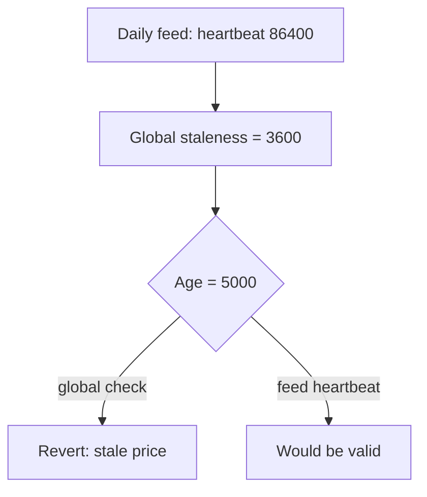

# CAP Labs PriceOracle — global staleness period rejects valid feeds

> **Vulnerability classes:** vuln/oracle/stale-price · vuln/oracle/missing-validation · vuln/dos/frozen-funds
>
> **Reproduction:** local synthetic Foundry reduction; the complete passing trace is in [output.txt](output.txt).

<!-- non-defihacklabs -->
<!-- source-auditvault: https://github.com/Auditware/AuditVault/blob/main/findings/61525-incorrect-oracle-staleness-period-leads-to-price-feed-dos-tr.md -->
<!-- date: 2025-05 -->

## Key info

| Field | Value |
|---|---|
| Loss | A daily-heartbeat feed is rejected as stale, making dependent lending paths unavailable. |
| Vulnerable contract | `PriceOracle.getPrice` in [test/61525-incorrect-oracle-staleness-period-price-feed-dos.sol](test/61525-incorrect-oracle-staleness-period-price-feed-dos.sol) |
| Attacker EOA | `0x1111111111111111111111111111111111111111` |
| Attack contract | `Exploit` |
| Attack tx | Local Foundry `Exploit.run()` |
| Chain · block · date | Ethereum model · block 0 · synthetic |
| Compiler | Solidity `^0.8.24` |
| Bug class | One global heartbeat/staleness threshold |

## TL;DR

CAP's oracle stores one staleness period for all assets. Configuring one hour for hourly ETH feeds makes a valid daily USDC-like report revert after five thousand seconds, causing a price-feed DoS.

## Background

Chainlink feeds publish at asset-specific heartbeats. A robust oracle stores each feed's heartbeat and validates freshness against that value, not a global constant.

## The vulnerable code

```solidity
function getPrice(address asset, uint256 nowTs) external view returns (uint256) {
    Feed memory f = feeds[asset];
    // @> VULN: every asset shares one staleness period; heartbeat is ignored.
    require(nowTs - f.updatedAt <= staleness, "stale price");
    return f.price;
}
```

## Root cause

The deployment sets `staleness = 1 hours` even though assets have 1-hour and 1-day heartbeats. The contract cannot distinguish a valid slow feed from a genuinely stale one.

## Preconditions

- At least two feeds have different update frequencies.
- The global staleness period is chosen for the faster feed.
- Lending/borrowing functions require `getPrice` to succeed.

## Attack walkthrough

1. Configure a daily-heartbeat feed with `updatedAt = 95,000`, `now = 100,000`.
2. The global one-hour check reverts even though the feed heartbeat allows it.
3. `staleFeedDos` and the heartbeat comparison prove the false rejection; see [output.txt:4](output.txt#L4).

## Diagrams



## Remediation

Store a staleness/heartbeat value per feed and validate the Chainlink round's `updatedAt` against that value. Add configuration tests covering hourly and daily feeds, and define safe behavior when a feed is missing.

## How to reproduce

```bash
cd evm-hack-registry/61525-incorrect-oracle-staleness-period-price-feed-dos_exp
forge test -vvvvv
```

## Sources

- [AuditVault finding #61525](https://github.com/Auditware/AuditVault/blob/main/findings/61525-incorrect-oracle-staleness-period-leads-to-price-feed-dos-tr.md)
- [Trail of Bits CAP Labs review](https://github.com/trailofbits/publications/blob/master/reviews/2025-05-caplabs-coveredagentprotocol-securityreview.pdf)
- [Synthetic test](test/61525-incorrect-oracle-staleness-period-price-feed-dos.sol)

*Reference: https://github.com/trailofbits/publications/blob/master/reviews/2025-05-caplabs-coveredagentprotocol-securityreview.pdf*
