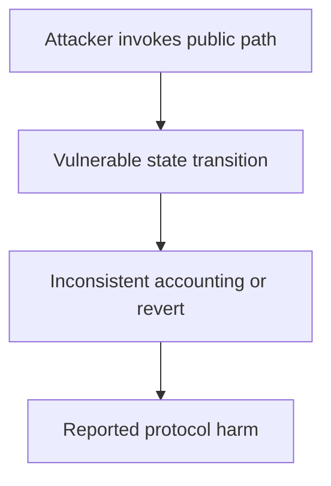

# CAP Labs — unvalidated vault address inflates interest rates

<!-- non-defihacklabs -->
<!-- source-auditvault: https://github.com/Auditware/AuditVault/blob/main/findings/61535-unvalidated-vault-address-in-vaultadapter-allows-interest-r.md -->
<!-- date: 2025-05 -->

> **Vulnerability classes:** vuln/oracle/price-manipulation · vuln/input-validation/missing · vuln/dependency/unsafe-external-call

> **Reproduction:** Fully local synthetic; run [forge test](.) and inspect [output.txt](output.txt). The Playground bundle replays the same 61535-unvalidated-vault-address-interest-rate invariant.

## Key info

| Field | Value |
| --- | --- |
| Loss | Borrowers can be charged an attacker-selected, inflated utilization rate |
| Vulnerable contract | VaultAdapter (reconstructed) |
| Attacker EOA | 0x1111111111111111111111111111111111111111 (synthetic caller) |
| Attack contract | [Exploit](test/61535-unvalidated-vault-address-interest-rate.sol) |
| Attack tx | Local `Exploit.run()` call (no historical transaction) |
| Chain · block · date | Ethereum · local stub 0x1181d03 · 2025-05 |
| Compiler | Solidity 0.8.35 (pragma ^0.8.24) |
| Bug class | vuln/oracle/price-manipulation · vuln/input-validation/missing · vuln/dependency/unsafe-external-call |

## TL;DR

VaultAdapter.rate accepts any vault address and trusts its currentUtilizationIndex/utilization responses. A malicious implementation returns extreme values and permanently updates the rate state.

## Background

AuditVault finding [61535-unvalidated-vault-address-interest-rate](https://github.com/Auditware/AuditVault/blob/main/findings/61535-unvalidated-vault-address-in-vaultadapter-allows-interest-r.md) is an audit-time issue rather than a historical exploit. This write-up reduces the report to one state transition and keeps the claimed harm assertion executable offline.

## The vulnerable code

The minimized source is explicitly marked **RECONSTRUCTED** and preserves the report's blamed operation with an `@> VULN` marker in [test/61535-unvalidated-vault-address-interest-rate.sol](test/61535-unvalidated-vault-address-interest-rate.sol). It is byte-identical to the Playground synthetic source. No verified production source was available in this local checkout.

## Root cause

rate performs an external IVault call before validating that _vault is an approved vault.

## Preconditions

The affected protocol path is deployed; the attacker can reach the public operation described in the report. The synthetic removes unrelated integrations while preserving the state and authorization assumptions required for the finding.

## Attack walkthrough

1. A malicious vault returns 1,000,000 ether; rate records that index and returns an inflated answer.
2. The `run()` method requires the broken invariant and sets `confirmed`; the Forge trace records a passing test at [output.txt:355](output.txt).
3. The remediation is to validate the accounting/state transition before accepting the external call or to consume the one-time state.

## Diagrams



## Remediation

Validate external addresses and returned balances before updating state, and make each one-time transition explicit. Add invariant tests covering zero/deflationary/epoch-boundary inputs.

## How to reproduce

```bash
cd 61535-unvalidated-vault-address-interest-rate_exp
forge test -vvv
```

The browser replay uses `scripts/poc-configs/61535-unvalidated-vault-address-interest-rate.mjs` and the same local-deploy `Exploit` contract.

## Sources

- [AuditVault finding](https://github.com/Auditware/AuditVault/blob/main/findings/61535-unvalidated-vault-address-in-vaultadapter-allows-interest-r.md)
- [Trail of Bits report](https://github.com/trailofbits/publications/blob/master/reviews/2025-05-caplabs-coveredagentprotocol-securityreview.pdf)
- Reduced local source: [test/61535-unvalidated-vault-address-interest-rate.sol](test/61535-unvalidated-vault-address-interest-rate.sol)
- Forge regression: [test/61535-unvalidated-vault-address-interest-rate_exp.sol](test/61535-unvalidated-vault-address-interest-rate_exp.sol)

