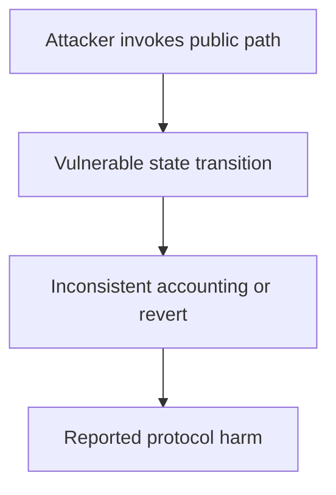

# CAP Labs — decimal count creates an inaccurate staked price

<!-- non-defihacklabs -->
<!-- source-auditvault: https://github.com/Auditware/AuditVault/blob/main/findings/61540-wrong-captokendecimals-value-used-in-stakedcapadapterprice-c.md -->
<!-- date: 2025-05 -->

> **Vulnerability classes:** vuln/arithmetic/decimal-mismatch · vuln/arithmetic/precision-loss · vuln/logic/price-calculation

> **Reproduction:** Fully local synthetic; run [forge test](.) and inspect [output.txt](output.txt). The Playground bundle replays the same 61540-stakedcap-decimals-price invariant.

## Key info

| Field | Value |
| --- | --- |
| Loss | Price is mis-scaled by orders of magnitude, enabling incorrect collateral valuation |
| Vulnerable contract | StakedCapAdapter (reconstructed) |
| Attacker EOA | 0x1111111111111111111111111111111111111111 (synthetic caller) |
| Attack contract | [Exploit](test/61540-stakedcap-decimals-price.sol) |
| Attack tx | Local `Exploit.run()` call (no historical transaction) |
| Chain · block · date | Ethereum · local stub 0x1181d03 · 2025-05 |
| Compiler | Solidity 0.8.35 (pragma ^0.8.24) |
| Bug class | vuln/arithmetic/decimal-mismatch · vuln/arithmetic/precision-loss · vuln/logic/price-calculation |

## TL;DR

The adapter multiplies by capTokenDecimals and divides by stakedTokenDecimals instead of applying 10**decimals. Six- and eighteen-decimal assets therefore receive a nonsensical price.

## Background

AuditVault finding [61540-stakedcap-decimals-price](https://github.com/Auditware/AuditVault/blob/main/findings/61540-wrong-captokendecimals-value-used-in-stakedcapadapterprice-c.md) is an audit-time issue rather than a historical exploit. This write-up reduces the report to one state transition and keeps the claimed harm assertion executable offline.

## The vulnerable code

The minimized source is explicitly marked **RECONSTRUCTED** and preserves the report's blamed operation with an `@> VULN` marker in [test/61540-stakedcap-decimals-price.sol](test/61540-stakedcap-decimals-price.sol). It is byte-identical to the Playground synthetic source. No verified production source was available in this local checkout.

## Root cause

A decimal count is treated as a scaling factor, collapsing 10^6/10^18 normalization into 6/18.

## Preconditions

The affected protocol path is deployed; the attacker can reach the public operation described in the report. The synthetic removes unrelated integrations while preserving the state and authorization assumptions required for the finding.

## Attack walkthrough

1. For raw=2 ether, 6/18 decimals produce 666666666666666666 instead of the normalized 2,000,000.
2. The `run()` method requires the broken invariant and sets `confirmed`; the Forge trace records a passing test at [output.txt:355](output.txt).
3. The remediation is to validate the accounting/state transition before accepting the external call or to consume the one-time state.

## Diagrams



## Remediation

Validate external addresses and returned balances before updating state, and make each one-time transition explicit. Add invariant tests covering zero/deflationary/epoch-boundary inputs.

## How to reproduce

```bash
cd 61540-stakedcap-decimals-price_exp
forge test -vvv
```

The browser replay uses `scripts/poc-configs/61540-stakedcap-decimals-price.mjs` and the same local-deploy `Exploit` contract.

## Sources

- [AuditVault finding](https://github.com/Auditware/AuditVault/blob/main/findings/61540-wrong-captokendecimals-value-used-in-stakedcapadapterprice-c.md)
- [Trail of Bits report](https://github.com/trailofbits/publications/blob/master/reviews/2025-05-caplabs-coveredagentprotocol-securityreview.pdf)
- Reduced local source: [test/61540-stakedcap-decimals-price.sol](test/61540-stakedcap-decimals-price.sol)
- Forge regression: [test/61540-stakedcap-decimals-price_exp.sol](test/61540-stakedcap-decimals-price_exp.sol)
