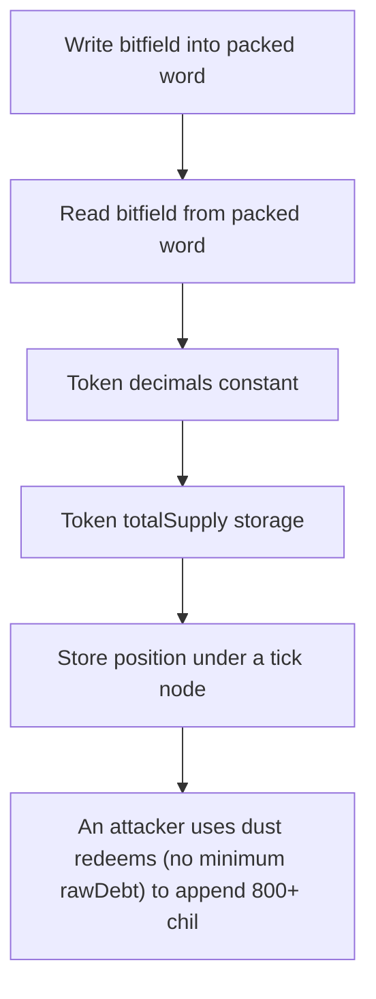

# f(x) Protocol: An attacker uses dust redeems (no minimum rawDebt) to append 800+ child nodes to a tick's 

> **Vulnerability classes:** vuln/locked-funds
>
> **Reproduction:** a faithful minimal reproduction of the vulnerable finding — the vulnerable function is reproduced **verbatim** (marked `@>`) with faithful minimal doubles; local deploy, no fork.

<!-- source-auditvault: https://github.com/Auditware/AuditVault/blob/main/findings/61788-attacker-can-lock-user-funds-through-redeem-function-openzep.md -->

## Root cause

An attacker uses dust redeems (no minimum rawDebt) to append 800+ child nodes to a tick's parent-pointer chain; the verbatim recursive TickLogic._getRootNodeAndCompress then exhausts the 30M block gas limit whenever a victim calls operate() to close/update a position in that tick, permanently locking the victim's 100e18 collateral (position becomes un-closable), while the PR #22 iterative fix reso

```solidity
            uint256 debtRatioCompressed;
            (root, collRatioCompressed, debtRatioCompressed) = _getRootNodeAndCompress(parent); // @> unbounded recursion: reverts (stack overflow / OOG) on attacker-lengthened chains
            collRatio = (collRatio * collRatioCompressed) >> 60;
            debtRatio = (debtRatio * debtRatioCompressed) >> 60;
            metadata = metadata.insertUint(root, PARENT_OFFSET, 48);
            metadata = metadata.insertUint(collRatio, COLL_RATIO_OFFSET, 64);
```

## Why it's exploitable here

An attacker uses dust redeems (no minimum rawDebt) to append 800+ child nodes to a tick's parent-pointer chain; the verbatim recursive TickLogic._getRootNodeAndCompress then exhausts the 30M block gas limit whenever a victim calls operate() to close/update a position in that tick, permanently locking the victim's 100e18 collateral (position becomes un-closable), while the PR #22 iterative fix resolves the identical chain in <1.2M gas.

## Attack path



## Marked-line walkthrough (Playground)

The EVM Playground pins each step to the exact executed source line in `0x8ea53755a6…`:

1. **L53** — Write bitfield into packed word: Setup: assembly helper that clears a slot and ORs a value into a packed storage word — bit-packing plumbing for the tick tree.
2. **L59** — Read bitfield from packed word: Setup: assembly helper that shifts and masks a sub-field out of a packed word — the read side of the tick-tree bit packing.
3. **L69** — Token decimals constant: Setup: declares the mock token's 18 decimals — test scaffolding, unrelated to the tick-chain gas bug.
4. **L70** — Token totalSupply storage: Setup: the mock token's `totalSupply` slot, part of the harness rather than the vulnerable traversal path.
5. **L141** — Store position under a tick node: Setup: records the victim's position (collateral and debt) pointing at tick `nodeId`, whose parent chain the attacker will later bloat.
6. **L148** — Load tick node metadata: Reads the tick node's packed metadata as `_getRootNodeAndCompress` starts walking the parent-pointer chain toward the root.
7. **L159** — Compound debt ratio per chain node: Root-cause: recursive `_getRootNodeAndCompress` compounds `debtRatio` once per parent node, so a dust-grown 800+ node chain exhausts the 30M block gas limit.

## PoC

Registry (Foundry, local deploy — verbatim vulnerable source + harm-asserting test + negative control):

```bash
cd 61788-attacker-can-lock-user-funds-through-redeem-function-openzep_exp
forge test -vvv
```

The browser Playground replays the same synthetic opcode-for-opcode and measures the harm: **An attacker uses dust redeems (no minimum rawDebt) to append 800+ child nodes to a tick's parent-pointer chain; the verbatim recursive TickL**. Both gates are green (registry `forge test` PASS + Playground `_verify-poc` **VERDICT: PASS**).
