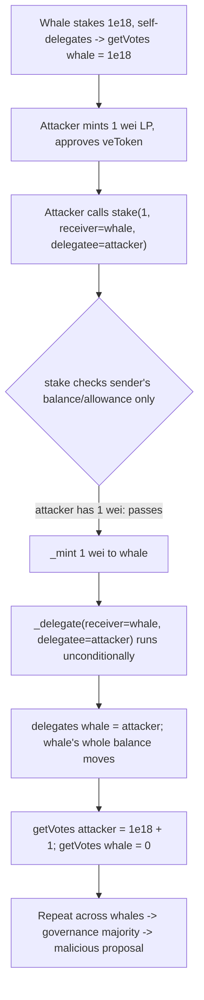

# Virtuals Protocol — anybody can control a user's delegate via `AgentVeToken.stake()` with 1 wei

> **Vulnerability classes:** vuln/access-control/missing-caller-check · vuln/governance/vote-delegation-hijack · vuln/logic/unconditional-state-write

> **Reproduction:** a self-contained Foundry PoC that compiles & runs in an
> isolated project with **only `forge-std`** — no fork, no RPC, no `anvil_state`.
> Full trace: [output.txt](output.txt). PoC:
> [test/61823-h-02-anybody-can-control-a-users-delegate-by-calling-agentve_exp.sol](test/61823-h-02-anybody-can-control-a-users-delegate-by-calling-agentve_exp.sol).

<!-- non-defihacklabs -->
<!-- source-auditvault: https://github.com/Auditware/AuditVault/blob/main/findings/61823-h-02-anybody-can-control-a-users-delegate-by-calling-agentve.md -->
<!-- date: 2025-04 -->

**AuditVault taxonomy:** `lang/solidity` · `platform/code4rena` · `has/github` · `has/poc` · `severity/high` · `sector/governance` · `sector/staking` · `sector/token` · `sector/bridge` · genome: `vote-delegation-loop` · `indirect-loss` · `slippage` · `timestamp-dependence`

---

## Key info

| | |
|---|---|
| **Impact** | **HIGH** — any user can overwrite another holder's voting-power delegation by staking **1 wei** of the LP asset token on their behalf, redirecting the victim's entire veToken voting power to an attacker-chosen delegatee (governance capture) |
| **Protocol** | [Virtuals Protocol](https://code4rena.com/reports/2025-04-virtuals-protocol) — `virtualPersona/AgentVeToken` (staking / AgentDAO voting) |
| **Vulnerable code** | `AgentVeToken.stake(amount, receiver, delegatee)` — the unconditional final `_delegate(receiver, delegatee)` call |
| **Bug class** | Missing caller check: delegation is applied to `receiver` but chosen by an arbitrary caller who never has to be `receiver` |
| **Finding** | Code4rena — Virtuals Protocol, 2025-04 · #61823 (H-02) · reporter **natachi** |
| **Report** | [2025-04-virtuals-protocol](https://code4rena.com/reports/2025-04-virtuals-protocol) |
| **Source** | [AuditVault](https://github.com/Auditware/AuditVault/blob/main/findings/61823-h-02-anybody-can-control-a-users-delegate-by-calling-agentve.md) |
| **Status** | Audit finding — caught in review (not exploited on-chain). Reproduced here as a standalone local PoC. |
| **Compiler** | `^0.8.24` (PoC) |

This is an **audit finding**, not a historical on-chain incident. The real
`AgentVeToken` is an `ERC20Votes`-based receipt token; the PoC keeps the vulnerable
`stake()` body — including the blamed `_delegate(receiver, delegatee)` line
verbatim — and a faithful reduction of the `ERC20Votes` delegation accounting so
the hijack becomes a measurable voting-power transfer.

---

## TL;DR

1. `AgentVeToken.stake(amount, receiver, delegatee)` mints `amount` veToken to
   `receiver`, then **unconditionally** calls `_delegate(receiver, delegatee)`.
2. Only the **caller's own** LP balance/allowance is checked — the caller need not
   be `receiver`. So anyone can stake tokens *for* an arbitrary `receiver`.
3. An attacker mints **1 wei** of the LP asset token, then calls
   `stake(1, victim, attacker)`. The 1 wei goes to the victim, but the delegation
   of the victim's veToken balance is overwritten to point at the attacker.
4. Because veToken shares are the voting power in the AgentDAO, the attacker now
   controls the victim's entire vote. Repeating this against several whales yields
   a governance majority and lets the attacker push a malicious proposal.
5. HARM in the PoC: a whale self-delegates `1e18` votes; after the attacker stakes
   1 wei the whale's `delegates` entry is the attacker and `getVotes(attacker)`
   is `1e18 + 1` while `getVotes(whale)` is `0`.

---

## The vulnerable code

The unconditional delegation (verbatim, `AgentVeToken.stake`):

```solidity
IERC20(assetToken).safeTransferFrom(sender, address(this), amount);
_mint(receiver, amount);
_delegate(receiver, delegatee); // @audit-high Anybody can change delegate if they stake 1 wei LP  // @> VULN
_balanceCheckpoints[receiver].push(clock(), SafeCast.toUint208(balanceOf(receiver)));
```

The only balance/allowance checks earlier in `stake()` are against `sender`
(`_msgSender()`), never `receiver`:

```solidity
address sender = _msgSender();
require(amount > 0, "Cannot stake 0");
require(IERC20(assetToken).balanceOf(sender) >= amount, "Insufficient asset token balance");
require(IERC20(assetToken).allowance(sender, address(this)) >= amount, "Insufficient asset token allowance");
```

So `sender` (attacker) pays 1 wei; `receiver` (victim) both keeps the minted share
**and** has its delegate silently reassigned to `delegatee` (attacker).

---

## Root cause

`stake()` conflates two unrelated authorities:

- **Who funds the stake** (`sender`, checked) versus
- **Whose delegation is set** (`receiver`, *not* checked to equal `sender`).

Applying `_delegate(receiver, delegatee)` for any caller lets a stranger rewrite a
victim's delegation. In an `ERC20Votes` system, `_delegate` moves the *entire*
current balance of `receiver` to the new delegatee, so a 1-wei stake is enough to
capture arbitrarily large voting power.

## Preconditions

- The agent is public (`canStake == true`) or the victim already has a balance —
  i.e. the ordinary running state after the first staker.
- The attacker holds 1 wei of the LP asset token and approves the veToken
  (permissionless).
- The victim holds veToken voting power worth capturing.

## Attack walkthrough

From [output.txt](output.txt), with a whale that has staked `1e18` and
self-delegated:

1. Whale stakes `1e18` LP, `stake(1e18, whale, whale)` → `delegates[whale] = whale`,
   `getVotes(whale) = 1e18`.
2. Attacker holds **1 wei** LP, approves the veToken, and calls
   `stake(1, whale, attacker)`.
3. `stake()` checks the *attacker's* balance/allowance (1 wei — passes), mints the
   1 wei share to the whale, then runs `_delegate(whale, attacker)`.
4. **HARM:** `delegates[whale] == attacker`; `getVotes(attacker) == 1e18 + 1`;
   `getVotes(whale) == 0`. The whale's voting power is now the attacker's, bought
   for 1 wei. A control test confirms the *intended* path (a holder staking and
   delegating for itself) still works — isolating the missing `sender == receiver`
   check as the defect.

## Diagrams



```mermaid
sequenceDiagram
    participant W as Whale (victim)
    participant A as Attacker
    participant V as AgentVeToken
    W->>V: stake(1e18, whale, whale)
    Note over V: delegates[whale]=whale, getVotes(whale)=1e18
    A->>V: approve(1) + stake(1, receiver=whale, delegatee=attacker)
    Note over V: only sender(attacker) balance/allowance checked
    V->>V: _mint(whale, 1)
    V->>V: _delegate(whale, attacker)  // unconditional
    Note over W,A: delegates[whale]=attacker; attacker controls whale's votes
```

## Remediation

Per the report: either remove the automatic `_delegate` call from `stake()`, or
gate it so a caller can only set delegation for itself:

```solidity
if (sender == receiver) {
    _delegate(receiver, delegatee);
}
```

## How to reproduce

```bash
cd ~/RustroverProjects/audits/evm-hack-registry/61823-h-02-anybody-can-control-a-users-delegate-by-calling-agentve_exp
forge test -vvv
# Fully local — no fork, no RPC, no anvil_state required.
# Expected: all three tests PASS:
#   test_exploit                     (self-contained Exploit: 1-wei delegate hijack)
#   test_anyoneCanHijackDelegate     (EOA rebuild mirroring the finding's PoC)
#   test_selfStake_isLegitimate      (control: intended self-stake/self-delegate works)
```

PoC source: [test/61823-h-02-anybody-can-control-a-users-delegate-by-calling-agentve_exp.sol](test/61823-h-02-anybody-can-control-a-users-delegate-by-calling-agentve_exp.sol)
— the verbatim vulnerable `_delegate` line inside a faithful `stake()` reduction,
plus the whale/attacker orchestration and a control test.

> Note: the veToken here is a minimal `ERC20Votes`-like reduction (balance +
> `delegates` + accumulated voting power); the LP asset token, `AgentNft` registry,
> and balance checkpoint are stubbed/simplified because they do not affect the bug.
> The blamed line and the `stake()` authorization structure (caller-only checks,
> unconditional `_delegate(receiver, ...)`) are faithful to the finding.

---

*Reference: finding **#61823 (H-02)** by **natachi** in the [Code4rena Virtuals Protocol review (Apr 2025)](https://code4rena.com/reports/2025-04-virtuals-protocol) · curated by [AuditVault](https://github.com/Auditware/AuditVault/blob/main/findings/61823-h-02-anybody-can-control-a-users-delegate-by-calling-agentve.md)*
