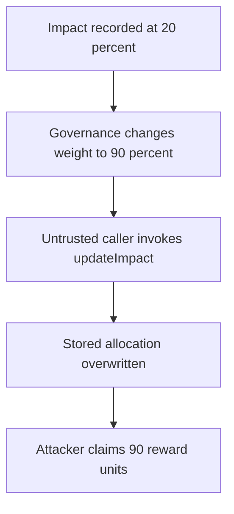

# Virtuals — public impact recalculation redirects reward allocation

> **Vulnerability classes:** vuln/access-control/missing-auth · vuln/logic/reward-calculation · vuln/logic/incorrect-state-transition

> **Reproduction:** self-contained Foundry PoC with no fork, RPC, or cheatcodes. Full trace: [output.txt](output.txt). Driver: [test/61824-h-03-public-servicenftupdateimpact-call-leads-to-cascading-i_exp.sol](test/61824-h-03-public-servicenftupdateimpact-call-leads-to-cascading-i_exp.sol).

<!-- non-defihacklabs -->
<!-- source-auditvault: https://github.com/Auditware/AuditVault/blob/main/findings/61824-h-03-public-servicenftupdateimpact-call-leads-to-cascading-i.md -->
<!-- date: 2025-04 -->

**AuditVault taxonomy:** `blockchain/evm` · `blockchain/evm/base` · `lang/solidity` · `sector/dex` · `sector/governance` · `sector/nft` · `platform/code4rena` · `has/github` · `has/poc` · `severity/high` · `impact/loss-of-funds/direct-drain` · genome: `single-function` · `direct-drain` · `reward-accounting`

## Key info

| | |
|---|---|
| **Impact** | **HIGH** — an untrusted caller can turn a governed weight update into a 90-unit reward claim rather than the original 20 units. |
| **Protocol** | [Virtuals](https://code4rena.com/reports/2025-04-virtuals-protocol) |
| **Vulnerable code** | `ServiceNft.updateImpact` |
| **Finding** | Code4rena Virtuals, 2025-04 · #61824 (H-03) · reporter **TheDonH** |
| **Status** | Audit finding; local reduction models the reward-bearing impact rewrite. |
| **Compiler** | `^0.8.24` (local reduction) |

## TL;DR

Impact values determine the allocation used to mint rewards. `updateImpact` is public, and it persists a recalculated allocation using the current `datasetImpactWeight`. After governance changes that weight, any account can invoke the function and force an already-recorded impact to be rewritten before claiming.

The PoC records an initial 20 percent allocation, changes the governed weight to 90 percent, lets a public helper recalculate it, and claims 90 reward units.

## The vulnerable code

```solidity
_impacts[datasetId] = (rawImpact * datasetImpactWeight) / 10_000; // @> VULN
_impacts[proposalId] = rawImpact - _impacts[datasetId];
```

These reward-bearing assignments are reachable through a public function rather than a controlled accounting update.

## Root cause

A mutable governance parameter is combined with a permissionless state-changing recalculation. The design does not distinguish reading a new configuration from authorized migration of historic accounting records.

## Preconditions

- An impact has already been recorded and can later be claimed for rewards.
- `datasetImpactWeight` changes through its intended governance path.
- Any external account can call `updateImpact` before settlement.

## Attack walkthrough

1. A dataset impact is created with a 20 percent weight.
2. Governance changes the global weight to 90 percent.
3. An attacker calls the public recalculation entry point.
4. The persisted impact becomes 90, and the attacker claims 90 reward units.

## Diagrams



## Remediation

Make impact mutation internal or restrict it to the protocol component that owns the accounting transition. If a governance migration is needed, use a bounded, explicitly authorized batch operation and snapshot the weight used for each settled record.

## How to reproduce

```bash
cd /workspaces/RustroverProjects/audits/evm-hack-registry/61824-h-03-public-servicenftupdateimpact-call-leads-to-cascading-i_exp
forge test -vvv
```

## Sources

- [AuditVault finding #61824](https://github.com/Auditware/AuditVault/blob/main/findings/61824-h-03-public-servicenftupdateimpact-call-leads-to-cascading-i.md)
- [Code4rena Virtuals report](https://code4rena.com/reports/2025-04-virtuals-protocol)

*Reference: Code4rena Virtuals finding H-03, curated by AuditVault.*
