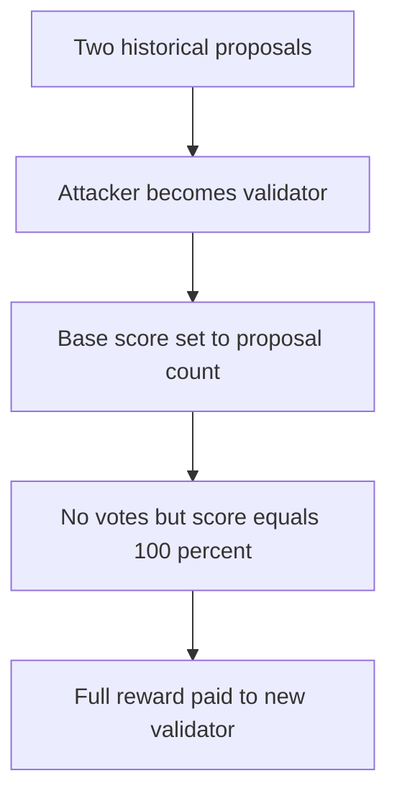

# Virtuals — new validator receives historic voting credit and the full reward

> **Vulnerability classes:** vuln/logic/reward-calculation · vuln/logic/incorrect-state-transition · vuln/logic/missing-check

> **Reproduction:** self-contained Foundry PoC with no fork, RPC, or cheatcodes. Full trace: [output.txt](output.txt). Driver: [test/61826-h-05-validatorregistryvalidatorscoregetpastvalidatorscore-al_exp.sol](test/61826-h-05-validatorregistryvalidatorscoregetpastvalidatorscore-al_exp.sol).

<!-- non-defihacklabs -->
<!-- source-auditvault: https://github.com/Auditware/AuditVault/blob/main/findings/61826-h-05-validatorregistryvalidatorscoregetpastvalidatorscore-al.md -->
<!-- date: 2025-04 -->

**AuditVault taxonomy:** `lang/solidity` · `sector/gaming` · `sector/governance` · `sector/nft` · `sector/staking` · `platform/code4rena` · `has/github` · `has/poc` · `severity/high` · genome: `proposal-manipulation` · `role-bypass` · `reward-accounting`

## Key info

| | |
|---|---|
| **Impact** | **HIGH** — a validator that cast no vote receives a score equal to all past proposals and takes the complete 100-unit reward. |
| **Protocol** | [Virtuals](https://code4rena.com/reports/2025-04-virtuals-protocol) |
| **Vulnerable code** | `ValidatorRegistry._initValidatorScore` |
| **Finding** | Code4rena Virtuals, 2025-04 · #61826 (H-05) · reporter **YouCrossTheLineAlfie** |
| **Status** | Audit finding; local reduction connects the fabricated score to reward payout. |
| **Compiler** | `^0.8.24` (local reduction) |

## TL;DR

A validator score should count actual engagement. When a validator is initialized, the audited code assigns its base score to the total number of past proposals. That makes a newly added validator appear to have participated in every historical proposal, even with zero votes.

The local PoC creates two historical proposals and gives an active validator one actual vote. It then initializes a new validator, which immediately has score two and receives all 100 reward units despite never voting.

## The vulnerable code

```solidity
_baseValidatorScore[validator][virtualId] = _getMaxScore(virtualId); // @> VULN
```

`_getMaxScore` is the historic proposal count, so this initialization grants credits that the account never earned.

## Root cause

Initialization uses the maximum achievable score as a baseline instead of a neutral baseline. Later reward accounting cannot differentiate a recently registered validator from an account that actually participated in all prior votes.

## Preconditions

- Historic proposals already exist when a validator is added.
- Validator rewards use `validatorScore` or its historical version.
- The new validator can be included in the relevant reward distribution.

## Attack walkthrough

1. Two proposals exist and an incumbent validator votes only once.
2. The attacker registers a fresh validator with no votes.
3. The vulnerable initialization assigns the attacker two base points.
4. The distributor reads a full score and pays the attacker all 100 local reward units.

## Diagrams



## Remediation

Initialize base score to zero. If a score needs to be normalized across epochs, snapshot the relevant start block or epoch and count only participation occurring after registration.

```solidity
_baseValidatorScore[validator][virtualId] = 0;
```

## How to reproduce

```bash
cd /workspaces/RustroverProjects/audits/evm-hack-registry/61826-h-05-validatorregistryvalidatorscoregetpastvalidatorscore-al_exp
forge test -vvv
```

## Sources

- [AuditVault finding #61826](https://github.com/Auditware/AuditVault/blob/main/findings/61826-h-05-validatorregistryvalidatorscoregetpastvalidatorscore-al.md)
- [Code4rena Virtuals report](https://code4rena.com/reports/2025-04-virtuals-protocol)

*Reference: Code4rena Virtuals finding H-05, curated by AuditVault.*
