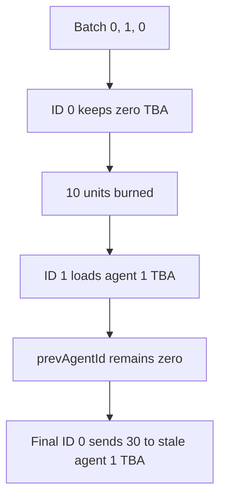

# Virtuals — stale `promptMulti` cache burns and misroutes user payments

> **Vulnerability classes:** vuln/logic/incorrect-state-transition · vuln/logic/state-update · vuln/logic/missing-check

> **Reproduction:** self-contained Foundry PoC with no fork, RPC, or cheatcodes. Full trace: [output.txt](output.txt). Driver: [test/61827-h-06-missing-prevagentidupdate-in-promptmulti-function-may-c_exp.sol](test/61827-h-06-missing-prevagentidupdate-in-promptmulti-function-may-c_exp.sol).

<!-- non-defihacklabs -->
<!-- source-auditvault: https://github.com/Auditware/AuditVault/blob/main/findings/61827-h-06-missing-prevagentidupdate-in-promptmulti-function-may-c.md -->
<!-- date: 2025-04 -->

**AuditVault taxonomy:** `lang/solidity` · `sector/gaming` · `platform/code4rena` · `has/github` · `has/poc` · `severity/high` · `precondition/uninitialized` · genome: `lockup` · `permanent` · `data/uninitialized`

## Key info

| | |
|---|---|
| **Impact** | **HIGH** — a supplied batch can burn 10 payment units at `address(0)` and send another 30 units to a stale agent account. |
| **Protocol** | [Virtuals](https://code4rena.com/reports/2025-04-virtuals-protocol) |
| **Vulnerable code** | `AgentInference.promptMulti` |
| **Finding** | Code4rena Virtuals, 2025-04 · #61827 (H-06) · reporter **sergei2340** |
| **Status** | Audit finding; local reduction preserves the cache invariant failure. |
| **Compiler** | `^0.8.24` (local reduction) |

## TL;DR

`promptMulti` tries to cache an agent token-bound account for consecutive identical agent IDs. It loads an address when the ID changes, but never assigns the new ID to `prevAgentId`. A first ID of zero therefore pays the zero address; a later zero can reuse a stale account loaded for a different ID.

The local batch `[0, 1, 0]` with amounts `[10, 20, 30]` burns the first payment, then sends the third payment to agent 1’s account. The PoC asserts the zero-address loss and the unintended 50-unit balance at agent 1’s vault.

## The vulnerable code

```solidity
if (prevAgentId != agentId) {
    agentTba = agentNft.getTBA(agentId);
    // @> VULN: missing `prevAgentId = agentId;`
}
token.transferFrom(msg.sender, agentTba, amount);
```

The cache key and cached value no longer describe the same entry after the first iteration.

## Root cause

The loop mutates the cached address but fails to update the corresponding cached identifier. The branch condition is then evaluated against an obsolete value, allowing uninitialized or stale recipient addresses to be used for transfers.

## Preconditions

- A caller can provide at least two agent IDs and payment amounts.
- The array contains zero first, or repeats an earlier ID after a different ID.
- The caller has approved the payment token.

## Attack walkthrough

1. The caller submits IDs `[0, 1, 0]` and amounts `[10, 20, 30]`.
2. The zero ID does not trigger an address load, so 10 units go to `address(0)`.
3. Agent 1 loads its vault and receives 20 units.
4. The cache key remains zero; the final zero ID sends 30 more units to agent 1.

## Diagrams



## Remediation

Update the key whenever the cached address is loaded, and explicitly initialize the first iteration or reject sentinel ID zero if it is not a valid agent:

```solidity
if (prevAgentId != agentId) {
    agentTba = agentNft.getTBA(agentId);
    prevAgentId = agentId;
}
```

## How to reproduce

```bash
cd /workspaces/RustroverProjects/audits/evm-hack-registry/61827-h-06-missing-prevagentidupdate-in-promptmulti-function-may-c_exp
forge test -vvv
```

## Sources

- [AuditVault finding #61827](https://github.com/Auditware/AuditVault/blob/main/findings/61827-h-06-missing-prevagentidupdate-in-promptmulti-function-may-c.md)
- [Code4rena Virtuals report](https://code4rena.com/reports/2025-04-virtuals-protocol)

*Reference: Code4rena Virtuals finding H-06, curated by AuditVault.*
