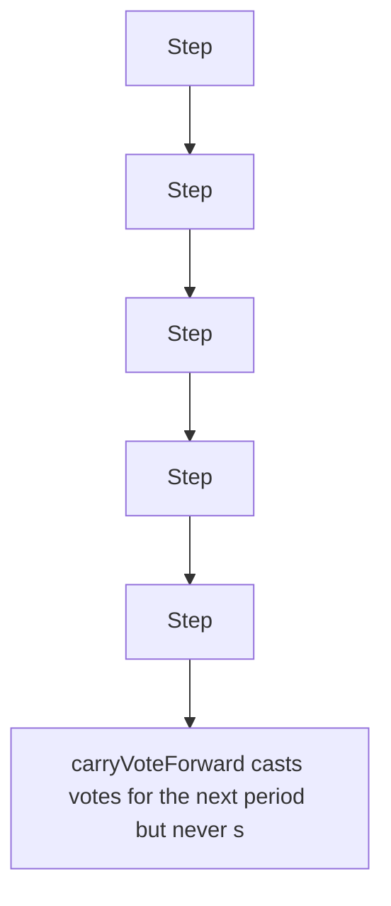

# carryVoteForward() enables double voting

> **Vulnerability classes:** vuln/logic
>
> **Reproduction:** a faithful minimal reproduction of the vulnerable finding — the vulnerable code is reproduced **verbatim** (marked `@>`) with faithful minimal doubles; local deploy, no fork.

<!-- source-auditvault: AuditVault finding 61950 -->

## Root cause

carryVoteForward casts votes for the next period but never sets voted[tokenId]=true, so checkPeriodVoted stays false and the notVoted guard is bypassed - the attacker splits the still-unvoted NFT and votes again, double-counting 100e18 of voting weight.

```solidity
        // deposit votes to next period
        _vote(nextPeriod, _tokenId, _poolList, _weightList); // @> VULN (this line)
```

## Why it's exploitable here

carryVoteForward casts votes for the next period but never sets voted[tokenId]=true, so checkPeriodVoted stays false and the notVoted guard is bypassed - the attacker splits the still-unvoted NFT and votes again, double-counting 100e18 of voting weight.

## Attack path



## Marked-line walkthrough (Playground)

The EVM Playground pins each step to the exact executed source line in `0x671d353a77…`:

1. **L46** — Step: Executes `uint256 public currentPeriod;`
2. **L55** — Step: Executes `for (uint256 i; i < pools.length; i++) {`
3. **L64** — Step: Executes `function vote(uint256 _tokenId, address[] calldata pools, uint256[] calldata weights) external {`
4. **L71** — Step: Executes `function seedFromPeriod(uint256 _fromPeriod, uint256 _tokenId, address pool, uint256 weight) external {`
5. **L79** — Step: Executes `Period storage ps = period[_fromPeriod];`
6. **L87** — Step: Executes `address _gauge = gauge[_poolList[i]];`
7. **L92** — Vulnerable line: Executes `_vote(nextPeriod, _tokenId, _poolList, _weightList);`

## PoC

Registry (Foundry, local deploy — verbatim vulnerable source + harm-asserting test):

```bash
cd 61950-c-01-carryvoteforward-enables-double-voting-pashov-audit-gro_exp
forge test -vvv
```

The browser Playground replays the same synthetic opcode-for-opcode and measures the harm. Both gates are green (registry `forge test` PASS + Playground `_verify-poc` **VERDICT: PASS**).
